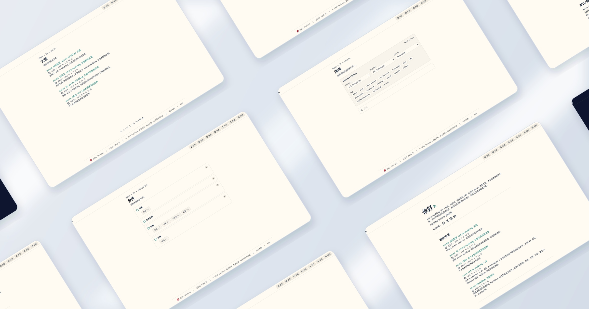

# astro-minimax

English | [**简体中文**](./README.md)




> **astro-minima-X** — Minima as the foundation, X for infinite extensibility.

astro-minimax is a minimal, modern, and modular Astro blog theme. Built on a minimal aesthetic with rich visualization components and feature extensions. Supports i18n, AI chat, Mermaid diagrams, Markmap mind maps, terminal replay, and more.

## Design Philosophy

- **Minimal First** — Clean design, content-focused
- **Modular & Pluggable** — Core theme + visualization plugins separated, use what you need
- **Modern** — Astro v5, Tailwind v4, strict TypeScript
- **Content-System Separation** — Flexible integration via NPM packages or GitHub Template

## Features

### Core

- [x] Type-safe Markdown / MDX
- [x] High performance (Lighthouse 90+)
- [x] Accessible
- [x] Responsive design
- [x] SEO friendly
- [x] Light/Dark theme with View Transitions
- [x] Full-text search (Pagefind)
- [x] Dynamic OG image generation
- [x] Multi-language (Chinese/English)

### Content Enhancement

- [x] 📊 **Mermaid Diagrams** — Flowcharts, sequence diagrams
- [x] 🧠 **Markmap Mind Maps** — Interactive mind maps
- [x] ✏️ **Rough.js Drawings** — Hand-drawn style SVG
- [x] 🖌️ **Excalidraw Embeds** — Whiteboard-style diagrams
- [x] 📺 **Asciinema Replay** — Embedded terminal recordings
- [x] 🤖 **AI Chat Widget** — Built-in AI assistant
- [x] 💬 **Waline Comments** — Interactive comment system
- [x] 🏷️ **Categories & Series** — Hierarchical content organization

## Two Integration Methods

### Method 1: GitHub Template (Recommended)

```bash
pnpm create astro@latest --template souloss/astro-minimax
cd my-blog && pnpm install && pnpm run dev
```

### Method 2: NPM Packages

```bash
pnpm add @astro-minimax/core
pnpm add @astro-minimax/viz  # optional, visualization plugins
```

See [Getting Started](src/data/blog/en/getting-started.md) for details.

## Project Structure

```bash
/
├── packages/
│   ├── core/          # @astro-minimax/core — Core theme package
│   └── viz/           # @astro-minimax/viz — Visualization plugins
├── src/
│   ├── components/
│   │   ├── ai/        # AI chat widget
│   │   ├── blog/      # Post components, TOC, comments
│   │   ├── media/     # Mermaid, Markmap, Rough.js, Excalidraw, Asciinema
│   │   ├── nav/       # Header, footer, pagination
│   │   └── ui/        # Cards, tags, alerts
│   ├── data/blog/     # Blog posts (en/, zh/)
│   ├── layouts/       # Layout components
│   ├── pages/         # Page routes
│   ├── plugins/       # Remark/Rehype plugins
│   ├── scripts/       # Client scripts
│   ├── styles/        # Global styles
│   └── config.ts      # Theme configuration
└── astro.config.ts
```

## Tech Stack

**Framework** — [Astro](https://astro.build/)
**Styling** — [TailwindCSS](https://tailwindcss.com/)
**Search** — [Pagefind](https://pagefind.app/)
**Comments** — [Waline](https://waline.js.org/)
**Diagrams** — [Mermaid](https://mermaid.js.org/)

## Commands

| Command | Action |
|---------|--------|
| `pnpm install` | Install dependencies |
| `pnpm run dev` | Start dev server |
| `pnpm run build` | Build for production |
| `pnpm run preview` | Preview build |
| `pnpm run lint` | Lint code |
| `pnpm run format` | Format code |

## Documentation

- [Getting Started](src/data/blog/en/getting-started.md)
- [Configure Theme](src/data/blog/en/how-to-configure-astro-minimax-theme.md)
- [Add Posts](src/data/blog/en/adding-new-post.md)
- [Customize Colors](src/data/blog/en/customizing-astro-minimax-theme-color-schemes.md)
- [Dynamic OG Images](src/data/blog/en/dynamic-og-images.md)

## Credits

Built upon [AstroPaper](https://github.com/satnaing/astro-paper).

## License

MIT License - Copyright © 2025

---

Crafted by [Souloss](https://souloss.cn).
