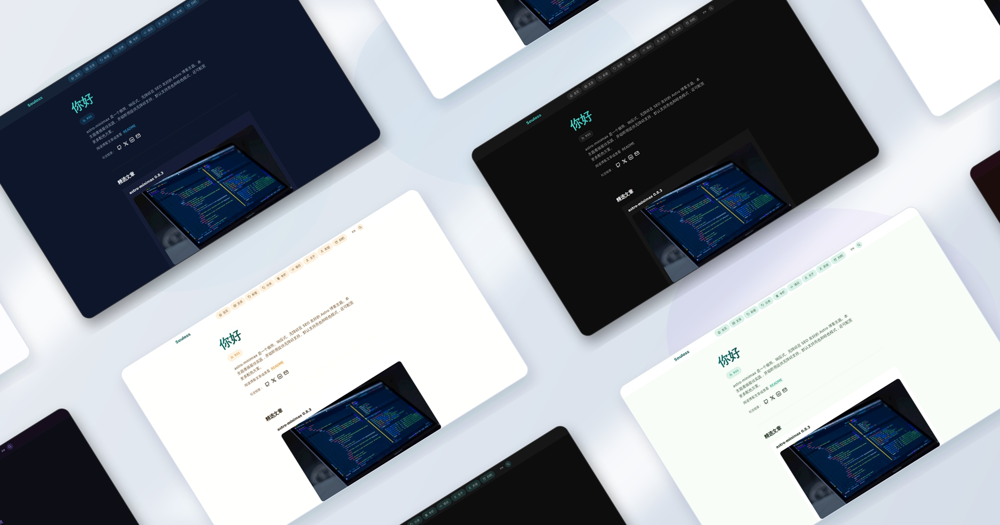

# astro-minimax

[**English**](./README.en.md) | 简体中文




> **astro-minima-X** — 极简（Minima）为底座，X 代表无限扩展。

astro-minimax 是一个极简、现代化、模块化的 Astro 博客主题。以极简风格为核心，同时提供丰富的可视化组件和功能扩展。支持多语言、AI 聊天、多种搜索方案、Mermaid 图表、Markmap 思维导图等。

## 设计哲学

- **极简优先** — 简洁的设计，内容为核心
- **模块化可插拔** — 四个独立包，按需组合
- **现代化** — Astro v6、Tailwind v4、TypeScript 严格模式、AI SDK v6
- **内容与系统分离** — 通过 CLI / NPM 包 / GitHub Template 灵活集成

## 功能特性

### 核心功能

- [x] 类型安全的 Markdown / MDX
- [x] 极致性能（Lighthouse 90+）
- [x] 无障碍支持
- [x] 响应式设计
- [x] SEO 友好
- [x] 明暗主题切换（View Transitions 动画）
- [x] 全文搜索（Pagefind 或 Algolia DocSearch）
- [x] 动态 OG 图片生成
- [x] 多语言支持（中文/英文）
- [x] 分类、标签、系列、归档

### 内容增强

- [x] 📊 **Mermaid 图表** — 流程图、时序图等
- [x] 🧠 **Markmap 思维导图** — 交互式思维导图
- [x] ✏️ **Rough.js 手绘图形** — 手绘风格 SVG
- [x] 🖌️ **Excalidraw 嵌入** — 白板风格图表
- [x] 📺 **Asciinema 终端回放** — 嵌入终端录制

### 互动功能

- [x] 🤖 **AI 聊天** — 多 Provider 自动故障转移、RAG 增强、流式对话、来源分层防幻觉
- [x] 📖 **边读边聊** — 文章页 AI 陪读，自动感知文章上下文
- [x] 🔒 **AI 隐私保护** — 自动拒绝敏感个人信息查询
- [x] 🧪 **AI 质量评估** — 黄金测试集自动化评估
- [x] 💬 **Waline 评论** — 互动评论系统
- [x] 🔔 **多渠道通知** — Telegram / Email / Webhook
- [x] 📊 **Umami 统计** — 隐私友好的访问分析
- [x] ☕ **赞助打赏** — 支持多种支付方式

## 三种使用方式

### 方式一：CLI 创建（推荐）

```bash
npx @astro-minimax/cli init my-blog
cd my-blog && pnpm install && pnpm run dev
```

### 方式二：GitHub Template

```bash
pnpm create astro@latest --template souloss/astro-minimax
cd my-blog && pnpm install && pnpm run dev
```

### 方式三：NPM 包集成

```bash
pnpm add @astro-minimax/core    # 核心主题（含可视化组件）
pnpm add @astro-minimax/ai      # 可选，AI 聊天
pnpm add -D @astro-minimax/cli  # 推荐，CLI 工具
```

详见 [快速开始指南](apps/blog/src/data/blog/zh/getting-started.md)。

## 项目结构

```bash
astro-minimax/
├── packages/
│   ├── core/      # @astro-minimax/core — 核心主题（布局、组件、样式、路由、插件、可视化）
│   ├── ai/        # @astro-minimax/ai — AI 集成（RAG、多 Provider、流式对话）
│   ├── notify/    # @astro-minimax/notify — 多渠道通知
│   └── cli/       # @astro-minimax/cli — CLI 工具链（创建、处理、评估）
└── apps/
    └── blog/      # 示例博客 / 开发预览站
```

## 技术栈

| 类别         | 技术                                                                                    |
| ------------ | --------------------------------------------------------------------------------------- |
| **主框架**   | [Astro v6](https://astro.build/)                                                        |
| **样式**     | [TailwindCSS v4](https://tailwindcss.com/)                                              |
| **搜索**     | [Pagefind](https://pagefind.app/) / [Algolia DocSearch](https://docsearch.algolia.com/) |
| **评论**     | [Waline](https://waline.js.org/)                                                        |
| **图表**     | [Mermaid](https://mermaid.js.org/)                                                      |
| **思维导图** | [Markmap](https://markmap.js.org/)                                                      |
| **AI**       | [Vercel AI SDK v6](https://sdk.vercel.ai/) + Cloudflare Workers AI                      |
| **通知**     | Telegram / Email (Resend) / Webhook                                                     |
| **统计**     | [Umami](https://umami.is/)                                                              |
| **部署**     | Cloudflare Pages / Vercel / Netlify / Docker                                            |

## CLI 命令

通过 `@astro-minimax/cli` 提供完整的命令行工具：

```bash
# 博客管理
astro-minimax init my-blog       # 创建新博客
astro-minimax post new "标题"    # 创建新文章
astro-minimax post list          # 列出所有文章
astro-minimax post stats         # 文章统计

# AI 内容处理
astro-minimax ai process         # AI 处理文章（摘要+SEO）
astro-minimax ai eval            # AI 对话质量评估

# 作者画像
astro-minimax profile build      # 构建完整画像（上下文+风格+报告）

# 数据管理
astro-minimax data status        # 查看数据文件状态
astro-minimax data clear         # 清理生成的缓存
```

在博客目录中也可以使用 `pnpm run` 快捷方式：`pnpm run ai:process`、`pnpm run profile:build` 等。

## 包说明

| 包                                          | 版本  | 说明                                                        |
| ------------------------------------------- | ----- | ----------------------------------------------------------- |
| [`@astro-minimax/core`](packages/core/)     | 0.8.0 | 核心主题：布局、组件、样式、路由注入、虚拟模块、可视化      |
| [`@astro-minimax/ai`](packages/ai/)         | 0.8.0 | AI 集成：多 Provider 故障转移、RAG 检索、来源分层、隐私保护 |
| [`@astro-minimax/notify`](packages/notify/) | 0.8.0 | 通知系统：Telegram Bot、Email (Resend)、Webhook             |
| [`@astro-minimax/cli`](packages/cli/)       | 0.8.0 | CLI 工具：博客创建、AI 处理、画像构建、质量评估             |

## 文档

- [快速开始](apps/blog/src/data/blog/zh/getting-started.md)
- [功能特性](apps/blog/src/data/blog/zh/feature-overview.md)
- [主题配置](apps/blog/src/data/blog/zh/how-to-configure-astro-minimax-theme.md)
- [添加文章](apps/blog/src/data/blog/zh/adding-new-post.md)
- [部署指南](apps/blog/src/data/blog/zh/deployment-guide.md)
- [通知系统](apps/blog/src/data/blog/zh/notification-guide.md)
- [自定义配色](apps/blog/src/data/blog/zh/customizing-astro-minimax-theme-color-schemes.md)
- [动态 OG 图片](apps/blog/src/data/blog/zh/dynamic-og-images.md)

## 致谢

基于 [AstroPaper](https://github.com/satnaing/astro-paper) 二次开发。

## 许可证

MIT License - Copyright © 2026

---

由 [Souloss](https://souloss.cn) 用心打造。
