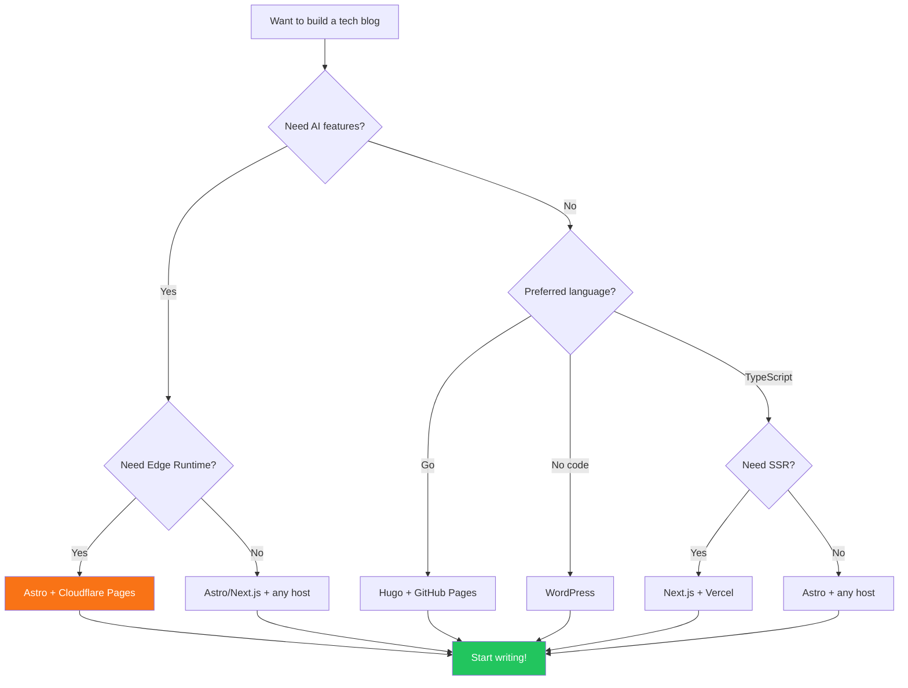

Building a personal tech blog involves 10+ technical decisions. This guide exhaustively covers every capability domain in the 2026 blog ecosystem to help you make informed choices.

```markmap
# 2026 Blog Ecosystem
## Framework
### Astro
### Hugo
### Next.js
### Hexo
## Content
### Markdown (Git)
### Headless CMS
### WordPress
## Search
### Pagefind
### Algolia DocSearch
### RAG (AI)
## Comments
### Waline
### Giscus
### Disqus
## AI
### Chat (RAG)
### Summaries
### SEO
### Translation
## Analytics
### Umami
### Plausible
### Cloudflare
## Notifications
### Telegram
### Email
### Webhook
## Deploy
### Cloudflare Pages
### Vercel
### GitHub Pages
### Docker
```

## Table of contents

## 1. Framework Selection

### Static Site Generators (SSG)

| Framework | Language | Strengths | Best For |
|-----------|----------|-----------|----------|
| **Astro** | TypeScript | Islands architecture, zero JS | Performance-focused devs |
| **Hugo** | Go | Fastest build, single binary | Non-JS developers |
| **Next.js** | TypeScript | Full-stack, ISR, App Router | React full-stack devs |
| **Nuxt** | TypeScript | Vue ecosystem, auto-routing | Vue developers |
| **VitePress** | TypeScript | Vue-powered, minimal | Technical docs |
| **Hexo** | JavaScript | Rich plugin ecosystem | Quick start |
| **Eleventy** | JavaScript | Zero-config, multi-template | Minimalists |

**How SSG works**: Markdown files → Build parser → Template engine → HTML/CSS/JS → CDN distribution.

## 2. Content Management

| Approach | Storage | Pros | Cons |
|----------|---------|------|------|
| **Git-based (Markdown)** | Git repo | Version control, offline | Non-tech barrier |
| **Headless CMS (Strapi/Sanity)** | Database/Cloud | Collaboration, API | Complexity |
| **WordPress** | Self-hosted | Largest ecosystem | Heavy |
| **Notion as CMS** | Notion API | Great editing UX | API limits |

## 3. Search Solutions

| Solution | Type | Cost | Best For |
|----------|------|------|----------|
| **Pagefind** | Static (WASM) | Free | Default choice |
| **Algolia DocSearch** | Cloud | Free (open source) | Best UX |
| **RAG (AI search)** | AI + TF-IDF | API cost | Conversational search |
| **Meilisearch** | Self-hosted | Free | Full control |

## 4. Comment Systems

| System | Backend | Cost | Highlights |
|--------|---------|------|------------|
| **Giscus** | GitHub Discussions | Free | Zero backend |
| **Waline** | Vercel + LeanCloud | Free | CJK-friendly |
| **Utterances** | GitHub Issues | Free | Lightweight |
| **Artalk** | Self-hosted | Free | Lightweight, SQLite |

## 5. AI Integration

### Blog AI Capabilities in 2026

| Capability | Description | Implementation |
|------------|-------------|----------------|
| **AI Chat** | Readers converse with blog content | RAG + LLM + SSE |
| **Content Summary** | Auto-generate article summaries | LLM API |
| **SEO Optimization** | Generate meta descriptions, keywords | LLM API |
| **Translation** | Multi-language article translation | LLM |
| **Tag Suggestion** | Auto-recommend article tags | NLP + keyword extraction |
| **Cover Generation** | AI-generated cover images | DALL-E / SD |
| **Author Profile** | Analyze writing style | Text analysis + LLM |

### Anti-Hallucination Measures

| Measure | Description |
|---------|-------------|
| **RAG Retrieval** | Answer based on real content only |
| **Source Priority Protocol** | L1-L5 priority constraints |
| **Citation Guard** | Remove fabricated links |
| **Privacy Protection** | Refuse sensitive personal info |
| **Mock Fallback** | Preset responses when API unavailable |

## 6. Analytics

| Solution | Privacy | Cost | Note |
|----------|---------|------|------|
| **Umami** | High (no cookies) | Free | Self-hosted, GDPR |
| **Plausible** | High | Paid/self-hosted | Simple, privacy-first |
| **Cloudflare Analytics** | High | Free | Zero JS |
| **Google Analytics** | Low | Free | Most features |

## 7. Notification Systems

| Channel | Use Case | Latency |
|---------|----------|---------|
| **Telegram Bot** | Mobile real-time | Instant |
| **Email (Resend)** | Archive, formal | Minutes |
| **Webhook** | Enterprise tools (Slack, Discord) | Instant |
| **RSS** | Passive subscribers | Hours |

## 8. Deployment

| Platform | Cost | Edge | Best For |
|----------|------|------|----------|
| **Cloudflare Pages** | Free | Workers AI | AI blogs |
| **Vercel** | Free tier | Edge Functions | Next.js |
| **GitHub Pages** | Free | None | Pure static |
| **Docker + VPS** | VPS cost | None | Full control |

## Quick Decision Matrix

## Selection Flowchart



### Minimal (Zero Cost)

```
Hugo/Astro + Markdown + Pagefind + Giscus + GitHub Pages
```

### Recommended (Low Cost, Feature-Rich)

```
Astro + Markdown + Pagefind + Waline + Umami + Cloudflare Pages
```

### Full-Featured (astro-minimax)

```
Astro 6 + Markdown/MDX + Pagefind + DocSearch
+ Waline + Umami + Mermaid + Markmap
+ AI Chat (RAG + Workers AI + OpenAI)
+ Telegram/Email/Webhook notifications
+ Cloudflare Pages
```

---

The tech blog ecosystem is mature in 2026. Choose tools that fit your needs and spend time writing, not fighting tooling.

If you want a batteries-included, infinitely extensible solution, [astro-minimax](https://github.com/souloss/astro-minimax) might be a good choice.
