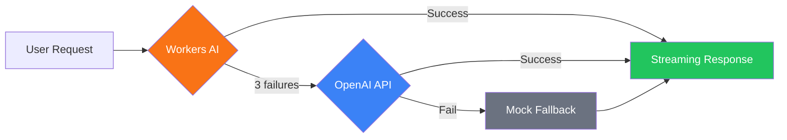

astro-minimax includes a built-in AI chat assistant with multi-provider failover, RAG retrieval, streaming responses, and Mock fallback. This guide covers the complete setup.

## Quick Setup

### 1. Enable AI

In `src/config.ts`:

```typescript
features: { ai: true },
ai: {
  enabled: true,
  mockMode: false,
  apiEndpoint: "/api/chat",
},
```

### 2. Configure Provider

In `.env`:

```bash
AI_BASE_URL=https://api.openai.com/v1
AI_API_KEY=your-api-key
AI_MODEL=gpt-4o-mini
SITE_AUTHOR=YourName
SITE_URL=https://your-blog.com
```

### 3. Build AI Data

```bash
astro-minimax ai process       # Generate summaries + SEO data
astro-minimax profile build     # Build author profile
```

### 4. Start Dev Server

```bash
pnpm run dev
```

## Provider Configuration

### Cloudflare Workers AI

Free AI with Cloudflare Pages deployment:

```toml
# wrangler.toml
[ai]
binding = "AI"
```

### OpenAI Compatible API

```bash
AI_BASE_URL=https://api.openai.com/v1
AI_API_KEY=sk-xxx
AI_MODEL=gpt-4o-mini
```

### Failover Chain



## Security Features

- **Source Priority Protocol**: L1-L5 source layers prevent hallucination
- **Privacy Protection**: Auto-refuses sensitive personal info queries
- **Intent Classification**: 7 intent categories for better search relevance

## Quality Evaluation

```bash
pnpm run ai:eval                             # Test local
pnpm run ai:eval -- --url=https://your.com   # Test production
```

Edit `datas/eval/gold-set.json` to customize test cases.

## Environment Variables

| Variable | Description | Required |
|----------|-------------|----------|
| `AI_BASE_URL` | OpenAI-compatible API URL | For OpenAI |
| `AI_API_KEY` | API key | For OpenAI |
| `AI_MODEL` | Chat model | No (default: `gpt-4o-mini`) |
| `SITE_AUTHOR` | Author name | No |
| `SITE_URL` | Site URL | No |

## Related

- [Feature Overview](/en/posts/feature-overview) — All AI features
- [CLI Guide](/en/posts/cli-guide) — AI processing commands
- [Notification System](/en/posts/notification-guide) — AI chat notifications
- [Deployment Guide](/en/posts/deployment-guide) — Cloudflare Workers AI deployment
