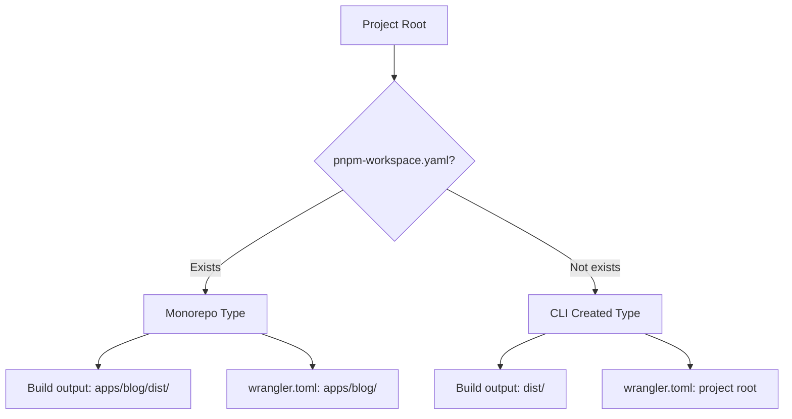

This guide covers how to deploy your astro-minimax blog to various platforms. astro-minimax generates static sites, so it can be deployed to almost any static hosting service.

## Project Types

astro-minimax supports two project types with slightly different deployment configurations:

| Project Type    | Description                       | Characteristics                                            |
| --------------- | --------------------------------- | ---------------------------------------------------------- |
| **Monorepo**    | Clone the repository directly     | Contains multiple packages, suitable for contributing code |
| **CLI Created** | Use `npx @astro-minimax/cli init` | Single project, simpler structure                          |

### How to Identify Your Project Type

Check if `pnpm-workspace.yaml` exists in your project root:

- **Exists** → Monorepo type
- **Does not exist** → CLI created type



---

## Prerequisites

Before deploying, make sure your blog builds successfully locally:

```bash
# Run from project root
pnpm run build
```

**Build output location**:

| Project Type | Build Output Directory |
| ------------ | ---------------------- |
| Monorepo     | `apps/blog/dist/`      |
| CLI Created  | `dist/`                |

> If the build fails, run `pnpm run dev` first to identify and fix errors.

---

## Cloudflare Pages (Recommended)

Cloudflare Pages is the recommended platform because astro-minimax's AI chat feature is built on Cloudflare Workers AI.

### Git Integration

1. Push your code to GitHub / GitLab
2. Log in to [Cloudflare Dashboard](https://dash.cloudflare.com/) → Pages → Create a project
3. Connect your Git repository
4. Configure build settings:

#### Monorepo Type

| Setting                | Value                                                 |
| ---------------------- | ----------------------------------------------------- |
| Framework preset       | Astro                                                 |
| Build command          | `pnpm run build`                                      |
| Build output directory | `apps/blog/dist`                                      |
| Root directory         | `/` (keep default)                                    |
| Node.js version        | `22` (set `NODE_VERSION=22` in environment variables) |

#### CLI Created Type

| Setting                | Value                                                 |
| ---------------------- | ----------------------------------------------------- |
| Framework preset       | Astro                                                 |
| Build command          | `pnpm run build`                                      |
| Build output directory | `dist`                                                |
| Root directory         | `/` (keep default)                                    |
| Node.js version        | `22` (set `NODE_VERSION=22` in environment variables) |

5. Click **Save and Deploy**

### Environment Variables

If AI chat is enabled, configure in Cloudflare Pages:

| Variable          | Description                               |
| ----------------- | ----------------------------------------- |
| `NODE_VERSION`    | `22` (recommended)                        |
| `AI_BINDING_NAME` | AI Binding name (defaults to `minimaxAI`) |

### AI Binding Configuration

The project includes a `wrangler.toml` file that defines the AI Binding:

**Monorepo Type**: File located at `apps/blog/wrangler.toml`

**CLI Created Type**: File located at `wrangler.toml` (project root)

```toml
name = "astro-minimax"
pages_build_output_dir = "dist"
compatibility_date = "2026-03-12"
compatibility_flags = ["nodejs_compat"]

[ai]
binding = "minimaxAI"

[[kv_namespaces]]
binding = "CACHE_KV"
id = "your-kv-namespace-id"
```

Cloudflare Pages automatically detects this configuration and enables Workers AI.

> `compatibility_flags = ["nodejs_compat"]` enables Node.js compatibility mode for proper AI functionality.

### Custom Domain

After deployment, add a custom domain in Cloudflare Pages settings. Cloudflare automatically provisions SSL certificates.

### Environment Variables

For detailed environment variable configuration, see [Cloudflare Environment Variables Guide](/en/posts/cloudflare-env-vars).

### Related Guides

- [Waline Comments Setup](/en/posts/setup-waline-on-vercel) — Deploy comment system on Vercel
- [Umami Analytics Setup](/en/posts/setup-umami-analytics) — Configure privacy-friendly analytics
- [Complete Setup Guide](/en/posts/complete-setup-guide) — End-to-end tutorial

---

## Vercel

### Git Integration

1. Log in to [Vercel](https://vercel.com/) → New Project → Import Git repository
2. Configure build settings:

#### Monorepo Type

| Setting          | Value              |
| ---------------- | ------------------ |
| Framework preset | Astro              |
| Build command    | `pnpm run build`   |
| Output directory | `apps/blog/dist`   |
| Install command  | `pnpm install`     |
| Root directory   | `.` (keep default) |

#### CLI Created Type

| Setting          | Value              |
| ---------------- | ------------------ |
| Framework preset | Astro              |
| Build command    | `pnpm run build`   |
| Output directory | `dist`             |
| Install command  | `pnpm install`     |
| Root directory   | `.` (keep default) |

3. Set `NODE_VERSION=22` in environment variables
4. Click **Deploy**

### Notes

- Vercel doesn't support Cloudflare Workers AI. The AI chat feature needs an alternative AI provider (e.g., OpenAI) on Vercel
- You'll need to modify `ai.apiEndpoint` in `src/config.ts` to point to your AI API

---

## Netlify

### Git Integration

1. Log in to [Netlify](https://app.netlify.com/) → New site → Import Git repository
2. Configure build settings:

#### Monorepo Type

| Setting           | Value            |
| ----------------- | ---------------- |
| Build command     | `pnpm run build` |
| Publish directory | `apps/blog/dist` |

#### CLI Created Type

| Setting           | Value            |
| ----------------- | ---------------- |
| Build command     | `pnpm run build` |
| Publish directory | `dist`           |

3. Set `NODE_VERSION=22` in environment variables
4. Click **Deploy site**

### netlify.toml (Optional)

Create `netlify.toml` in the project root for unified configuration:

**Monorepo Type**:

```toml
[build]
  command = "pnpm run build"
  publish = "apps/blog/dist"

[build.environment]
  NODE_VERSION = "22"
```

**CLI Created Type**:

```toml
[build]
  command = "pnpm run build"
  publish = "dist"

[build.environment]
  NODE_VERSION = "22"
```

---

## Docker

astro-minimax supports Docker containerized deployment.

### Development

Use `docker-compose.yml` for a quick dev server:

```yaml
services:
  app:
    image: node:lts
    ports:
      - 4321:4321
    working_dir: /app
    command: pnpm run dev -- --host 0.0.0.0
    volumes:
      - ./:/app
```

```bash
docker compose up
```

### Production

Use a multi-stage Dockerfile for production images:

#### Monorepo Type

```dockerfile
# Build stage
FROM node:lts AS base
WORKDIR /app

RUN corepack enable && corepack prepare pnpm@latest --activate

# Copy dependency files
COPY package.json pnpm-lock.yaml pnpm-workspace.yaml ./
COPY packages/ packages/
COPY apps/blog/package.json apps/blog/
RUN pnpm install --frozen-lockfile

# Copy source and build
COPY . .
RUN pnpm run build

# Runtime stage
FROM nginx:mainline-alpine-slim AS runtime
COPY --from=base /app/apps/blog/dist /usr/share/nginx/html
EXPOSE 80
```

#### CLI Created Type

```dockerfile
# Build stage
FROM node:lts AS base
WORKDIR /app

RUN corepack enable && corepack prepare pnpm@latest --activate

# Copy dependency files
COPY package.json pnpm-lock.yaml ./
RUN pnpm install --frozen-lockfile

# Copy source and build
COPY . .
RUN pnpm run build

# Runtime stage
FROM nginx:mainline-alpine-slim AS runtime
COPY --from=base /app/dist /usr/share/nginx/html
EXPOSE 80
```

```bash
# Build image
docker build -t my-blog .

# Run container
docker run -p 80:80 my-blog
```

---

## Static File Hosting

astro-minimax generates pure static files and can be deployed to any static file server:

### GitHub Pages

1. Create `.github/workflows/deploy.yml`:

**Monorepo Type**:

```yaml
name: Deploy to GitHub Pages
on:
  push:
    branches: [main]
jobs:
  deploy:
    runs-on: ubuntu-latest
    permissions:
      contents: read
      pages: write
      id-token: write
    steps:
      - uses: actions/checkout@v4
      - uses: pnpm/action-setup@v4
      - uses: actions/setup-node@v4
        with:
          node-version: 22
          cache: pnpm
      - run: pnpm install --frozen-lockfile
      - run: pnpm run build
      - uses: actions/upload-pages-artifact@v3
        with:
          path: apps/blog/dist
      - uses: actions/deploy-pages@v4
```

**CLI Created Type**:

```yaml
name: Deploy to GitHub Pages
on:
  push:
    branches: [main]
jobs:
  deploy:
    runs-on: ubuntu-latest
    permissions:
      contents: read
      pages: write
      id-token: write
    steps:
      - uses: actions/checkout@v4
      - uses: pnpm/action-setup@v4
      - uses: actions/setup-node@v4
        with:
          node-version: 22
          cache: pnpm
      - run: pnpm install --frozen-lockfile
      - run: pnpm run build
      - uses: actions/upload-pages-artifact@v3
        with:
          path: dist
      - uses: actions/deploy-pages@v4
```

2. In repo Settings → Pages, select **GitHub Actions** as the Source

### Self-hosted Server

Upload the build output directory contents to your server's web root:

**Monorepo Type**:

```bash
rsync -avz apps/blog/dist/ user@server:/var/www/html/
```

**CLI Created Type**:

```bash
rsync -avz dist/ user@server:/var/www/html/
```

---

## Deployment Checklist

Before deploying, verify:

- [ ] `SITE.website` in `src/config.ts` is set to your correct domain
- [ ] `pnpm run build` succeeds locally
- [ ] Build output directory is set correctly (Monorepo: `apps/blog/dist`, CLI: `dist`)
- [ ] Environment variable `NODE_VERSION` is set to `22`
- [ ] If using AI features, API configuration is correctly set
- [ ] `public/robots.txt` content is appropriate
- [ ] OG images are properly configured

## Quick Reference

### Build Output Directory

| Project Type | Build Output Directory |
| ------------ | ---------------------- |
| Monorepo     | `apps/blog/dist`       |
| CLI Created  | `dist`                 |

### wrangler.toml Location

| Project Type | File Path                      |
| ------------ | ------------------------------ |
| Monorepo     | `apps/blog/wrangler.toml`      |
| CLI Created  | `wrangler.toml` (project root) |

---

## FAQ

### Build fails: pnpm not found

Ensure the deployment platform supports pnpm. Most platforms need the Node.js version specified in environment variables:

```
NODE_VERSION=22
```

### Search doesn't work

Pagefind search index is generated during build. Make sure the build command includes the `pagefind --site dist` step (already included in `pnpm run build`).

### AI chat doesn't work

The AI chat feature depends on Cloudflare Workers AI. If deploying to other platforms:

1. Set `ai.mockMode` to `true` (shows preset responses only), or
2. Configure an alternative AI API endpoint
