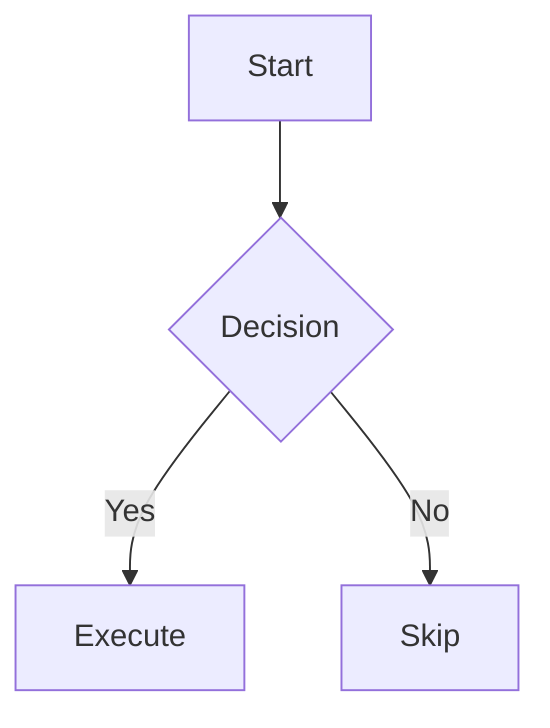

astro-minimax is a feature-rich Astro blog theme built with a modular architecture. This article provides a comprehensive overview of all features and how to use them.

## Table of contents

## Architecture Overview

astro-minimax consists of five core packages:

| Package                 | Description                                                                    | Required    |
| ----------------------- | ------------------------------------------------------------------------------ | ----------- |
| `@astro-minimax/core`   | Core theme: layouts, components, styles, utilities, plugins                    | Yes         |
| `@astro-minimax/viz`    | Visualization plugins: Mermaid, Markmap, Rough.js, Excalidraw, Asciinema, etc. | Optional    |
| `@astro-minimax/ai`     | AI integration: multi-provider chat, RAG retrieval, streaming                  | Optional    |
| `@astro-minimax/notify` | Notification system: Telegram, Email, Webhook multi-channel notifications      | Optional    |
| `@astro-minimax/cli`    | CLI tools: blog scaffolding, AI processing, profile building, quality eval     | Recommended |

---

## Content Management

### Markdown / MDX

All posts are written in Markdown or MDX with support for:

- Standard Markdown syntax
- GFM (GitHub Flavored Markdown) extensions
- MDX component embedding
- Math equations (LaTeX via KaTeX)
- GitHub-style alerts (`> [!NOTE]`, `> [!WARNING]`, etc.)
- Emoji shortcodes (`:smile:` -> :smile:)

### Multi-language

Built-in Chinese/English bilingual support. Posts are organized by language:

```
src/data/blog/
├── zh/     # Chinese posts
└── en/     # English posts
```

Languages are distinguished by URL prefix: `/zh/posts/...` and `/en/posts/...`.

### Content Organization

#### Tags

Each post can have multiple tags for flexible cross-categorization:

```yaml
tags:
  - astro
  - typescript
  - tutorial
```

The tags page (`/tags/`) displays a tag cloud. Click any tag to see all posts with that tag.

#### Categories

Hierarchical categories supported with `/` separators:

```yaml
category: Tutorial/Configuration
```

The categories page (`/categories/`) displays a tree-structured category view.

#### Series

Organize related posts into ordered series:

```yaml
series:
  name: Rust Getting Started
  order: 1
```

Series pages auto-generate navigation showing previous/next posts.

#### Archives

A timeline-based archive page (`/archives/`) showing all posts. Controlled by the `features.archives` toggle.

### Frontmatter

Post metadata is defined via frontmatter:

```yaml
---
title: Post Title
pubDatetime: 2026-03-14T10:00:00Z
modDatetime: 2026-03-14T12:00:00Z
author: Souloss
description: Post description
tags: [astro, tutorial]
category: Tutorial/Configuration
series: { name: "Series Name", order: 1 }
featured: true
draft: false
ogImage: ./cover.png
---
```

See [Adding New Posts](/en/posts/adding-new-post) for details.

---

## Search

Two search providers available, configurable via `search.provider`:

### Pagefind Full-text Search (Default)

Built-in [Pagefind](https://pagefind.app/) static search engine:

- Search index generated at build time
- Fully static, no server required
- Chinese text segmentation support
- Search result highlighting
- Advanced filters (category, language, tags)

The search index is automatically generated during `pnpm run build`.

### Algolia DocSearch

Support for [Algolia DocSearch](https://docsearch.algolia.com/) cloud search:

- Millisecond search response
- `Ctrl+K` keyboard shortcut to open search
- Search suggestions and autocomplete
- Search analytics and insights

Configuration:

```typescript
search: {
  provider: 'docsearch',
  docsearch: {
    appId: 'YOUR_APP_ID',
    apiKey: 'YOUR_SEARCH_API_KEY',
    indexName: 'YOUR_INDEX_NAME',
  },
},
```

---

## Themes & Styling

### Light/Dark Mode

Three theme modes supported:

- **Light mode** — White background, dark text
- **Dark mode** — Dark background, light text
- **System** — Automatically matches OS preference

Theme switching uses View Transitions animation for smooth transitions. Controlled by `features.darkMode`.

### Custom Color Schemes

Customize the entire site's colors through CSS variables:

```css
:root {
  --background: #ffffff;
  --foreground: #1a1a2e;
  --accent: #3b82f6;
  --muted: #6b7280;
  --border: #e5e7eb;
}

[data-theme="dark"] {
  --background: #0f172a;
  --foreground: #e2e8f0;
  --accent: #60a5fa;
  --muted: #94a3b8;
  --border: #334155;
}
```

See [Customizing Color Schemes](/en/posts/customizing-astro-minimax-theme-color-schemes) for details.

### Responsive Design

Mobile-first responsive design throughout:

- Mobile: Single-column layout, touch-friendly navigation
- Tablet: Optimized reading width
- Desktop: Full sidebar and floating TOC

---

## Visualization Components

The `@astro-minimax/viz` package provides rich visualization components.

### Mermaid Diagrams

Write Mermaid diagrams directly in Markdown:

````markdown

````

Supports flowcharts, sequence diagrams, Gantt charts, pie charts, class diagrams, and all Mermaid chart types. Automatically adapts to light/dark themes.

### Markmap Mind Maps

Generate interactive mind maps from Markdown outlines:

````markdown
```markmap
# Central Topic
## Branch A
### Leaf 1
### Leaf 2
## Branch B
### Leaf 3
```
````

Supports zoom, pan, and expand/collapse interactions.

### Rough.js Hand-drawn Graphics

Use hand-drawn style SVG shapes in MDX:

```mdx
import RoughDrawing from '@astro-minimax/viz/components/RoughDrawing.astro';

<RoughDrawing shapes={[
  { type: "rectangle", x: 10, y: 10, width: 200, height: 100 }
]} />
```

### Excalidraw Whiteboard

Embed Excalidraw whiteboard-style diagrams:

```mdx
import ExcalidrawEmbed from '@astro-minimax/viz/components/ExcalidrawEmbed.astro';

<ExcalidrawEmbed src="/drawings/architecture.excalidraw" />
```

Automatically adapts to light/dark themes.

### Asciinema Terminal Replay

Embed terminal recording playback:

```mdx
import AsciinemaPlayer from '@astro-minimax/viz/components/AsciinemaPlayer.astro';

<AsciinemaPlayer src="/casts/demo.cast" cols={120} rows={30} />
```

### More Components

| Component       | Description                                     |
| --------------- | ----------------------------------------------- |
| `Bilibili`      | Bilibili video embed                            |
| `MusicPlayer`   | Music player (NetEase, QQ Music, Kugou, etc.)   |
| `CodeRunner`    | Interactive JavaScript code runner              |
| `FullHtmlEmbed` | Full HTML page embed                            |
| `VizContainer`  | Visualization container (zoom, pan, fullscreen) |

---

## AI Chat

The `@astro-minimax/ai` package provides intelligent conversation capabilities.

### Key Features

- **Multi-provider support** — Cloudflare Workers AI + OpenAI-compatible APIs
- **Automatic failover** — Seamlessly switches to backup when primary fails, Mock fallback guarantees availability
- **Streaming responses** — Real-time SSE streaming output
- **RAG retrieval** — Context-enhanced answers based on blog content
- **Source priority protocol** — L1-L5 source layers to prevent AI hallucination
- **Intent classification** — 7 topic categories for improved search relevance
- **Privacy protection** — Automatically refuses sensitive personal info queries (address, income, family, etc.)
- **Reading companion** — Article pages auto-inject context for contextual Q&A
- **Global/session cache** — Public questions cached across users for faster responses
- **Mock mode** — No real API needed during development

### Usage

The AI chat appears as a floating widget in the bottom-right corner. Click to open the chat window where you can:

- Ask about blog content
- Get technical answers
- Browse blog navigation suggestions

### Configuration

Enable in `src/config.ts`:

```js
features: {
  ai: true,
},
ai: {
  enabled: true,
  mockMode: false,       // Set to false for production
  apiEndpoint: "/api/chat",
  model: "@cf/zai-org/glm-4.7-flash",
},
```

See [Configuration Guide](/en/posts/how-to-configure-astro-minimax-theme#configuring-ai-chat) for details.

---

## Interactive Systems

### Waline Comments

Built-in [Waline](https://waline.js.org/) comment system:

- Anonymous or authenticated comments
- Emoji pack support
- Page view counter
- Emoji reactions
- Comment word limit
- Markdown formatted comments

Requires self-hosted Waline server. See [Configuration Guide](/en/posts/how-to-configure-astro-minimax-theme#configuring-waline-comments).

### Sponsorship

Donation feature supporting multiple payment methods:

- WeChat Pay
- Alipay
- Custom payment methods

Shows donation buttons and QR codes at the bottom of posts. Supports displaying a sponsors list.

### Notification System

Multi-channel notifications to stay updated on blog activity:

- **Telegram Bot**: Receive comment and AI chat notifications
- **Email (Resend)**: Email notifications
- **Webhook**: Custom notification channels

Rich notification content including token usage, phase timing, referenced articles, and automatic session ID anonymization for privacy.

See [Notification System Configuration Guide](/en/posts/notification-guide) for details.

---

## SEO & Performance

### Dynamic OG Images

Posts without a specified OG image get one auto-generated:

- Uses [Satori](https://github.com/vercel/satori) at build time
- Includes post title, author, date
- Custom font support
- 1200x640px dimensions

See [Dynamic OG Images](/en/posts/dynamic-og-images) for details.

### SEO Optimization

- Auto-generated `sitemap.xml`
- Auto-generated `robots.txt`
- RSS feed
- Semantic HTML structure
- Canonical URLs
- Structured data (JSON-LD)
- Correct Open Graph and Twitter Card tags

### Performance

- Lighthouse 90+ target score
- Static site generation (zero server runtime)
- Automatic image optimization (Astro Image Service)
- Code splitting and lazy loading
- Preloading and prefetching
- CSS/JS minification
- Web Vitals monitoring

---

## Code Enhancement

### Syntax Highlighting

[Shiki](https://shiki.style/) provides beautiful code highlighting:

- Dual theme support (light: github-light / dark: night-owl)
- Line highlighting / diff notation
- Code block title bar
- Language label
- One-click copy button
- Long code collapse/expand

### Math Equations

LaTeX math equations rendered via KaTeX:

Inline: `$E = mc^2$`

Block:

```latex
$$
\int_{-\infty}^{\infty} e^{-x^2} dx = \sqrt{\pi}
$$
```

See [How to Add LaTeX Equations](/en/posts/how-to-add-latex-equations-in-blog-posts) for details.

---

## Analytics

### Umami

Integrated [Umami](https://umami.is/) privacy-friendly web analytics:

- No cookies
- GDPR compliant
- Lightweight (< 2KB)
- Self-hosted

Requires self-hosted Umami instance.

---

## Additional Features

| Feature                 | Description                                        |
| ----------------------- | -------------------------------------------------- |
| **Friends page**        | Display friend links with avatars and descriptions |
| **Projects showcase**   | GitHub repo cards with auto-fetched repo info      |
| **Image lightbox**      | Click-to-zoom image preview                        |
| **Reading position**    | Save and restore reading position                  |
| **Floating TOC**        | Sidebar floating table of contents                 |
| **Breadcrumb**          | Page hierarchy navigation                          |
| **Copyright notice**    | License info at post bottom                        |
| **Edit link**           | "Edit on GitHub" link under post title             |
| **Keyboard navigation** | Keyboard shortcut support                          |
| **Accessibility**       | WCAG 2.1 AA compliance                             |
| **View Transitions**    | Page transition animations                         |
| **Prefetching**         | Link prefetching for faster navigation             |

---

## Feature Toggle Quick Reference

Control all feature toggles in `features` inside `src/config.ts`:

```js
features: {
  tags: true,        // Tag system
  categories: true,  // Category system
  series: true,      // Series posts
  archives: true,    // Archives page
  friends: true,     // Friends page
  projects: true,    // Projects showcase
  search: true,      // Full-text search
  darkMode: true,    // Light/dark theme
  ai: true,          // AI chat
  waline: true,      // Comment system
  sponsor: true,     // Sponsorship
},
```

## CLI Tools

The `@astro-minimax/cli` package provides a comprehensive command-line toolkit for blog management and AI content processing.

### Installation

CLI tools are included with the `@astro-minimax/cli` package, or use `npx astro-minimax` for one-off commands.

### Main Commands

| Command                  | Description                                      |
| ------------------------ | ------------------------------------------------ |
| `astro-minimax init`     | Create a new blog project                        |
| `astro-minimax ai`       | AI content processing (summaries, SEO, eval)     |
| `astro-minimax profile`  | Author profile management (context, voice, report)|
| `astro-minimax post`     | Post management (new, list, stats)               |
| `astro-minimax data`     | Data management (status, clear)                  |

### Shortcut Scripts

All commands have corresponding `pnpm run` shortcuts:

```bash
pnpm run ai:process       # AI process all articles
pnpm run ai:eval           # Evaluate AI chat quality
pnpm run profile:build     # Build complete author profile
pnpm run post:new          # Create a new post
pnpm run data:status       # View data status
```

### AI Evaluation System

Built-in golden test set (`datas/eval/gold-set.json`) for automated AI chat quality assessment:

- 5 automated checks: non-empty, topic coverage, forbidden claims, link validation, answer mode
- Test against local dev server or production deployment
- Generates detailed report (`datas/eval/report.json`)

```bash
pnpm run ai:eval                                  # Local test
pnpm run ai:eval -- --url=https://your-blog.com   # Remote test
```

---

## More Resources

- [Getting Started](/en/posts/getting-started) — Installation & initial setup
- [Configure Theme](/en/posts/how-to-configure-astro-minimax-theme) — Full configuration reference
- [Add Posts](/en/posts/adding-new-post) — Post format & Frontmatter
- [Deployment Guide](/en/posts/deployment-guide) — Multi-platform deployment
- [Customize Colors](/en/posts/customizing-astro-minimax-theme-color-schemes) — Theme color customization
