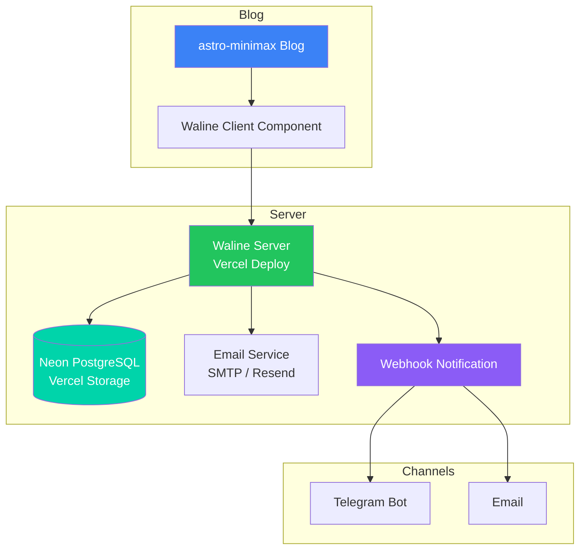
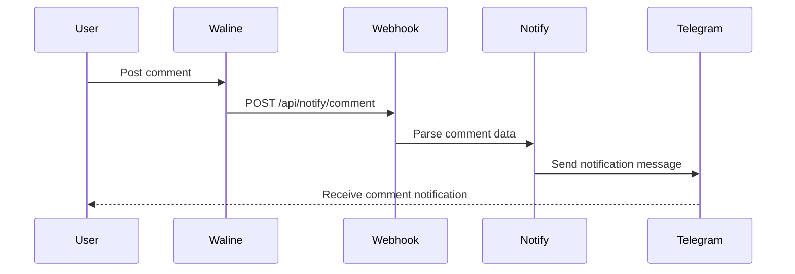

Waline is a simple, safe comment system with Markdown support, email notifications, and multi-language features. This guide walks you through deploying Waline on Vercel using Vercel's built-in Neon PostgreSQL database, then integrating it with your astro-minimax blog.

## Architecture Overview



The system consists of three components:

| Component | Description          | Recommendation                |
| --------- | -------------------- | ----------------------------- |
| Database  | Store comment data   | Vercel Neon PostgreSQL (Free) |
| Server    | Handle comment logic | Vercel (One-click deploy)     |
| Client    | Comment UI component | Built-in astro-minimax        |

## Prerequisites

Before starting, ensure you have:

- [ ] GitHub account (for Vercel login)
- [ ] A deployed astro-minimax blog
- [ ] Optional: SMTP service or Resend account for email notifications

## Step 1: Create Vercel Neon PostgreSQL Database

Vercel provides free Neon PostgreSQL database storage. No need to register for a third-party service - create it with one click.

### 1.1 Access Vercel Storage

1. Login to [Vercel Dashboard](https://vercel.com/dashboard)
2. Click **Storage** in the top navigation
3. Click **Create Database** button

### 1.2 Create Neon PostgreSQL Database

1. Select **Neon PostgreSQL** as database type
2. Enter database name, e.g., `waline-comments`
3. Select region (choose the closest to your users)
4. Click **Create** to create the database

> Neon free tier provides 512MB storage, which is sufficient for personal blog comment systems.

### 1.3 Initialize Database Schema

Waline requires a specific database schema. After creating the database, import the initialization SQL:

1. On the Vercel Storage page, click the newly created database
2. Click **Query** tab to enter query interface
3. Copy content from [waline.pgsql](https://github.com/walinejs/waline/blob/main/assets/waline.pgsql)
4. Paste into query editor and click **Run Query**

<details>
<summary>Click to view waline.pgsql full content</summary>

```sql
CREATE TABLE IF NOT EXISTS "Comment" (
  "id" INTEGER PRIMARY KEY AUTOINCREMENT,
  "user_id" VARCHAR(255),
  "nick" VARCHAR(255) NOT NULL,
  "mail" VARCHAR(255),
  "link" VARCHAR(255),
  "url" VARCHAR(255),
  "comment" TEXT NOT NULL,
  "ua" VARCHAR(255),
  "ip" VARCHAR(63),
  "is_spam" INTEGER DEFAULT 0,
  "parent" INTEGER,
  "status" VARCHAR(50) DEFAULT 'approved',
  "created_at" TIMESTAMP DEFAULT CURRENT_TIMESTAMP,
  "updated_at" TIMESTAMP DEFAULT CURRENT_TIMESTAMP
);

CREATE TABLE IF NOT EXISTS "Counter" (
  "id" INTEGER PRIMARY KEY AUTOINCREMENT,
  "url" VARCHAR(255) NOT NULL,
  "time" INTEGER DEFAULT 0
);

CREATE TABLE IF NOT EXISTS "Users" (
  "id" INTEGER PRIMARY KEY AUTOINCREMENT,
  "display_name" VARCHAR(255) NOT NULL,
  "email" VARCHAR(255),
  "url" VARCHAR(255),
  "token" VARCHAR(255),
  "avatar_url" VARCHAR(255),
  "password" VARCHAR(255),
  "label" VARCHAR(255),
  "github_id" VARCHAR(255),
  "twitter_id" VARCHAR(255),
  "facebook_id" VARCHAR(255),
  "google_id" VARCHAR(255),
  "weibo_id" VARCHAR(255),
  "qq_id" VARCHAR(255),
  "recieved" INTEGER DEFAULT 0,
  "created_at" TIMESTAMP DEFAULT CURRENT_TIMESTAMP,
  "updated_at" TIMESTAMP DEFAULT CURRENT_TIMESTAMP
);

CREATE INDEX IF NOT EXISTS "idx_comment_url" ON "Comment" ("url");
CREATE INDEX IF NOT EXISTS "idx_comment_user_id" ON "Comment" ("user_id");
CREATE INDEX IF NOT EXISTS "idx_counter_url" ON "Counter" ("url");
CREATE INDEX IF NOT EXISTS "idx_users_email" ON "Users" ("email");
```

</details>

### 1.4 Get Database Connection Info

On the database details page, click **Connect** tab to see connection info:

| Parameter | Description           |
| --------- | --------------------- |
| Host      | Database host address |
| Port      | Database port         |
| Database  | Database name         |
| User      | Database username     |
| Password  | Database password     |

> Vercel will automatically inject this information into environment variables. You can also manually copy for backup.

## Step 2: Deploy Waline to Vercel

### 2.1 One-Click Deploy

Click the button below to deploy on Vercel:

[](https://vercel.com/new/clone?repository-url=https://github.com/walinejs/waline/tree/main/example)

Deployment steps:

1. Click the button and login to Vercel with GitHub (if not logged in)
2. Enter project name and click `Create` to create the project
3. Wait 1-2 minutes until you see the celebration animation indicating successful deployment
4. Click `Go to Dashboard` to enter project console

### 2.2 Configure Environment Variables

Add the following environment variables in Vercel project settings:

| Variable Name | Value                         | Description                   |
| ------------- | ----------------------------- | ----------------------------- |
| `PG_HOST`     | Database host address         | Neon PostgreSQL host          |
| `PG_PORT`     | `5432`                        | PostgreSQL port               |
| `PG_DB`       | Database name                 | Neon PostgreSQL database      |
| `PG_USER`     | Database username             | Neon PostgreSQL user          |
| `PG_PASSWORD` | Database password             | Neon PostgreSQL password      |
| `PG_SSL`      | `true`                        | Enable SSL (required by Neon) |
| `SITE_URL`    | `https://your-blog.pages.dev` | Blog URL (optional)           |
| `SITE_TITLE`  | `My Blog`                     | Site name (optional)          |

> **Tip**: If the Waline project and Neon database are under the same Vercel account, you can directly link the database in project settings. Vercel will automatically inject `POSTGRES_*` environment variables. Waline supports both `PG_*` and `POSTGRES_*` prefixes.

Steps in Vercel Dashboard:

1. Project -> Settings -> Environment Variables
2. Add each variable above
3. Click "Save"

### 2.3 Complete Deployment

1. After configuring environment variables, click "Redeploy"
2. Wait for deployment to complete and get the Vercel assigned domain, e.g., `https://your-waline.vercel.app`
3. Visit the URL and see the Waline welcome page to confirm successful deployment

### 2.4 Bind Custom Domain (Optional)

If you have your own domain, you can bind it in Vercel:

1. Project -> Settings -> Domains
2. Enter your domain, e.g., `waline.yourdomain.com`
3. Add CNAME record in your DNS pointing to `cname.vercel-dns.com`
4. Wait for DNS to propagate

## Step 3: Configure Email Notifications (Optional)

Waline supports multiple email notification methods. Recommended: Resend or SMTP.

### Option 1: Resend (Recommended)

Resend provides free email sending service:

1. Register for [Resend](https://resend.com) account
2. Create API Key (format: `re_xxx`)
3. Verify your sender domain

Add environment variables in Vercel:

| Variable Name  | Value                    | Description           |
| -------------- | ------------------------ | --------------------- |
| `RESEND_TOKEN` | `re_xxx`                 | Resend API Key        |
| `SMTP_SERVICE` | `Resend`                 | Email service ID      |
| `SMTP_USER`    | `noreply@yourdomain.com` | Sender email          |
| `SMTP_PASS`    | Leave empty              | Not needed for Resend |

### Option 2: SMTP

Use Gmail, QQ Mail, or other SMTP services:

| Variable Name  | Value                | Description             |
| -------------- | -------------------- | ----------------------- |
| `SMTP_SERVICE` | `QQ` or `Gmail`      | Email service provider  |
| `SMTP_USER`    | `your@qq.com`        | SMTP username           |
| `SMTP_PASS`    | `authorization code` | SMTP password/auth code |

Common SMTP service identifiers:

| Provider | SMTP_SERVICE Value |
| -------- | ------------------ |
| Gmail    | `Gmail`            |
| QQ Mail  | `QQ`               |
| 163 Mail | `163`              |
| Aliyun   | `Aliyun`           |
| Outlook  | `Outlook`          |

> QQ Mail requires an authorization code instead of login password. Get it from QQ Mail Settings -> Account -> POP3/SMTP Service.

### Notification Template Configuration

Customize notification email content:

| Variable Name        | Description                |
| -------------------- | -------------------------- |
| `MAIL_SUBJECT`       | Email subject template     |
| `MAIL_TEMPLATE`      | Email body template        |
| `MAIL_SUBJECT_ADMIN` | Admin notification subject |

Template variables:

- `{{site.name}}` - Site name
- `{{site.url}}` - Site URL
- `{{post.title}}` - Post title
- `{{comment.author}}` - Commenter nickname
- `{{comment.content}}` - Comment content

## Step 4: Configure Webhook Notifications

Through Webhook, you can trigger notifications to Telegram or other channels when receiving comments. astro-minimax has a built-in Webhook endpoint.

### 4.1 Configure Waline Webhook

Add environment variable in Vercel's Waline project:

| Variable Name | Value                                            | Description                |
| ------------- | ------------------------------------------------ | -------------------------- |
| `WEBHOOK`     | `https://your-blog.pages.dev/api/notify/comment` | Blog notification endpoint |

### 4.2 Configure Blog Notifications

Configure notification channels in your blog's `.env` file or deployment platform:

```bash
# Telegram notification
NOTIFY_TELEGRAM_BOT_TOKEN=123456789:ABCdefGHIjklMNOpqrsTUVwxyz
NOTIFY_TELEGRAM_CHAT_ID=123456789

# Email notification (optional)
NOTIFY_RESEND_API_KEY=re_xxx
NOTIFY_RESEND_FROM=noreply@yourdomain.com
NOTIFY_RESEND_TO=you@example.com
```

For complete blog notification configuration, refer to [Notification System Configuration Guide](/en/posts/notification-guide).

### 4.3 Notification Flow



## Step 5: Integrate with Blog

Enabling Waline comments in astro-minimax is straightforward.

### 5.1 Enable Waline Feature

Edit `src/config.ts` and enable `waline` in `features`:

```typescript file=src/config.ts
features: {
  tags: true,
  categories: true,
  series: true,
  archives: true,
  friends: true,
  projects: true,
  search: true,
  darkMode: true,
  ai: true,
  waline: true,    // Enable Waline comments
  sponsor: true,
},
```

### 5.2 Configure Waline Parameters

Configure the `waline` object in `src/config.ts`:

```typescript file=src/config.ts
waline: {
  enabled: true,
  serverURL: "https://your-waline.vercel.app/",  // Your Waline server URL
  emoji: [
    "https://unpkg.com/@waline/emojis@1.2.0/weibo",
    "https://unpkg.com/@waline/emojis@1.2.0/bilibili",
    "https://unpkg.com/@waline/emojis@1.2.0/tieba",
  ],
  lang: "en-US",
  pageview: true,
  reaction: true,
  login: "enable",
  wordLimit: [0, 1000],
  imageUploader: false,
  requiredMeta: ["nick", "mail"],
  copyright: true,
  recaptchaV3Key: "",
  turnstileKey: "",
},
```

### 5.3 Configuration Parameters

| Parameter        | Type             | Default            | Description                     |
| ---------------- | ---------------- | ------------------ | ------------------------------- |
| `enabled`        | boolean          | `false`            | Enable comment system           |
| `serverURL`      | string           | -                  | Waline server URL, **required** |
| `emoji`          | string[]         | -                  | Emoji CDN URL array             |
| `lang`           | string           | `"en-US"`          | Interface language              |
| `pageview`       | boolean          | `true`             | Show article view count         |
| `reaction`       | boolean          | `true`             | Enable article reaction feature |
| `login`          | string           | `"enable"`         | Login mode                      |
| `wordLimit`      | [number, number] | `[0, 1000]`        | Comment word limit [min, max]   |
| `imageUploader`  | boolean          | `false`            | Allow image upload              |
| `requiredMeta`   | string[]         | `["nick", "mail"]` | Required fields                 |
| `copyright`      | boolean          | `true`             | Show Waline copyright           |
| `recaptchaV3Key` | string           | -                  | Google reCAPTCHA v3 key         |
| `turnstileKey`   | string           | -                  | Cloudflare Turnstile key        |

### 5.4 Login Mode

The `login` parameter controls comment login behavior:

| Value       | Description                        |
| ----------- | ---------------------------------- |
| `"enable"`  | Allow guest and logged-in comments |
| `"disable"` | Disable login, guest comments only |
| `"force"`   | Require login to comment           |

### 5.5 CAPTCHA Configuration (Optional)

To prevent spam comments, configure human verification:

**Google reCAPTCHA v3:**

1. Visit [Google reCAPTCHA](https://www.google.com/recaptcha/admin)
2. Create v3 key pair
3. Configure `RECAPTCHAV3_SECRET` environment variable on server
4. Configure `recaptchaV3Key` on client

**Cloudflare Turnstile:**

1. Visit [Cloudflare Turnstile](https://dash.cloudflare.com/?to=/:account/turnstile)
2. Create site key
3. Configure `TURNSTILE_SECRET` environment variable on server
4. Configure `turnstileKey` on client

## Step 6: Test Comment System

### 6.1 Local Test

```bash
pnpm run dev
```

Visit any article page and check if the comment section displays correctly.

### 6.2 Feature Checklist

- [ ] Comment section loads correctly
- [ ] Can post comments
- [ ] Comments display in real-time
- [ ] Emojis load correctly
- [ ] Email notifications sent (if configured)
- [ ] Webhook notifications triggered (if configured)
- [ ] Page view statistics display

### 6.3 Manage Comments

Waline provides an admin dashboard:

1. Visit `https://your-waline.vercel.app/ui`
2. First visit requires registering an admin account (first registered user becomes admin automatically)
3. You can review, edit, and delete comments in the dashboard

## Troubleshooting

### Comment Loading Failed

**Issue**: Comment section shows "Loading failed" or blank.

**Troubleshooting**:

1. Check if `serverURL` is correct, ensure it ends with `/`
2. Check if `SECURE_DOMAINS` includes your blog URL
3. Open browser developer tools to check network request errors

### Comment Submission Failed

**Issue**: No response or error after posting comment.

**Troubleshooting**:

1. Check if PostgreSQL environment variables are configured correctly
2. Check if `PG_SSL` is set to `true` (required by Neon)
3. Check Vercel logs for error messages
4. Confirm database schema is initialized

### Email Notifications Not Sending

**Issue**: Comments received but no email notification.

**Troubleshooting**:

1. Check email configuration in Vercel environment variables
2. Check if Resend domain is verified
3. Check email sending errors in Vercel function logs

### Webhook Notifications Not Triggering

**Issue**: Blog notification system not receiving notifications after comments.

**Troubleshooting**:

1. Confirm `WEBHOOK` environment variable is configured in Vercel
2. Check blog notification system environment variables
3. Test if Webhook endpoint is accessible:

```bash
curl -X POST https://your-blog.pages.dev/api/notify/comment \
  -H "Content-Type: application/json" \
  -d '{"type":"comment","data":{"nick":"test","comment":"test"}}'
```

### PostgreSQL Connection Failed

**Issue**: Error "Connection refused" or "SSL connection required".

**Solution**:

1. Confirm `PG_SSL` is set to `true` (Neon requires SSL connection)
2. Check if database host address and port are correct
3. Confirm database is not suspended (Neon free tier suspends after idle, auto-wakes on access)

### Neon Database Suspended

**Issue**: Slow response on first comment.

**Solution**:

Neon free tier databases auto-suspend after idle and need to wake up on first access. You can:

1. Set up external cron job to periodically ping the database
2. Upgrade to Neon Pro plan for continuous operation

### CORS Issues

**Issue**: Console shows CORS-related errors.

**Solution**:

1. Configure `SECURE_DOMAINS` environment variable to add blog domain
2. Ensure Waline server `SITE_URL` is configured correctly
3. If using custom domain, ensure HTTPS is configured correctly

## Advanced Configuration

### Multi-language Support

Waline has built-in multi-language support via `lang` parameter:

```typescript
lang: "zh-CN",  // Simplified Chinese
lang: "zh-TW",  // Traditional Chinese
lang: "en-US",  // English
lang: "ja-JP",  // Japanese
```

### Custom Styles

Waline supports custom styles via CSS variables. Add to global styles:

```css
:root {
  --waline-font-size: 1rem;
  --waline-theme-color: #3b82f6;
  --waline-active-color: #2563eb;
  --waline-bgcolor: #fff;
  --waline-bgcolor-light: #f8fafc;
}
```

### Image Upload

Enable image upload feature:

```typescript
imageUploader: true,
```

> Requires configuring storage service on server (e.g., Vercel Blob, S3, etc.).

### Sensitive Word Filtering

Configure sensitive word filtering on server:

| Variable Name     | Value         | Description               |
| ----------------- | ------------- | ------------------------- |
| `FORBIDDEN_WORDS` | `word1,word2` | Comma-separated word list |

## Other Database Options

Besides Vercel Neon PostgreSQL, Waline supports multiple databases:

| Database   | Variable Prefix | Notes                                        |
| ---------- | --------------- | -------------------------------------------- |
| PostgreSQL | `PG_`           | Recommended: Vercel Neon, free and one-click |
| LeanCloud  | `LEAN_`         | Good free tier, suitable for China access    |
| MySQL      | `MYSQL_`        | Traditional relational database              |
| MongoDB    | `MONGO_`        | Document database                            |
| SQLite     | `SQLITE_`       | Lightweight, suitable for low traffic        |

For other databases, refer to [Waline Documentation](https://waline.js.org/guide/database/).

## Next Steps

- [Theme Configuration Guide](/en/posts/how-to-configure-astro-minimax-theme) — Learn more configuration options
- [Notification System Configuration](/en/posts/notification-guide) — Complete notification system setup
- [Deployment Guide](/en/posts/deployment-guide) — Deploy blog to production

---

By following these steps, you have successfully deployed and integrated the Waline comment system. Waline is feature-rich and easy to deploy, making it an ideal comment solution for personal blogs. If you have questions, visit [Waline GitHub Issues](https://github.com/walinejs/waline/issues) for help.
