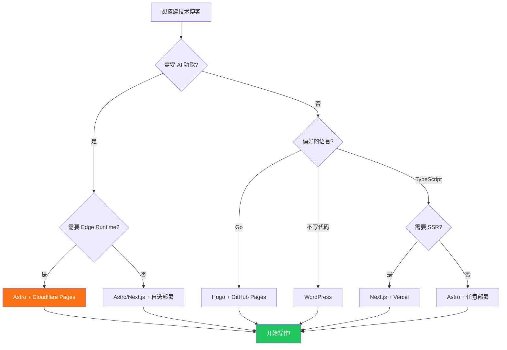

构建个人技术博客看似简单，实际涉及 10+ 个技术决策。本文穷举式地梳理 2026 年博客生态的每个能力域，帮你做出知情的选择。

```markmap
# 2026 博客生态全景
## 🏗️ 框架选型 — 决定技术基础和开发体验
### SSG（静态生成）— 构建时渲染，部署纯静态文件
#### Astro — 岛屿架构零 JS，多框架混用，最适合内容站
#### Hugo — Go 编写毫秒级构建，单二进制无依赖
#### Hexo — 中文插件生态最丰富，上手快但扩展性有限
### 全栈框架 — 前后端一体，支持 SSR 和 API
#### Next.js — React 生态标配，Vercel 深度集成
#### Nuxt — Vue 开发者首选，约定式路由
### 文档框架 — 专为技术文档优化
#### VitePress — 极快的 Vue 文档站，适合单项目文档
#### Starlight — Astro 驱动，适合多语言文档集
## 📝 内容管理
### 文件系统 (Git-based)
#### Markdown/MDX
#### 离线编辑（VS Code/Obsidian）
#### 版本控制（Git）
### Headless CMS
#### Strapi（自托管）
#### Sanity（云托管）
#### Contentful（企业级）
### 传统 CMS
#### WordPress — 最大生态
#### Ghost — 现代 CMS
## 🎨 样式系统
### Tailwind CSS — 原子化
### UnoCSS — 按需生成
### CSS Modules — 组件作用域
### vanilla CSS — 零依赖
## 🔍 搜索方案
### 静态搜索
#### Pagefind — 零成本 WASM
#### FlexSearch — 内存搜索
### 云搜索
#### Algolia DocSearch — 毫秒响应
#### Meilisearch — 自托管
### AI 搜索
#### RAG — 意图理解
#### 语义搜索 — Embedding 向量
## 💬 评论系统
### 自托管
#### Waline — 中文友好
#### Twikoo — 轻量
#### Artalk — SQLite
### GitHub 集成
#### Giscus — Discussions
#### Utterances — Issues
### 云服务
#### Disqus — 最大平台
## 🤖 AI 集成
### 对话式
#### RAG 聊天 — 基于博客内容回答
#### 边读边聊 — 文章上下文感知
### 内容生成
#### 摘要生成 — LLM API
#### SEO 优化 — 元数据生成
#### 翻译 — 多语言互译
#### 标签建议 — 关键词提取
#### 封面生成 — DALL-E/SD
### 质量保障
#### 来源分层 — 防幻觉
#### 隐私保护 — 拒绝敏感信息
#### 评估系统 — 黄金测试集
### Provider
#### Cloudflare Workers AI（免费边缘）
#### OpenAI / DeepSeek / Moonshot
#### 本地模型 (Ollama)
## 📊 分析统计
### 隐私友好
#### Umami — 无 Cookie
#### Plausible — 简洁合规
#### Cloudflare Analytics — 零 JS
### 传统方案
#### Google Analytics — 功能最全
#### PostHog — 产品分析
## 🔔 通知系统
### 即时通讯
#### Telegram Bot — 移动实时
#### Discord Webhook
#### 飞书/钉钉 Webhook
### 邮件
#### Resend — 开发者友好
#### Mailgun / SendGrid
### 通用
#### Webhook — 对接任何系统
## 🚀 部署运维
### 边缘部署
#### Cloudflare Pages — AI + CDN
#### Vercel — Next.js 最佳
#### Netlify — 易用
### 静态托管
#### GitHub Pages — 零成本
#### 阿里云 OSS + CDN
### 容器化
#### Docker + Nginx
#### Railway / Fly.io
## 🛠️ 开发工具
### CLI 工具链
#### 项目脚手架
#### AI 内容处理
#### 质量评估
### 代码增强
#### 语法高亮 (Shiki)
#### 数学公式 (KaTeX)
#### 图表 (Mermaid)
#### 思维导图 (Markmap)
### SEO 工具
#### 动态 OG 图片
#### sitemap.xml
#### robots.txt
#### RSS Feed
## 📢 运营推广
### 搜索引擎
#### Google Search Console
#### Bing Webmaster
### 社交分享
#### Twitter/X
#### 微信公众号
#### LinkedIn
### 订阅分发
#### RSS
#### Newsletter (Resend)
```

## Table of contents

## 一、框架选型

框架决定了博客的技术基础。2026 年的主流选择：

### 静态站点生成器 (SSG)

| 框架 | 语言 | 特点 | 适合人群 |
|------|------|------|----------|
| **Astro** | TypeScript | 岛屿架构、零 JS、多框架组件 | 追求性能的前端开发者 |
| **Hugo** | Go | 极快构建速度、单二进制 | 不想写 JS 的人 |
| **Next.js** | TypeScript | 全栈、ISR、App Router | React 全栈开发者 |
| **Nuxt** | TypeScript | Vue 生态、自动路由 | Vue 开发者 |
| **Gatsby** | TypeScript | GraphQL 数据层 | 数据密集型站点 |
| **VitePress** | TypeScript | Vue 驱动、极简 | 技术文档 |
| **Hexo** | JavaScript | 丰富插件生态 | 快速启动 |
| **Jekyll** | Ruby | GitHub Pages 原生支持 | Ruby 用户 |
| **Eleventy** | JavaScript | 零配置、多模板引擎 | 简约主义者 |

**选型建议**：

- 要极致性能 → Astro 或 Hugo
- 要全栈能力（SSR + API） → Next.js 或 Nuxt
- 要中文生态和插件 → Hexo
- 要零依赖 → Hugo

**原理**：SSG 在构建时将 Markdown 转为 HTML，部署的是纯静态文件。优势是速度快、安全、成本低。

### 运行原理

```
Markdown 文件 → 构建器解析 frontmatter → 模板引擎渲染 → HTML/CSS/JS → CDN 分发
```

## 二、内容管理

### 文件系统（Git-based）

内容以 Markdown/MDX 文件存储在 Git 仓库中。

- **优势**：版本控制、离线编辑、无数据库
- **劣势**：非技术用户上手门槛高
- **工具**：VS Code、Obsidian、Typora

### Headless CMS

通过 API 提供内容，前端自由渲染。

| CMS | 类型 | 特点 | 费用 |
|-----|------|------|------|
| **Strapi** | 自托管 | 开源、定制性强 | 免费（需服务器） |
| **Sanity** | 云托管 | 实时协作、GROQ 查询 | 免费层 |
| **Contentful** | 云托管 | 企业级、CDN | 免费层 |
| **Notion** | 笔记工具 | 编辑体验好 | 免费 |
| **WordPress** | 自托管 | 最大生态 | 免费（需服务器） |

**选型建议**：

- 独立开发者 → Git-based（Markdown 文件）
- 多人协作 → Headless CMS
- 非技术博主 → WordPress 或 Notion

## 三、样式系统

| 方案 | 特点 | 适合 |
|------|------|------|
| **Tailwind CSS** | 原子化 CSS、无需写自定义样式 | 快速开发 |
| **CSS Modules** | 组件级作用域 | React/Vue 项目 |
| **UnoCSS** | 按需生成、兼容 Tailwind 语法 | 追求极致体积 |
| **Sass/SCSS** | 变量、嵌套、Mixin | 传统前端 |
| **vanilla CSS** | 无依赖 | 简约项目 |

**2026 趋势**：Tailwind v4 已成为主流选择，原生支持 CSS 变量和深色模式。

## 四、搜索方案

### 静态搜索

| 方案 | 原理 | 优势 | 劣势 |
|------|------|------|------|
| **Pagefind** | 构建时生成 WASM 索引 | 零成本、离线工作 | 需要构建 |
| **FlexSearch** | 内存中全文搜索 | 快速、轻量 | 大数据集性能下降 |
| **Lunr.js** | 预构建倒排索引 | 成熟稳定 | 中文支持弱 |

### 云搜索

| 方案 | 原理 | 优势 | 劣势 |
|------|------|------|------|
| **Algolia DocSearch** | 云端索引+API | 毫秒响应、自动补全 | 需要申请 |
| **Meilisearch** | 自托管搜索引擎 | 开源、中文友好 | 需要服务器 |
| **Elasticsearch** | 分布式搜索 | 功能最强 | 运维成本高 |

### AI 搜索

| 方案 | 原理 | 优势 | 劣势 |
|------|------|------|------|
| **RAG（检索增强生成）** | TF-IDF/Embedding + LLM | 理解用户意图 | 需要 AI API |
| **语义搜索** | Embedding 向量相似度 | 精准匹配概念 | 需要向量数据库 |

**选型建议**：
- 零成本方案 → Pagefind
- 最佳体验 → Algolia DocSearch
- AI 对话式搜索 → RAG（astro-minimax 内置）

## 五、评论系统

| 方案 | 类型 | 数据存储 | 费用 | 特点 |
|------|------|----------|------|------|
| **Waline** | 自托管 | Vercel/Railway + LeanCloud | 免费 | 中文友好、Markdown 支持 |
| **Giscus** | GitHub | GitHub Discussions | 免费 | 无需后端，需 GitHub 账号 |
| **Utterances** | GitHub | GitHub Issues | 免费 | 轻量，需 GitHub 账号 |
| **Disqus** | 云托管 | Disqus 服务器 | 免费/付费 | 最大平台，有广告 |
| **Twikoo** | 自托管 | MongoDB/CloudBase | 免费 | 中文友好 |
| **Artalk** | 自托管 | SQLite/MySQL | 免费 | 轻量、自部署 |

**选型建议**：
- 中文博客 → Waline 或 Twikoo
- GitHub 用户群体 → Giscus
- 零运维 → Giscus（纯 GitHub）

## 六、AI 集成

### 2026 年博客 AI 能力全景

| 能力 | 说明 | 实现方式 |
|------|------|----------|
| **AI 聊天** | 读者与博客内容对话 | RAG + LLM + 流式响应 |
| **内容摘要** | 自动生成文章摘要 | LLM API 调用 |
| **SEO 优化** | 生成 meta description、keywords | LLM API 调用 |
| **翻译** | 多语言文章互译 | LLM 翻译 |
| **标签建议** | 自动推荐文章标签 | NLP + 关键词提取 |
| **封面生成** | AI 生成文章封面图 | DALL-E / Stable Diffusion |
| **向量搜索** | 语义级全文检索 | Embedding + 相似度 |
| **写作辅助** | 大纲生成、校对 | LLM 集成到编辑器 |
| **作者画像** | 分析写作风格、生成简介 | 文本分析 + LLM |

### AI Provider 选择

| Provider | 类型 | 延迟 | 费用 | 特点 |
|----------|------|------|------|------|
| **Cloudflare Workers AI** | Edge | ~200ms | 免费层 | 全球边缘运行 |
| **OpenAI** | Cloud | ~500ms | 按量付费 | 最强模型 |
| **DeepSeek** | Cloud | ~300ms | 低价 | 中文优化 |
| **Moonshot** | Cloud | ~400ms | 低价 | 长上下文 |
| **Qwen** | Cloud | ~300ms | 低价 | 阿里云生态 |
| **本地模型 (Ollama)** | Local | ~1s | 免费 | 完全隐私 |

### 防幻觉措施

| 措施 | 说明 |
|------|------|
| **RAG 检索增强** | 只基于真实内容回答 |
| **来源分层协议** | L1-L5 优先级约束 |
| **Citation Guard** | 移除虚假链接 |
| **隐私保护** | 拒绝回答敏感信息 |
| **Mock 降级** | API 不可用时的预设回复 |

## 七、分析统计

| 方案 | 隐私 | 费用 | 特点 |
|------|------|------|------|
| **Umami** | 高（无 Cookie） | 免费 | 自托管、GDPR 合规 |
| **Plausible** | 高（无 Cookie） | 付费/自托管 | 简洁、隐私友好 |
| **Google Analytics** | 低 | 免费 | 功能最全、隐私争议 |
| **Cloudflare Web Analytics** | 高 | 免费 | 零 JS、CDN 级别 |
| **Fathom** | 高 | 付费 | 简洁、合规 |
| **PostHog** | 中 | 免费层 | 产品分析、A/B 测试 |

**2026 趋势**：隐私友好方案（Umami、Plausible）成为技术博客标配。

## 八、通知系统

| 渠道 | 适合场景 | 实时性 |
|------|----------|--------|
| **Telegram Bot** | 移动端实时通知 | 即时 |
| **Email (Resend)** | 存档、正式通知 | 分钟级 |
| **Webhook** | 对接企业工具（Slack、飞书） | 即时 |
| **RSS** | 订阅者被动接收 | 小时级 |
| **Web Push** | 浏览器推送 | 即时 |

## 九、部署方案

| 平台 | 费用 | Edge Runtime | 特点 |
|------|------|-------------|------|
| **Cloudflare Pages** | 免费 | Workers AI | 全球 CDN、AI 集成 |
| **Vercel** | 免费层 | Edge Functions | Next.js 最佳 |
| **Netlify** | 免费层 | Edge Functions | 易用 |
| **GitHub Pages** | 免费 | 无 | 纯静态 |
| **Railway** | 按量 | 无 | 简单部署 |
| **Docker + VPS** | VPS 费用 | 无 | 完全控制 |
| **阿里云/腾讯云 OSS** | 极低 | 无 | 国内加速 |

**选型建议**：
- 有 AI 功能 → Cloudflare Pages（免费 Workers AI）
- 纯静态 → GitHub Pages（零成本）
- 国内用户 → 阿里云 OSS + CDN

## 十、运营工具

| 工具 | 用途 |
|------|------|
| **Google Search Console** | 搜索引擎收录监控 |
| **Bing Webmaster** | Bing 搜索收录 |
| **Ahrefs/SEMrush** | SEO 分析（付费） |
| **RSS Feed** | 内容分发 |
| **社交分享** | Twitter/X、微信、LinkedIn |
| **Newsletter** | 邮件订阅（Resend、Mailchimp） |

## 选型决策流程



## 快速决策清单

如果你想快速做决定，这是 2026 年的推荐组合：

### 最简方案（零成本）

```
Hugo/Astro + Markdown + Pagefind + Giscus + GitHub Pages
```

### 推荐方案（低成本、功能丰富）

```
Astro + Markdown + Pagefind + Waline + Umami + Cloudflare Pages
```

### 全功能方案（astro-minimax 的选择）

```
Astro 6 + Markdown/MDX + Pagefind + DocSearch
+ Waline + Umami + Mermaid + Markmap
+ AI Chat (RAG + Workers AI + OpenAI)
+ Telegram/Email/Webhook 通知
+ Cloudflare Pages
```

---

技术博客生态在 2026 年已经非常成熟。选择适合自己的工具组合，把时间花在写作上，而不是折腾工具。

如果你想要一个开箱即用、功能丰富、可无限扩展的方案，[astro-minimax](https://github.com/souloss/astro-minimax) 可能是一个好选择。
