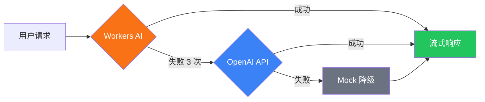

astro-minimax 内置 AI 聊天助手，支持多 Provider 自动故障转移、RAG 检索增强、流式响应和 Mock 降级。本文介绍完整的 AI 配置流程。

## Table of contents

## 概览

AI 聊天系统由以下模块组成：

| 模块 | 说明 |
|------|------|
| `@astro-minimax/ai` | AI 核心包：RAG 管线、Provider 管理、聊天 UI |
| `@astro-minimax/cli` | CLI 工具：AI 内容处理、作者画像构建、质量评估 |
| `@astro-minimax/notify` | 通知系统：AI 对话实时通知到 Telegram/Email/Webhook |

## 快速启用

### 1. 启用 AI 功能

在 `src/config.ts` 中：

```typescript
features: {
  ai: true,
},
ai: {
  enabled: true,
  mockMode: false,
  apiEndpoint: "/api/chat",
},
```

### 2. 配置 Provider

在 `.env` 中配置 AI Provider：

```bash
# OpenAI 兼容 API（支持 DeepSeek、Moonshot、Qwen 等）
AI_BASE_URL=https://api.openai.com/v1
AI_API_KEY=your-api-key
AI_MODEL=gpt-4o-mini

# 站点信息
SITE_AUTHOR=YourName
SITE_URL=https://your-blog.com
```

### 3. 构建 AI 数据

```bash
astro-minimax ai process       # 生成文章摘要和 SEO 数据
astro-minimax profile build     # 构建作者画像
```

### 4. 启动开发服务器

```bash
pnpm run dev
```

AI 聊天按钮会出现在页面右下角。

## Provider 配置详解

### Cloudflare Workers AI

在 Cloudflare Pages 部署时，可使用免费的 Workers AI：

```toml
# wrangler.toml
[ai]
binding = "AI"
```

Workers AI 作为最高优先级 Provider，不需要 API Key。

### OpenAI 兼容 API

支持任何 OpenAI 兼容的 API 服务：

```bash
AI_BASE_URL=https://api.openai.com/v1
AI_API_KEY=sk-xxx
AI_MODEL=gpt-4o-mini
```

也可以配置不同模型用于不同任务：

```bash
AI_KEYWORD_MODEL=gpt-4o-mini    # 关键词提取模型
AI_EVIDENCE_MODEL=gpt-4o-mini   # 证据分析模型
```

### 故障转移机制



- 连续失败 3 次标记为不健康
- 60 秒后自动尝试恢复
- 所有 Provider 失败时，Mock 保证用户始终收到回复

## Mock 模式

开发时不需要真实 API：

```typescript
ai: {
  enabled: true,
  mockMode: true,  // 开发环境
},
```

Mock 模式返回预定义的文章推荐和外部资源链接，模拟真实 AI 回复。

## AI 安全特性

### 来源分层协议

AI 回答遵循 L1-L5 来源优先级：

- **L1**: 博客原始内容（最高优先级）
- **L2**: 作者简介、项目列表
- **L3**: 结构化事实数据
- **L5**: 语言风格（仅影响表达）

### 隐私保护

自动拒绝回答敏感个人信息：

- 住址、收入、家庭成员、电话、身份信息、年龄

### 意图分类

7 类意图识别，提升搜索相关性：

- setup、config、content、feature、deployment、troubleshooting、general

## 质量评估

### 配置测试集

编辑 `datas/eval/gold-set.json` 定义测试用例：

```json
{
  "cases": [
    {
      "id": "about-001",
      "category": "about",
      "question": "介绍一下你自己",
      "answerMode": "fact",
      "expectedTopics": ["博客", "AI"],
      "forbiddenClaims": [],
      "lang": "zh"
    }
  ]
}
```

### 运行评估

```bash
pnpm run ai:eval                             # 本地测试
pnpm run ai:eval -- --url=https://your.com   # 远程测试
pnpm run ai:eval -- --verbose                # 详细输出
```

## 通知集成

AI 对话完成后自动发送通知（fire-and-forget）：

```bash
# .env
NOTIFY_TELEGRAM_BOT_TOKEN=your-bot-token
NOTIFY_TELEGRAM_CHAT_ID=your-chat-id
```

通知内容包含：用户问题、AI 回答摘要、引用文章、Token 用量、各阶段耗时。

详见 [通知系统配置指南](/zh/posts/notification-guide)。

## 环境变量参考

| 变量 | 说明 | 必需 |
|------|------|------|
| `AI_BASE_URL` | OpenAI 兼容 API 地址 | 使用 OpenAI 时必需 |
| `AI_API_KEY` | API 密钥 | 使用 OpenAI 时必需 |
| `AI_MODEL` | 主对话模型 | 否（默认 `gpt-4o-mini`） |
| `AI_KEYWORD_MODEL` | 关键词提取模型 | 否（同主模型） |
| `AI_EVIDENCE_MODEL` | 证据分析模型 | 否（同关键词模型） |
| `SITE_AUTHOR` | 作者名称 | 否 |
| `SITE_URL` | 站点 URL | 否 |

## 下一步

- [功能特性总览](/zh/posts/feature-overview) — 了解所有 AI 功能
- [CLI 工具指南](/zh/posts/cli-guide) — AI 处理命令详解
- [通知系统](/zh/posts/notification-guide) — 配置 AI 对话通知
- [部署指南](/zh/posts/deployment-guide) — Cloudflare Workers AI 部署
