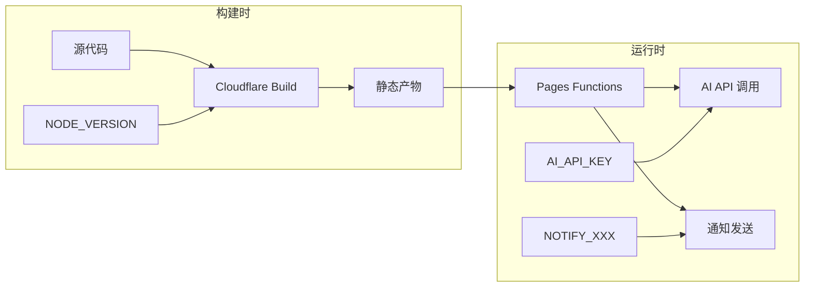

astro-minimax 博客在 Cloudflare Pages 部署时，需要正确配置环境变量才能启用完整功能。本文详细介绍环境变量的作用、配置方法和最佳实践。

## 概览

环境变量在 Cloudflare Pages 中有两个作用时机：

| 时机       | 说明                         | 典型用途               |
| ---------- | ---------------------------- | ---------------------- |
| **构建时** | 执行 `pnpm run build` 时可用 | Node.js 版本、构建参数 |
| **运行时** | 页面访问和 API 调用时可用    | API 密钥、功能开关     |

### 为什么需要环境变量

- **安全性**：敏感信息（API 密钥、Token）不应硬编码在代码中
- **灵活性**：同一套代码可部署到不同环境（开发/生产）
- **可维护性**：配置集中管理，修改无需改代码



---

## 访问环境变量设置

在 Cloudflare Dashboard 中配置环境变量：

**导航路径**：

```
Cloudflare Dashboard → Workers & Pages → [your-project] → Settings → Environment variables
```

### 操作步骤

1. 登录 [Cloudflare Dashboard](https://dash.cloudflare.com/)
2. 在左侧导航栏点击 **Workers & Pages**
3. 点击你的项目名称进入项目详情
4. 点击 **Settings** 标签页
5. 在侧边栏找到 **Environment variables**
6. 点击 **Add variables** 添加新变量

---

## 必需变量

以下环境变量是 astro-minimax 正常运行所必需的：

### 构建配置

| 变量名         | 值   | 说明                                       |
| -------------- | ---- | ------------------------------------------ |
| `NODE_VERSION` | `22` | Node.js 版本，确保构建时使用正确的 Node.js |

> [!IMPORTANT]
> `NODE_VERSION=22` 是必需的。使用较低版本可能导致构建失败。

### AI Binding 配置

| 变量名            | 值          | 说明                                             |
| ----------------- | ----------- | ------------------------------------------------ |
| `AI_BINDING_NAME` | `minimaxAI` | AI Binding 名称，与 `wrangler.toml` 中的配置对应 |

如果启用了 AI 功能并使用 Cloudflare Workers AI，需要配置此变量。

---

## 可选变量

根据需要启用的功能，配置相应的环境变量：

### 通知系统 - Telegram

配置后可在收到评论或 AI 对话时推送通知到 Telegram。

| 变量名                      | 示例值                | 说明                                     |
| --------------------------- | --------------------- | ---------------------------------------- |
| `NOTIFY_TELEGRAM_BOT_TOKEN` | `123456789:ABCdef...` | Telegram Bot Token，从 @BotFather 获取   |
| `NOTIFY_TELEGRAM_CHAT_ID`   | `123456789`           | 接收通知的 Chat ID，从 @userinfobot 获取 |

### 通知系统 - Email (Resend)

配置后可通过邮件接收通知。

| 变量名                  | 示例值                   | 说明               |
| ----------------------- | ------------------------ | ------------------ |
| `NOTIFY_RESEND_API_KEY` | `re_xxx`                 | Resend API Key     |
| `NOTIFY_RESEND_FROM`    | `noreply@yourdomain.com` | 发件人邮箱地址     |
| `NOTIFY_RESEND_TO`      | `you@example.com`        | 接收通知的邮箱地址 |

### 通知系统 - Webhook

配置后可向自定义 URL 发送通知。

| 变量名               | 示例值                            | 说明             |
| -------------------- | --------------------------------- | ---------------- |
| `NOTIFY_WEBHOOK_URL` | `https://your-webhook.com/notify` | Webhook 接收地址 |

### AI 提供商配置（非 Cloudflare Workers AI）

当不使用 Cloudflare Workers AI，而使用 OpenAI 或其他兼容 API 时配置：

| 变量名        | 示例值                      | 说明           |
| ------------- | --------------------------- | -------------- |
| `AI_API_KEY`  | `sk-xxx`                    | API 密钥       |
| `AI_BASE_URL` | `https://api.openai.com/v1` | API 基础 URL   |
| `AI_MODEL`    | `gpt-4o-mini`               | 使用的模型名称 |

支持的 OpenAI 兼容服务：

- OpenAI
- DeepSeek
- Moonshot (月之暗面)
- 通义千问 (Qwen)
- 其他 OpenAI 兼容 API

### 站点配置

| 变量名        | 示例值                  | 说明         |
| ------------- | ----------------------- | ------------ |
| `SITE_URL`    | `https://your-blog.com` | 站点完整 URL |
| `SITE_AUTHOR` | `YourName`              | 作者名称     |

---

## 添加环境变量步骤

### 步骤一：进入设置页面

按照「访问环境变量设置」章节的导航路径，进入项目的 Environment variables 页面。

### 步骤二：添加变量

1. 点击 **Add variables** 按钮
2. 在输入框中填写变量名和值

**批量添加方式**：

```
NODE_VERSION=22
AI_BINDING_NAME=minimaxAI
NOTIFY_TELEGRAM_BOT_TOKEN=your-bot-token
```

可以直接粘贴多行，每行一个变量。

### 步骤三：选择环境

Cloudflare Pages 有两种环境：

| 环境           | 说明                      | 推荐设置         |
| -------------- | ------------------------- | ---------------- |
| **Production** | 生产环境                  | 所有变量         |
| **Preview**    | 预览环境（PR 构建时使用） | 可选，仅必需变量 |

勾选 **Production**，如需要预览环境也生效，同时勾选 **Preview**。

### 步骤四：保存并重新部署

1. 点击 **Save** 保存变量
2. 返回项目首页
3. 点击 **View details** → **Deployments**
4. 点击最新部署右侧的 **Retry** 按钮重新部署

> [!TIP]
> 环境变量修改后需要重新部署才能生效。

---

## AI Binding 配置

### wrangler.toml 配置

项目已包含 `apps/blog/wrangler.toml` 文件：

```toml
name = "astro-minimax"
pages_build_output_dir = "dist"
compatibility_date = "2026-03-12"
compatibility_flags = ["nodejs_compat"]

[ai]
binding = "minimaxAI"

[[kv_namespaces]]
binding = "CACHE_KV"
id = "your-kv-namespace-id"
```

### 关键配置说明

| 配置项                   | 说明                                                 |
| ------------------------ | ---------------------------------------------------- |
| `name`                   | 项目名称                                             |
| `pages_build_output_dir` | 构建输出目录                                         |
| `compatibility_flags`    | 启用 Node.js 兼容模式                                |
| `[ai]`                   | Workers AI Binding 配置                              |
| `binding`                | AI Binding 名称，需与环境变量 `AI_BINDING_NAME` 一致 |

### 验证 AI Binding

部署成功后，在 Cloudflare Dashboard 查看：

```
Workers & Pages → [your-project] → Settings → Functions → Workers AI
```

确认 Workers AI 绑定显示为 `minimaxAI`。

---

## KV Namespace 配置（可选）

如果需要使用 Cloudflare KV 存储功能，需要配置 KV Namespace：

### 创建 KV Namespace

1. 进入 Cloudflare Dashboard
2. 点击 **Workers & Pages** → **KV**
3. 点击 **Create a namespace**
4. 输入名称（如 `blog-cache`）
5. 点击 **Add**

### 绑定到项目

在 `wrangler.toml` 中添加：

```toml
[[kv_namespaces]]
binding = "CACHE_KV"
id = "your-kv-namespace-id"
```

将 `your-kv-namespace-id` 替换为实际创建的 KV Namespace ID。

### 获取 KV Namespace ID

```
Cloudflare Dashboard → Workers & Pages → KV → [your-namespace] → 复制 ID
```

---

## 安全最佳实践

### 密钥管理原则

| 原则           | 说明                           |
| -------------- | ------------------------------ |
| **最小权限**   | 只配置必需的变量               |
| **定期轮换**   | 定期更新 API 密钥              |
| **禁止硬编码** | 敏感信息不要写入代码           |
| **禁止提交**   | `.env` 文件添加到 `.gitignore` |

### 环境变量加密

Cloudflare 会加密存储所有环境变量值。但请注意：

- 不要在日志中打印环境变量值
- 不要在客户端代码中暴露环境变量
- 使用 `.env.example` 文件记录需要的变量（不含实际值）

### 本地开发

创建 `.env` 文件（已自动添加到 `.gitignore`）：

```bash
# .env 示例
NODE_VERSION=22

# AI 配置（开发时可使用 Mock 模式）
AI_BINDING_NAME=minimaxAI

# 通知配置（可选）
NOTIFY_TELEGRAM_BOT_TOKEN=
NOTIFY_TELEGRAM_CHAT_ID=

# 站点配置
SITE_URL=http://localhost:4321
SITE_AUTHOR=YourName
```

---

## 故障排除

### 构建失败：Node 版本不正确

**症状**：构建报错，提示语法错误或不支持的特性

**解决方案**：

1. 确认 `NODE_VERSION=22` 已配置
2. 确认变量应用于 Production 环境
3. 重新触发构建

### AI 功能不工作

**症状**：AI 聊天返回错误或 Mock 消息

**排查步骤**：

1. 检查 `AI_BINDING_NAME` 是否与 `wrangler.toml` 中一致
2. 在 Dashboard 确认 Workers AI 已绑定
3. 检查 Cloudflare 账户是否启用 Workers AI（免费账户有配额限制）
4. 查看 Functions 日志中的错误信息

```
Workers & Pages → [your-project] → Logs → Real-time Logs
```

### 通知发送失败

**症状**：评论或 AI 对话后未收到通知

**排查步骤**：

1. 确认 Telegram Bot Token 正确（格式：`数字:字母数字混合`）
2. 确认 Chat ID 正确（纯数字）
3. 如果发送到群组，确认 Bot 是群组管理员
4. 查看 Functions 日志中的错误信息

### 环境变量不生效

**症状**：代码中读取不到环境变量

**解决方案**：

1. 确认变量保存后重新部署
2. 确认选择了正确的环境（Production/Preview）
3. 检查变量名拼写是否正确（区分大小写）

---

## 变量速查表

### 完整变量列表

| 变量名                      | 必需 | 环境   | 说明               |
| --------------------------- | ---- | ------ | ------------------ |
| `NODE_VERSION`              | 是   | 构建时 | Node.js 版本       |
| `AI_BINDING_NAME`           | 条件 | 构建时 | AI Binding 名称    |
| `NOTIFY_TELEGRAM_BOT_TOKEN` | 否   | 运行时 | Telegram Bot Token |
| `NOTIFY_TELEGRAM_CHAT_ID`   | 否   | 运行时 | Telegram Chat ID   |
| `NOTIFY_RESEND_API_KEY`     | 否   | 运行时 | Resend API Key     |
| `NOTIFY_RESEND_FROM`        | 否   | 运行时 | 发件人邮箱         |
| `NOTIFY_RESEND_TO`          | 否   | 运行时 | 收件人邮箱         |
| `NOTIFY_WEBHOOK_URL`        | 否   | 运行时 | Webhook URL        |
| `AI_API_KEY`                | 条件 | 运行时 | AI API 密钥        |
| `AI_BASE_URL`               | 条件 | 运行时 | AI API URL         |
| `AI_MODEL`                  | 否   | 运行时 | AI 模型名称        |
| `SITE_URL`                  | 否   | 运行时 | 站点 URL           |
| `SITE_AUTHOR`               | 否   | 运行时 | 作者名称           |

> [!NOTE]
> 标记为「条件」的变量在某些配置下必需。例如，启用 AI 功能但未使用 Workers AI 时，需要配置 `AI_API_KEY` 等。

---

## 下一步

配置完环境变量后，可以继续了解：

- [部署指南](/zh/posts/deployment-guide) — 多平台部署方案
- [AI 功能配置](/zh/posts/ai-guide) — AI 聊天详细配置
- [通知系统配置](/zh/posts/notification-guide) — Telegram 和邮件通知设置
- [主题配置](/zh/posts/how-to-configure-astro-minimax-theme) — 站点外观和功能设置
