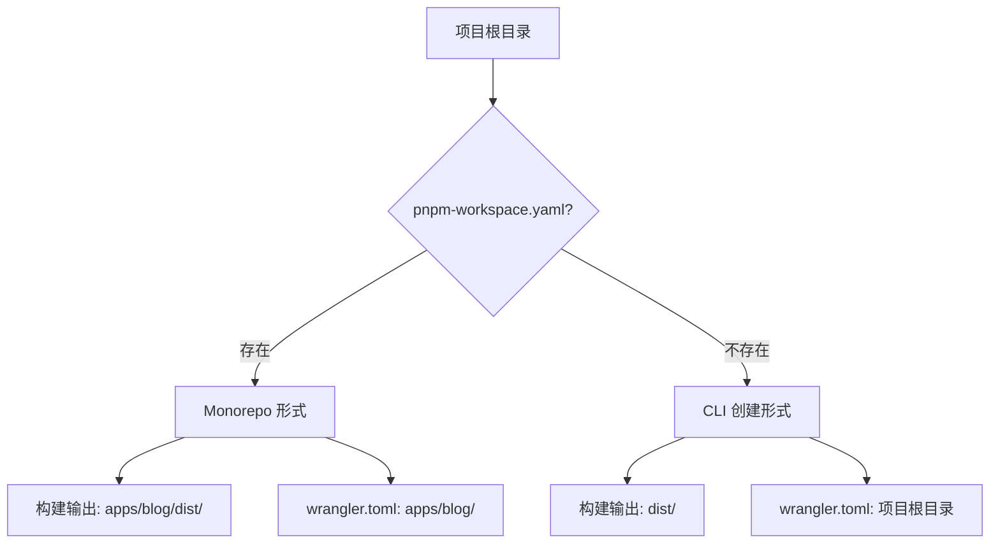

本指南详细介绍如何将 astro-minimax 博客部署到各种平台。astro-minimax 生成静态站点，可以部署到几乎任何支持静态托管的服务。

## 项目形式说明

astro-minimax 支持两种项目形式，部署配置略有不同：

| 项目形式     | 说明                               | 特点                     |
| ------------ | ---------------------------------- | ------------------------ |
| **Monorepo** | 直接 clone 仓库                    | 包含多个包，适合贡献代码 |
| **CLI 创建** | 使用 `npx @astro-minimax/cli init` | 单一项目，结构简洁       |

### 如何判断项目形式

检查项目根目录是否存在 `pnpm-workspace.yaml` 文件：

- **存在** → Monorepo 形式
- **不存在** → CLI 创建形式



---

## 前置准备

在部署之前，确保你的博客能够在本地成功构建：

```bash
# 从项目根目录运行
pnpm run build
```

**构建产物位置**：

| 项目形式 | 构建输出目录      |
| -------- | ----------------- |
| Monorepo | `apps/blog/dist/` |
| CLI 创建 | `dist/`           |

> 如果构建失败，请先运行 `pnpm run dev` 查看错误并修复。

---

## Cloudflare Pages（推荐）

Cloudflare Pages 是推荐的部署平台，因为 astro-minimax 的 AI 聊天功能基于 Cloudflare Workers AI 实现。

### Git 集成部署

1. 将代码推送到 GitHub / GitLab
2. 登录 [Cloudflare Dashboard](https://dash.cloudflare.com/) → Pages → 创建项目
3. 连接 Git 仓库
4. 配置构建设置：

#### Monorepo 形式

| 设置         | 值                                         |
| ------------ | ------------------------------------------ |
| 框架预设     | Astro                                      |
| 构建命令     | `pnpm run build`                           |
| 构建输出目录 | `apps/blog/dist`                           |
| 根目录       | `/`（保持默认）                            |
| Node.js 版本 | `22`（在环境变量中设置 `NODE_VERSION=22`） |

#### CLI 创建形式

| 设置         | 值                                         |
| ------------ | ------------------------------------------ |
| 框架预设     | Astro                                      |
| 构建命令     | `pnpm run build`                           |
| 构建输出目录 | `dist`                                     |
| 根目录       | `/`（保持默认）                            |
| Node.js 版本 | `22`（在环境变量中设置 `NODE_VERSION=22`） |

5. 点击 **保存并部署**

### 环境变量

如果启用了 AI 聊天功能，需要在 Cloudflare Pages 中配置：

| 变量              | 说明                                  |
| ----------------- | ------------------------------------- |
| `NODE_VERSION`    | `22`（推荐）                          |
| `AI_BINDING_NAME` | AI Binding 名称（默认为 `minimaxAI`） |

### AI Binding 配置

项目包含 `wrangler.toml` 文件，定义了 AI Binding：

**Monorepo 形式**：文件位于 `apps/blog/wrangler.toml`

**CLI 创建形式**：文件位于项目根目录 `wrangler.toml`

```toml
name = "astro-minimax"
pages_build_output_dir = "dist"
compatibility_date = "2026-03-12"
compatibility_flags = ["nodejs_compat"]

[ai]
binding = "minimaxAI"

[[kv_namespaces]]
binding = "CACHE_KV"
id = "your-kv-namespace-id"
```

Cloudflare Pages 会自动识别此配置并启用 Workers AI。

> `compatibility_flags = ["nodejs_compat"]` 启用 Node.js 兼容模式，确保 AI 功能正常运行。

### 自定义域名

部署成功后，在 Cloudflare Pages 设置中添加自定义域名，Cloudflare 会自动配置 SSL 证书。

### 环境变量配置

详细的环境变量配置步骤请参考 [Cloudflare 环境变量配置指南](/zh/posts/cloudflare-env-vars)。

### 相关指南

- [Waline 评论部署](/zh/posts/setup-waline-on-vercel) — 在 Vercel 上部署评论系统
- [Umami 分析配置](/zh/posts/setup-umami-analytics) — 配置隐私友好的访问统计
- [完整搭建指南](/zh/posts/complete-setup-guide) — 从零开始的完整教程

---

## Vercel

### Git 集成部署

1. 登录 [Vercel](https://vercel.com/) → 新建项目 → 导入 Git 仓库
2. 配置构建设置：

#### Monorepo 形式

| 设置     | 值               |
| -------- | ---------------- |
| 框架预设 | Astro            |
| 构建命令 | `pnpm run build` |
| 输出目录 | `apps/blog/dist` |
| 安装命令 | `pnpm install`   |
| 根目录   | `.`（保持默认）  |

#### CLI 创建形式

| 设置     | 值               |
| -------- | ---------------- |
| 框架预设 | Astro            |
| 构建命令 | `pnpm run build` |
| 输出目录 | `dist`           |
| 安装命令 | `pnpm install`   |
| 根目录   | `.`（保持默认）  |

3. 环境变量中设置 `NODE_VERSION=22`
4. 点击 **Deploy**

### 注意事项

- Vercel 默认不支持 Cloudflare Workers AI，AI 聊天功能在 Vercel 上需要使用其他 AI 提供商（如 OpenAI）
- 需要在 `src/config.ts` 中修改 `ai.apiEndpoint` 指向你的 AI API

---

## Netlify

### Git 集成部署

1. 登录 [Netlify](https://app.netlify.com/) → 新建站点 → 导入 Git 仓库
2. 配置构建设置：

#### Monorepo 形式

| 设置     | 值               |
| -------- | ---------------- |
| 构建命令 | `pnpm run build` |
| 发布目录 | `apps/blog/dist` |

#### CLI 创建形式

| 设置     | 值               |
| -------- | ---------------- |
| 构建命令 | `pnpm run build` |
| 发布目录 | `dist`           |

3. 环境变量中设置 `NODE_VERSION=22`
4. 点击 **Deploy site**

### netlify.toml（可选）

在项目根目录创建 `netlify.toml` 统一管理配置：

**Monorepo 形式**：

```toml
[build]
  command = "pnpm run build"
  publish = "apps/blog/dist"

[build.environment]
  NODE_VERSION = "22"
```

**CLI 创建形式**：

```toml
[build]
  command = "pnpm run build"
  publish = "dist"

[build.environment]
  NODE_VERSION = "22"
```

---

## Docker

astro-minimax 支持 Docker 容器化部署。

### 开发环境

使用 `docker-compose.yml` 快速启动开发服务器：

```yaml
services:
  app:
    image: node:lts
    ports:
      - 4321:4321
    working_dir: /app
    command: pnpm run dev -- --host 0.0.0.0
    volumes:
      - ./:/app
```

```bash
docker compose up
```

### 生产环境

使用多阶段 Dockerfile 构建生产镜像：

#### Monorepo 形式

```dockerfile
# 构建阶段
FROM node:lts AS base
WORKDIR /app

RUN corepack enable && corepack prepare pnpm@latest --activate

# 复制依赖文件
COPY package.json pnpm-lock.yaml pnpm-workspace.yaml ./
COPY packages/ packages/
COPY apps/blog/package.json apps/blog/
RUN pnpm install --frozen-lockfile

# 复制源码并构建
COPY . .
RUN pnpm run build

# 运行阶段
FROM nginx:mainline-alpine-slim AS runtime
COPY --from=base /app/apps/blog/dist /usr/share/nginx/html
EXPOSE 80
```

#### CLI 创建形式

```dockerfile
# 构建阶段
FROM node:lts AS base
WORKDIR /app

RUN corepack enable && corepack prepare pnpm@latest --activate

# 复制依赖文件
COPY package.json pnpm-lock.yaml ./
RUN pnpm install --frozen-lockfile

# 复制源码并构建
COPY . .
RUN pnpm run build

# 运行阶段
FROM nginx:mainline-alpine-slim AS runtime
COPY --from=base /app/dist /usr/share/nginx/html
EXPOSE 80
```

```bash
# 构建镜像
docker build -t my-blog .

# 运行容器
docker run -p 80:80 my-blog
```

---

## 静态文件托管

astro-minimax 生成纯静态文件，也可以部署到任何静态文件服务器：

### GitHub Pages

1. 在 `.github/workflows/deploy.yml` 中配置 GitHub Actions：

**Monorepo 形式**：

```yaml
name: Deploy to GitHub Pages
on:
  push:
    branches: [main]
jobs:
  deploy:
    runs-on: ubuntu-latest
    permissions:
      contents: read
      pages: write
      id-token: write
    steps:
      - uses: actions/checkout@v4
      - uses: pnpm/action-setup@v4
      - uses: actions/setup-node@v4
        with:
          node-version: 22
          cache: pnpm
      - run: pnpm install --frozen-lockfile
      - run: pnpm run build
      - uses: actions/upload-pages-artifact@v3
        with:
          path: apps/blog/dist
      - uses: actions/deploy-pages@v4
```

**CLI 创建形式**：

```yaml
name: Deploy to GitHub Pages
on:
  push:
    branches: [main]
jobs:
  deploy:
    runs-on: ubuntu-latest
    permissions:
      contents: read
      pages: write
      id-token: write
    steps:
      - uses: actions/checkout@v4
      - uses: pnpm/action-setup@v4
      - uses: actions/setup-node@v4
        with:
          node-version: 22
          cache: pnpm
      - run: pnpm install --frozen-lockfile
      - run: pnpm run build
      - uses: actions/upload-pages-artifact@v3
        with:
          path: dist
      - uses: actions/deploy-pages@v4
```

2. 在仓库 Settings → Pages 中选择 **GitHub Actions** 作为 Source

### 自有服务器

将构建输出目录内容上传到服务器的 Web 根目录：

**Monorepo 形式**：

```bash
rsync -avz apps/blog/dist/ user@server:/var/www/html/
```

**CLI 创建形式**：

```bash
rsync -avz dist/ user@server:/var/www/html/
```

---

## 部署检查清单

部署前请确认：

- [ ] `src/config.ts` 中 `SITE.website` 已设置为正确的域名
- [ ] 构建命令 `pnpm run build` 在本地执行成功
- [ ] 构建输出目录设置正确（Monorepo: `apps/blog/dist`，CLI: `dist`）
- [ ] 环境变量 `NODE_VERSION` 设置为 `22`
- [ ] 如使用 AI 功能，相关 API 配置已正确设置
- [ ] `public/robots.txt` 内容符合你的需求
- [ ] OG 图片已正确配置

## 快速参考表

### 构建输出目录

| 项目形式 | 构建输出目录     |
| -------- | ---------------- |
| Monorepo | `apps/blog/dist` |
| CLI 创建 | `dist`           |

### wrangler.toml 位置

| 项目形式 | 文件路径                      |
| -------- | ----------------------------- |
| Monorepo | `apps/blog/wrangler.toml`     |
| CLI 创建 | `wrangler.toml`（项目根目录） |

## 常见问题

### 构建失败：找不到 pnpm

确保部署平台支持 pnpm。大多数平台需要在环境变量中指定 Node.js 版本：

```
NODE_VERSION=22
```

### 搜索功能不工作

Pagefind 搜索索引在构建时生成。确保构建命令包含 `pagefind --site dist` 步骤（已包含在 `pnpm run build` 中）。

### AI 聊天不工作

AI 聊天功能依赖 Cloudflare Workers AI。如果部署在其他平台，需要：

1. 将 `ai.mockMode` 设为 `true`（仅显示预设回复），或
2. 配置替代的 AI API 端点
