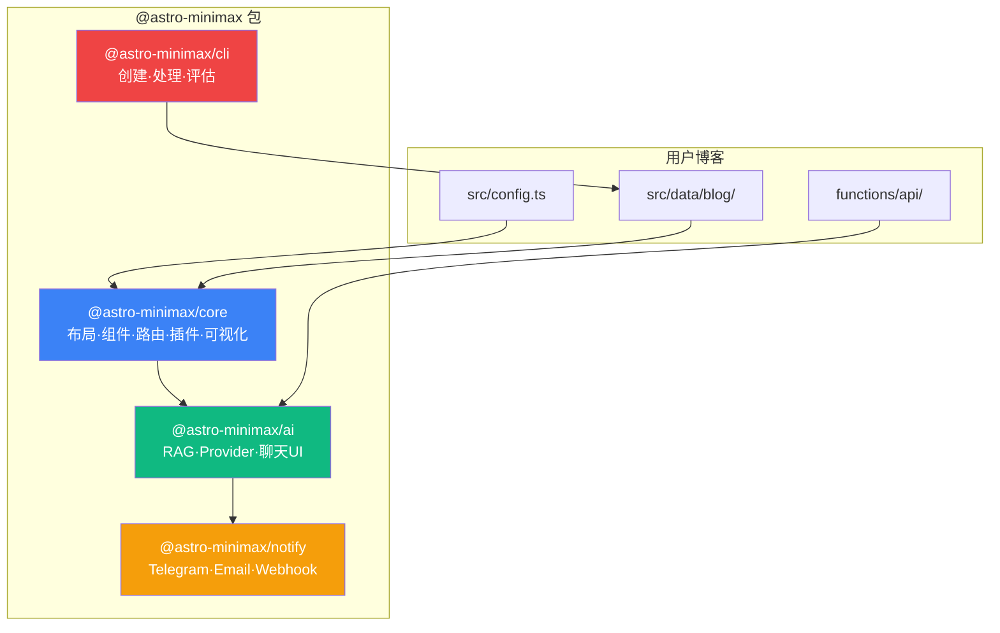
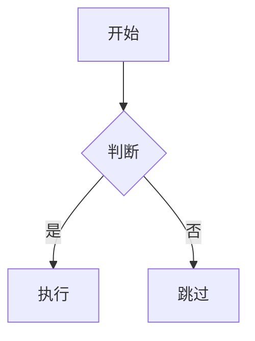

astro-minimax 是一个功能丰富的 Astro 博客主题，采用模块化架构设计。本文全面介绍所有功能特性及其使用方式。

## 架构概览

astro-minimax 由四个核心包组成，形成清晰的层次架构：



| 包                      | 说明                                                             | 必需 |
| ----------------------- | ---------------------------------------------------------------- | ---- |
| `@astro-minimax/core`   | 核心主题：布局、组件、样式、可视化（Mermaid/Markmap 等）         | 是   |
| `@astro-minimax/ai`     | AI 集成：多 Provider 聊天、RAG 检索、流式响应                    | 可选 |
| `@astro-minimax/notify` | 通知系统：Telegram、Email、Webhook 多渠道通知                    | 可选 |
| `@astro-minimax/cli`    | CLI 工具：博客创建、AI 内容处理、画像构建、质量评估              | 推荐 |

---

## 内容管理

### Markdown / MDX

所有文章使用 Markdown 或 MDX 编写，支持：

- 标准 Markdown 语法
- GFM（GitHub Flavored Markdown）扩展
- MDX 组件嵌入
- 数学公式（LaTeX，通过 KaTeX 渲染）
- GitHub 风格的提示框（`> [!NOTE]`、`> [!WARNING]` 等）
- Emoji 表情（`:smile:` -> :smile:）

### 多语言

内置中文/英文双语支持。文章按语言分目录组织：

```
src/data/blog/
├── zh/     # 中文文章
└── en/     # 英文文章
```

通过 URL 前缀区分语言：`/zh/posts/...` 和 `/en/posts/...`。

### 内容组织

#### 标签

每篇文章可以有多个标签，用于灵活的交叉分类：

```yaml
tags:
  - astro
  - typescript
  - tutorial
```

标签页面 (`/tags/`) 展示标签云，点击标签可查看该标签下的所有文章。

#### 分类

支持层级分类，使用 `/` 分隔：

```yaml
category: 教程/配置
```

分类页面 (`/categories/`) 展示树形分类结构。

#### 系列文章

将相关文章组织为有序系列：

```yaml
series:
  name: Rust 入门
  order: 1
```

系列页面会自动生成导航，显示上一篇/下一篇。

#### 归档

按时间线展示所有文章的归档页面 (`/archives/`)。可通过 `features.archives` 开关控制。

### Frontmatter

每篇文章的元数据通过 frontmatter 定义：

```yaml
---
title: 文章标题
pubDatetime: 2026-03-14T10:00:00Z
modDatetime: 2026-03-20T01:46:35Z
author: Souloss
description: 文章描述
tags: [astro, tutorial]
category: 教程/配置
series: { name: "系列名称", order: 1 }
featured: true
draft: false
ogImage: ./cover.png
---
```

详见 [添加文章指南](/zh/posts/adding-new-post)。

---

## 搜索

支持两种搜索方案，通过 `search.provider` 配置切换：

### Pagefind 全文搜索（默认）

内置 [Pagefind](https://pagefind.app/) 静态搜索引擎：

- 构建时自动生成搜索索引
- 完全静态，无需服务端
- 支持中文分词
- 搜索结果高亮显示
- 高级过滤（分类、语言、标签）

搜索索引在 `pnpm run build` 时自动生成。

### Algolia DocSearch

支持 [Algolia DocSearch](https://docsearch.algolia.com/) 云搜索：

- 毫秒级搜索响应
- 键盘快捷键 `Ctrl+K` 打开搜索
- 支持搜索建议和自动补全
- 搜索分析和统计

配置方式：

```typescript
search: {
  provider: 'docsearch',
  docsearch: {
    appId: 'YOUR_APP_ID',
    apiKey: 'YOUR_SEARCH_API_KEY',
    indexName: 'YOUR_INDEX_NAME',
  },
},
```

---

## 主题与样式

### 明暗模式

支持三种主题模式：

- **浅色模式** — 白色背景，深色文字
- **深色模式** — 深色背景，浅色文字
- **跟随系统** — 自动匹配操作系统偏好

主题切换使用 View Transitions 动画，切换过程流畅自然。可通过 `darkMode` 控制是否启用。

### 自定义配色

通过 CSS 变量自定义整站配色，支持独立的浅色/深色方案：

```css
:root {
  --background: #ffffff;
  --foreground: #1a1a2e;
  --accent: #3b82f6;
  --muted: #6b7280;
  --border: #e5e7eb;
}

[data-theme="dark"] {
  --background: #0f172a;
  --foreground: #e2e8f0;
  --accent: #60a5fa;
  --muted: #94a3b8;
  --border: #334155;
}
```

详见 [自定义配色方案](/zh/posts/how-to-configure-astro-minimax-theme)。

### 响应式设计

全站采用移动优先的响应式设计：

- 移动端：单列布局，触摸友好的导航
- 平板：优化的阅读宽度
- 桌面：完整的侧边栏和浮动目录

---

## 可视化组件

`@astro-minimax/core` 包提供丰富的可视化组件。

### Mermaid 图表

在 Markdown 中直接编写 Mermaid 图表：

````markdown

````

支持流程图、时序图、甘特图、饼图、类图等所有 Mermaid 图表类型。自动适配明暗主题。

### Markmap 思维导图

使用 Markdown 大纲语法生成交互式思维导图：

````markdown
```markmap
# 中心主题
## 分支 A
### 子节点 1
### 子节点 2
## 分支 B
### 子节点 3
```
````

支持缩放、拖拽、展开/折叠等交互操作。

### Rough.js 手绘图形

在 MDX 中使用手绘风格的 SVG 图形：

```mdx
import RoughDrawing from '@astro-minimax/core/components/viz/RoughDrawing.astro';

<RoughDrawing shapes={[
  { type: "rectangle", x: 10, y: 10, width: 200, height: 100 }
]} />
```

### Excalidraw 白板

嵌入 Excalidraw 白板式图表：

```mdx
import ExcalidrawEmbed from '@astro-minimax/core/components/viz/ExcalidrawEmbed.astro';

<ExcalidrawEmbed src="/drawings/architecture.excalidraw" />
```

自动适配明暗主题。

### Asciinema 终端回放

嵌入终端录制回放：

```mdx
import AsciinemaPlayer from '@astro-minimax/core/components/viz/AsciinemaPlayer.astro';

<AsciinemaPlayer src="/casts/demo.cast" cols={120} rows={30} />
```

### 更多组件

| 组件            | 说明                                |
| --------------- | ----------------------------------- |
| `Bilibili`      | B 站视频嵌入                        |
| `MusicPlayer`   | 音乐播放器（支持网易云、QQ 音乐等） |
| `CodeRunner`    | 交互式 JavaScript 代码运行器        |
| `FullHtmlEmbed` | 完整 HTML 页面嵌入                  |
| `VizContainer`  | 可视化容器（缩放、平移、全屏）      |

---

## AI 聊天

`@astro-minimax/ai` 包提供智能对话能力。

### 功能特点

- **多 Provider 支持** — Cloudflare Workers AI + OpenAI 兼容 API
- **自动故障转移** — 主 Provider 失败时自动切换到备用，Mock 兜底保证可用
- **流式响应** — SSE 实时流式输出
- **RAG 检索** — 基于博客内容的上下文增强回答
- **来源分层协议** — L1-L5 五层来源优先级，有效防止 AI 幻觉
- **意图分类** — 7 类主题意图识别，提升搜索相关性
- **隐私保护** — 自动拒绝回答敏感个人信息（住址、收入、家人等）
- **边读边聊** — 文章页自动注入上下文，实现阅读伴侣模式
- **全局/会话缓存** — 公共问题跨用户缓存，提升响应速度
- **Mock 模式** — 开发时无需真实 API

### 使用方式

AI 聊天以浮动组件形式出现在页面右下角。点击打开对话窗口，可以：

- 询问博客相关内容
- 获取技术问题解答
- 浏览博客导航建议

### 配置

在 `src/config.ts` 中启用：

```js
ai: {
  enabled: true,
  mockMode: false,       // 生产环境设为 false
  apiEndpoint: "/api/chat",
  model: "@cf/zai-org/glm-4.7-flash",
},
```

详见 [配置指南](/zh/posts/how-to-configure-astro-minimax-theme#配置-ai-聊天)。

---

## 互动系统

### Waline 评论

内置 [Waline](https://waline.js.org/) 评论系统：

- 匿名评论或登录评论
- 表情包支持
- 页面浏览量统计
- 表情互动（reaction）
- 评论字数限制
- Markdown 格式评论

需要自行部署 Waline 服务端。详见 [配置指南](/zh/posts/how-to-configure-astro-minimax-theme#配置-waline-评论)。

### 赞助打赏

支持多种支付方式的打赏功能：

- 微信支付
- 支付宝
- 自定义支付方式

在文章底部显示打赏按钮和二维码。支持展示赞助者列表。

### 通知系统

多渠道通知，实时了解博客动态：

- **Telegram Bot**：接收评论、AI 对话通知
- **Email (Resend)**：邮件通知
- **Webhook**：自定义通知渠道

支持丰富的通知内容：Token 用量、阶段耗时、引用文章等。Session ID 自动匿名化保护隐私。

详见 [通知系统配置指南](/zh/posts/notification-guide)。

---

## SEO 与性能

### 动态 OG 图片

未指定 OG 图片的文章会自动生成：

- 使用 [Satori](https://github.com/vercel/satori) 在构建时生成
- 包含文章标题、作者、日期
- 支持自定义字体
- 尺寸 1200x640px

详见 [动态 OG 图片](/zh/posts/dynamic-og-images)。

### SEO 优化

- 自动生成 `sitemap.xml`
- 自动生成 `robots.txt`
- RSS 订阅源
- 语义化 HTML 结构
- 规范化 URL（canonical）
- 结构化数据（JSON-LD）
- 正确的 Open Graph 和 Twitter Card 标签

### 性能优化

- Lighthouse 90+ 评分目标
- 静态站点生成（零服务端运行时）
- 图片自动优化（Astro Image Service）
- 代码分割和按需加载
- 预加载和预获取
- CSS/JS 最小化
- Web Vitals 监控

---

## 代码增强

### 语法高亮

使用 [Shiki](https://shiki.style/) 提供精美的代码高亮：

- 双主题支持（亮色 github-light / 暗色 night-owl）
- 行高亮 / 行差异标记
- 代码块标题栏
- 语言标签
- 一键复制按钮
- 长代码折叠展开

### 数学公式

通过 KaTeX 渲染 LaTeX 数学公式：

行内公式：`$E = mc^2$`

块级公式：

```latex
$$
\int_{-\infty}^{\infty} e^{-x^2} dx = \sqrt{\pi}
$$
```

详见 [如何添加 LaTeX 公式](/zh/posts/how-to-add-latex-equations-in-blog-posts)。

---

## 分析统计

### Umami

集成 [Umami](https://umami.is/) 隐私友好的访问统计：

- 不使用 Cookie
- GDPR 合规
- 轻量级（< 2KB）
- 自部署

需要自行部署 Umami 实例。

---

## 辅助功能

### 其他特性

| 特性                 | 说明                                 |
| -------------------- | ------------------------------------ |
| **友链页面**         | 展示友情链接，支持头像、描述         |
| **项目展示**         | GitHub 仓库卡片，自动获取仓库信息    |
| **图片灯箱**         | 点击图片放大预览                     |
| **阅读进度**         | 保存和恢复阅读位置                   |
| **浮动目录**         | 文章页侧边栏浮动目录导航             |
| **面包屑**           | 页面层级导航                         |
| **版权声明**         | 文章底部显示许可证信息               |
| **编辑链接**         | 文章标题下显示"在 GitHub 上编辑"链接 |
| **键盘导航**         | 支持键盘快捷键操作                   |
| **无障碍**           | WCAG 2.1 AA 级别合规                 |
| **View Transitions** | 页面切换动画                         |
| **预加载**           | 链接预加载提升导航速度               |

---

## 功能启用速查

在 `src/config.ts` 的 `features` 中控制所有功能开关：

```js
features: {
  tags: true,        // 标签系统
  categories: true,  // 分类系统
  series: true,      // 系列文章
  archives: true,    // 归档页面
  friends: true,     // 友链页面
  projects: true,    // 项目展示
  search: true,      // 全文搜索
},
darkMode: true,     // 明暗主题
```

## CLI 工具链

`@astro-minimax/cli` 提供完整的命令行工具，用于博客管理和 AI 内容处理。

### 安装

CLI 工具随 `@astro-minimax/cli` 包安装，也可以通过 `npx astro-minimax` 临时使用。

### 主要命令

| 命令                   | 说明                                          |
| ---------------------- | --------------------------------------------- |
| `astro-minimax init`   | 创建新博客项目                                |
| `astro-minimax ai`     | AI 内容处理（摘要、SEO、评估）                |
| `astro-minimax profile`| 作者画像管理（上下文、风格、报告）            |
| `astro-minimax post`   | 文章管理（新建、列表、统计）                  |
| `astro-minimax data`   | 数据管理（状态查看、缓存清理）                |

### 使用示例

```bash
astro-minimax post new "文章标题"    # 创建新文章
astro-minimax ai process              # AI 处理所有文章
astro-minimax ai eval                 # 评估 AI 对话质量
astro-minimax profile build           # 构建完整作者画像
astro-minimax data status             # 查看数据状态
```

> 所有命令也有 `pnpm run` 快捷方式（如 `pnpm run ai:process`）。详见 [CLI 使用指南](/zh/posts/cli-guide)。

### AI 评估系统

内置黄金测试集（`datas/eval/gold-set.json`），自动化评估 AI 对话质量：

- 5 项自动检查：非空验证、主题覆盖、禁止声明、链接检查、回答模式
- 支持对本地开发服务器或生产环境进行测试
- 生成详细评估报告（`datas/eval/report.json`）

```bash
pnpm run ai:eval                              # 本地测试
pnpm run ai:eval -- --url=https://your-blog.com  # 远程测试
```

---

## 更多资源

- [快速开始](/zh/posts/getting-started) — 安装与初始配置
- [主题配置](/zh/posts/how-to-configure-astro-minimax-theme) — 完整配置参考
- [添加文章](/zh/posts/adding-new-post) — 文章格式与 Frontmatter
- [部署指南](/zh/posts/deployment-guide) — 多平台部署方案
- [自定义配色](/zh/posts/how-to-configure-astro-minimax-theme) — 主题颜色定制
