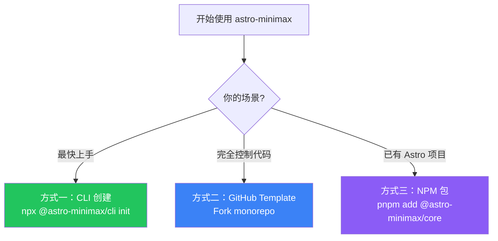

## 概览

astro-minimax 提供三种使用方式，适合不同场景：



| 方式 | 适合场景 | 更新方式 |
|------|----------|----------|
| **CLI 创建（推荐）** | 最快上手，独立项目 | `pnpm update` |
| **GitHub Template** | 一次性创建，完全自定义 | 手动合并上游更新 |
| **NPM 包集成** | 已有 Astro 项目，按需引入 | `pnpm update` |

---

## 方式一：CLI 创建（推荐）

使用 `@astro-minimax/cli` 一键创建完整博客项目：

```bash
npx @astro-minimax/cli init my-blog
cd my-blog
pnpm install
pnpm run dev
```

生成的项目包含完整的配置文件、示例文章和 AI 工具链。编辑 `src/config.ts` 自定义站点信息，在 `src/data/blog/` 下添加文章即可。

CLI 还提供实用的管理命令：

```bash
astro-minimax post new "文章标题"    # 创建新文章
astro-minimax ai process              # AI 处理文章（摘要+SEO）
astro-minimax profile build           # 构建作者画像
astro-minimax data status             # 查看数据状态
```

> 所有命令也有 `pnpm run` 快捷方式，如 `pnpm run post:new -- "标题"`。详见 [CLI 使用指南](/zh/posts/cli-guide)。

---

## 方式二：GitHub Template

### 1. 创建仓库

点击 GitHub 仓库页面的 **"Use this template"** 按钮，或通过命令行：

```bash
pnpm create astro@latest --template souloss/astro-minimax
```

### 2. 安装依赖

```bash
cd your-blog
pnpm install
```

### 3. 了解项目结构

astro-minimax 采用 monorepo 结构，你的博客站点位于 `apps/blog/` 目录下：

```
your-blog/
├── pnpm-workspace.yaml       # Workspace 配置
├── package.json               # 根级：统一命令入口
├── packages/
│   ├── core/                  # 核心主题包（布局、组件、样式、可视化）
│   ├── ai/                    # AI 集成包
│   ├── notify/                # 通知系统包
│   └── cli/                   # CLI 工具包
└── apps/
    └── blog/                  # 你的博客站点
        ├── astro.config.ts    # Astro 配置
        ├── public/            # 静态资源
        └── src/
            ├── config.ts      # 站点配置（修改这里）
            ├── constants.ts   # 社交链接
            ├── content.config.ts
            └── data/
                ├── blog/zh/   # 中文文章
                └── blog/en/   # 英文文章
```

### 4. 配置站点

编辑 `apps/blog/src/config.ts`，设置你的博客信息：

```typescript
export const SITE = {
  website: "https://your-domain.com/",
  author: "Your Name",
  title: "My Blog",
  desc: "A personal tech blog",
  lang: "zh",
  timezone: "Asia/Shanghai",
  features: {
    tags: true,
    categories: true,
    search: true,
    darkMode: true,
    // 按需启用更多功能
    ai: false,
    waline: false,
    sponsor: false,
  },
  // ...
};
```

详细配置请参考 [主题配置指南](/zh/posts/how-to-configure-astro-minimax-theme)。

### 5. 添加内容

将你的文章放到 `apps/blog/src/data/blog/zh/`（中文）或 `apps/blog/src/data/blog/en/`（英文）目录下。

文章使用 Markdown 或 MDX 格式，需要包含 frontmatter：

```yaml
---
title: 我的第一篇文章
pubDatetime: 2026-03-14T10:00:00Z
description: 这是文章描述。
tags:
  - 入门
---

文章正文...
```

详见 [添加文章指南](/zh/posts/adding-new-post)。

### 6. 开发与构建

所有命令都从项目根目录运行：

```bash
# 本地开发
pnpm run dev

# 构建生产站点（含类型检查和搜索索引生成）
pnpm run build

# 预览构建结果
pnpm run preview
```

### 7. 部署

astro-minimax 支持多种部署平台，推荐 Cloudflare Pages：

```bash
# 连接 Git 仓库到 Cloudflare Pages
# 构建命令：pnpm run build
# 构建输出目录：apps/blog/dist
```

也可以部署到 Vercel、Netlify 或使用 Docker。详见 [部署指南](/zh/posts/deployment-guide)。

### 8. 获取上游更新

```bash
# 添加上游仓库
git remote add upstream https://github.com/souloss/astro-minimax.git

# 拉取更新
git fetch upstream
git merge upstream/main

# 解决冲突后提交
```

---

## 方式三：NPM 包集成

适合希望将内容与主题系统分离的用户。主题核心和 AI 功能作为独立 npm 包发布，可视化组件已内置于核心包中。

### 1. 创建 Astro 项目

```bash
pnpm create astro@latest my-blog
cd my-blog
```

### 2. 安装主题包

```bash
# 核心主题（布局、组件、样式、可视化 Mermaid/Markmap）
pnpm add @astro-minimax/core

# AI 聊天集成（可选）
pnpm add @astro-minimax/ai
```

### 3. 配置 Astro

在 `astro.config.ts` 中使用主题集成：

```typescript
import { defineConfig } from 'astro/config';
import minimax from '@astro-minimax/core';
import preact from '@astrojs/preact';

export default defineConfig({
  integrations: [
    minimax({
      site: SITE,
      socials: SOCIALS,
      viz: { mermaid: true, markmap: true },
    }),
    preact({ compat: true }),
  ],
});
```

### 4. 使用布局和组件

```astro
---
import Layout from '@astro-minimax/core/layouts/Layout.astro';
import Header from '@astro-minimax/core/components/nav/Header.astro';
import Footer from '@astro-minimax/core/components/nav/Footer.astro';
import Card from '@astro-minimax/core/components/ui/Card.astro';
---

<Layout title="My Blog">
  <Header />
  <main>
    <slot />
  </main>
  <Footer />
</Layout>
```

### 5. 更新

```bash
pnpm update @astro-minimax/core @astro-minimax/ai
```

---

## 内容目录结构

无论使用哪种方式，博客内容结构保持一致：

```
src/data/blog/
├── zh/                # 中文文章
│   ├── my-post.md
│   └── _examples/     # 示例文章（以 _ 开头的目录不参与 URL 生成）
├── en/                # 英文文章
│   ├── my-post.md
│   └── _examples/
```

> GitHub Template 用户：内容位于 `apps/blog/src/data/blog/`。NPM 集成用户：位于项目根目录的 `src/data/blog/`。

## 下一步

- [配置主题](/zh/posts/how-to-configure-astro-minimax-theme) — 详细配置指南
- [添加文章](/zh/posts/adding-new-post) — Frontmatter 格式说明
- [功能特性](/zh/posts/feature-overview) — 完整功能介绍
- [部署指南](/zh/posts/deployment-guide) — 多平台部署方案
- [自定义配色](/zh/posts/customizing-astro-minimax-theme-color-schemes) — 主题颜色定制
