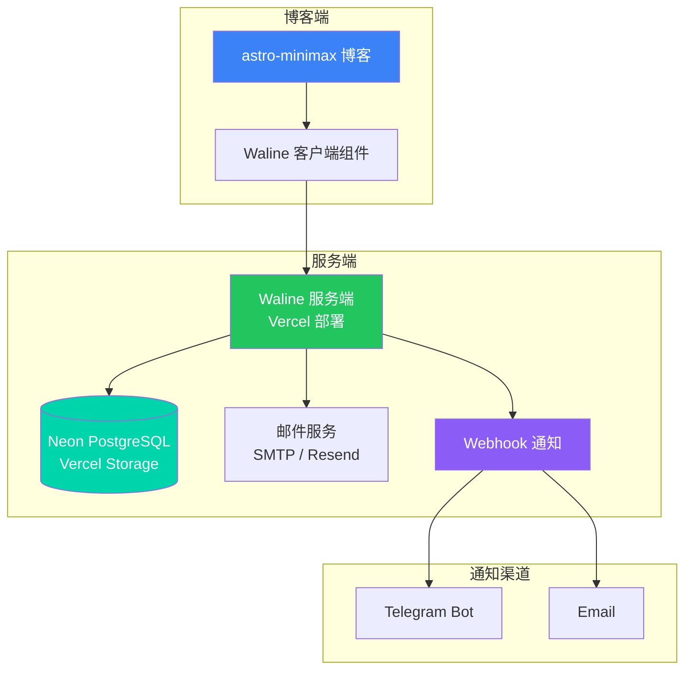
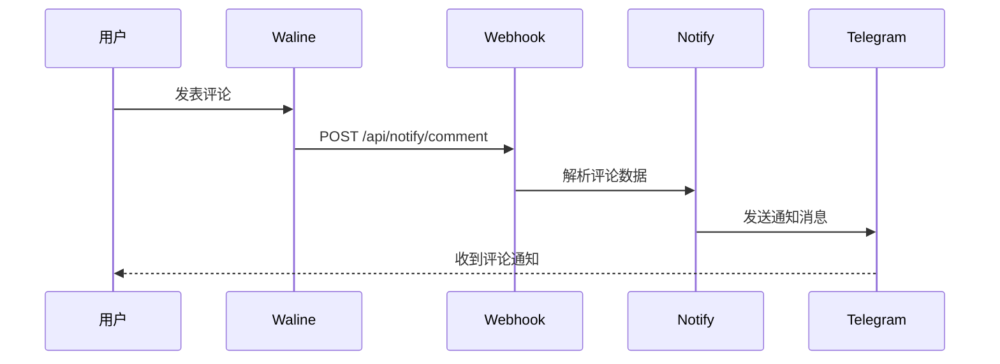

Waline 是一款简洁、安全的评论系统，支持 Markdown、邮件通知、多语言等特性。本文将详细介绍如何在 Vercel 部署 Waline，使用 Vercel 自带的 Neon PostgreSQL 作为数据库，并与 astro-minimax 博客集成。

## 架构概览



整个系统由三部分组成：

| 组件   | 说明         | 推荐                           |
| ------ | ------------ | ------------------------------ |
| 数据库 | 存储评论数据 | Vercel Neon PostgreSQL（免费） |
| 服务端 | 处理评论逻辑 | Vercel（一键部署）             |
| 客户端 | 评论界面组件 | astro-minimax 内置             |

## 前置准备

开始之前，请确保你已有：

- [ ] GitHub 账号（用于 Vercel 登录）
- [ ] 一个已部署的 astro-minimax 博客
- [ ] 可选：用于邮件通知的 SMTP 服务或 Resend 账号

## 第一步：创建 Vercel Neon PostgreSQL 数据库

Vercel 提供免费的 Neon PostgreSQL 数据库存储，无需额外注册第三方服务，一键创建即可使用。

### 1.1 进入 Vercel Storage

1. 登录 [Vercel Dashboard](https://vercel.com/dashboard)
2. 点击顶部导航栏的 **Storage** 标签
3. 点击 **Create Database** 按钮

### 1.2 创建 Neon PostgreSQL 数据库

1. 选择 **Neon PostgreSQL** 作为数据库类型
2. 输入数据库名称，如 `waline-comments`
3. 选择区域（建议选择离你用户最近的区域）
4. 点击 **Create** 创建数据库

> Neon 免费版提供 512MB 存储空间，对于个人博客评论系统完全足够。

### 1.3 初始化数据库表结构

Waline 需要特定的数据库表结构。创建数据库后，需要导入初始化 SQL：

1. 在 Vercel Storage 页面，点击刚创建的数据库
2. 点击 **Query** 标签进入查询界面
3. 复制 [waline.pgsql](https://github.com/walinejs/waline/blob/main/assets/waline.pgsql) 文件内容
4. 粘贴到查询编辑器中，点击 **Run Query** 执行

<details>
<summary>点击查看 waline.pgsql 完整内容</summary>

```sql
CREATE TABLE IF NOT EXISTS "Comment" (
  "id" INTEGER PRIMARY KEY AUTOINCREMENT,
  "user_id" VARCHAR(255),
  "nick" VARCHAR(255) NOT NULL,
  "mail" VARCHAR(255),
  "link" VARCHAR(255),
  "url" VARCHAR(255),
  "comment" TEXT NOT NULL,
  "ua" VARCHAR(255),
  "ip" VARCHAR(63),
  "is_spam" INTEGER DEFAULT 0,
  "parent" INTEGER,
  "status" VARCHAR(50) DEFAULT 'approved',
  "created_at" TIMESTAMP DEFAULT CURRENT_TIMESTAMP,
  "updated_at" TIMESTAMP DEFAULT CURRENT_TIMESTAMP
);

CREATE TABLE IF NOT EXISTS "Counter" (
  "id" INTEGER PRIMARY KEY AUTOINCREMENT,
  "url" VARCHAR(255) NOT NULL,
  "time" INTEGER DEFAULT 0
);

CREATE TABLE IF NOT EXISTS "Users" (
  "id" INTEGER PRIMARY KEY AUTOINCREMENT,
  "display_name" VARCHAR(255) NOT NULL,
  "email" VARCHAR(255),
  "url" VARCHAR(255),
  "token" VARCHAR(255),
  "avatar_url" VARCHAR(255),
  "password" VARCHAR(255),
  "label" VARCHAR(255),
  "github_id" VARCHAR(255),
  "twitter_id" VARCHAR(255),
  "facebook_id" VARCHAR(255),
  "google_id" VARCHAR(255),
  "weibo_id" VARCHAR(255),
  "qq_id" VARCHAR(255),
  "recieved" INTEGER DEFAULT 0,
  "created_at" TIMESTAMP DEFAULT CURRENT_TIMESTAMP,
  "updated_at" TIMESTAMP DEFAULT CURRENT_TIMESTAMP
);

CREATE INDEX IF NOT EXISTS "idx_comment_url" ON "Comment" ("url");
CREATE INDEX IF NOT EXISTS "idx_comment_user_id" ON "Comment" ("user_id");
CREATE INDEX IF NOT EXISTS "idx_counter_url" ON "Counter" ("url");
CREATE INDEX IF NOT EXISTS "idx_users_email" ON "Users" ("email");
```

</details>

### 1.4 获取数据库连接信息

在数据库详情页面，点击 **Connect** 标签，可以看到连接信息：

| 参数     | 说明           |
| -------- | -------------- |
| Host     | 数据库主机地址 |
| Port     | 数据库端口     |
| Database | 数据库名称     |
| User     | 数据库用户名   |
| Password | 数据库密码     |

> Vercel 会自动将这些信息注入到环境变量中，你也可以手动复制备用。

## 第二步：部署 Waline 到 Vercel

### 2.1 一键部署

点击下方按钮，跳转到 Vercel 进行部署：

[](https://vercel.com/new/clone?repository-url=https://github.com/walinejs/waline/tree/main/example)

部署流程：

1. 点击按钮后，使用 GitHub 账号登录 Vercel（如未登录）
2. 输入项目名称，点击 `Create` 创建项目
3. 等待 1-2 分钟，看到烟花画面表示部署成功
4. 点击 `Go to Dashboard` 进入项目控制台

### 2.2 配置环境变量

在 Vercel 项目设置中，添加以下环境变量：

| 变量名        | 值                            | 说明                       |
| ------------- | ----------------------------- | -------------------------- |
| `PG_HOST`     | 数据库主机地址                | Neon PostgreSQL 主机地址   |
| `PG_PORT`     | `5432`                        | PostgreSQL 端口            |
| `PG_DB`       | 数据库名称                    | Neon PostgreSQL 数据库名   |
| `PG_USER`     | 数据库用户名                  | Neon PostgreSQL 用户名     |
| `PG_PASSWORD` | 数据库密码                    | Neon PostgreSQL 密码       |
| `PG_SSL`      | `true`                        | 启用 SSL 连接（Neon 必需） |
| `SITE_URL`    | `https://your-blog.pages.dev` | 博客地址（可选）           |
| `SITE_TITLE`  | `我的博客`                    | 站点名称（可选）           |

> **提示**：如果 Waline 项目和 Neon 数据库在同一个 Vercel 账户下，可以在项目设置中直接关联数据库，Vercel 会自动注入 `POSTGRES_*` 环境变量。Waline 同时支持 `PG_*` 和 `POSTGRES_*` 两种前缀。

在 Vercel Dashboard 操作步骤：

1. 进入项目 -> Settings -> Environment Variables
2. 逐个添加上述变量
3. 点击「Save」

### 2.3 完成部署

1. 配置完环境变量后，点击「Redeploy」重新部署
2. 等待部署完成，获得 Vercel 分配的域名，如 `https://your-waline.vercel.app`
3. 访问该地址，看到 Waline 欢迎页面即部署成功

### 2.4 绑定自定义域名（可选）

如果你有自己的域名，可以在 Vercel 中绑定：

1. 项目 -> Settings -> Domains
2. 输入你的域名，如 `waline.yourdomain.com`
3. 在域名 DNS 添加 CNAME 记录指向 `cname.vercel-dns.com`
4. 等待 DNS 生效

## 第三步：配置邮件通知（可选）

Waline 支持多种邮件通知方式，推荐使用 Resend 或 SMTP。

### 方式一：Resend（推荐）

Resend 提供免费的邮件发送服务：

1. 注册 [Resend](https://resend.com) 账号
2. 创建 API Key（格式：`re_xxx`）
3. 验证你的发件域名

在 Vercel 添加环境变量：

| 变量名         | 值                       | 说明           |
| -------------- | ------------------------ | -------------- |
| `RESEND_TOKEN` | `re_xxx`                 | Resend API Key |
| `SMTP_SERVICE` | `Resend`                 | 邮件服务标识   |
| `SMTP_USER`    | `noreply@yourdomain.com` | 发件邮箱       |
| `SMTP_PASS`    | 留空                     | Resend 不需要  |

### 方式二：SMTP

使用 Gmail、QQ 邮箱等 SMTP 服务：

| 变量名         | 值              | 说明             |
| -------------- | --------------- | ---------------- |
| `SMTP_SERVICE` | `QQ` 或 `Gmail` | 邮件服务商       |
| `SMTP_USER`    | `your@qq.com`   | SMTP 用户名      |
| `SMTP_PASS`    | `授权码`        | SMTP 密码/授权码 |

常用 SMTP 服务标识：

| 服务商   | SMTP_SERVICE 值 |
| -------- | --------------- |
| Gmail    | `Gmail`         |
| QQ 邮箱  | `QQ`            |
| 163 邮箱 | `163`           |
| 阿里邮箱 | `Aliyun`        |
| Outlook  | `Outlook`       |

> QQ 邮箱需要使用授权码而非登录密码。在 QQ 邮箱设置 -> 账户 -> POP3/SMTP 服务中获取授权码。

### 通知模板配置

自定义通知邮件内容：

| 变量名               | 说明           |
| -------------------- | -------------- |
| `MAIL_SUBJECT`       | 邮件标题模板   |
| `MAIL_TEMPLATE`      | 邮件正文模板   |
| `MAIL_SUBJECT_ADMIN` | 管理员通知标题 |

模板变量：

- `{{site.name}}` - 站点名称
- `{{site.url}}` - 站点地址
- `{{post.title}}` - 文章标题
- `{{comment.author}}` - 评论者昵称
- `{{comment.content}}` - 评论内容

## 第四步：配置 Webhook 通知

通过 Webhook，可以在收到评论时触发通知到 Telegram 或其他渠道。astro-minimax 内置了 Webhook 接收端点。

### 4.1 配置 Waline Webhook

在 Vercel 的 Waline 项目中添加环境变量：

| 变量名    | 值                                               | 说明         |
| --------- | ------------------------------------------------ | ------------ |
| `WEBHOOK` | `https://your-blog.pages.dev/api/notify/comment` | 博客通知端点 |

### 4.2 配置博客通知

在博客的 `.env` 文件或部署平台配置通知渠道：

```bash
# Telegram 通知
NOTIFY_TELEGRAM_BOT_TOKEN=123456789:ABCdefGHIjklMNOpqrsTUVwxyz
NOTIFY_TELEGRAM_CHAT_ID=123456789

# 邮件通知（可选）
NOTIFY_RESEND_API_KEY=re_xxx
NOTIFY_RESEND_FROM=noreply@yourdomain.com
NOTIFY_RESEND_TO=you@example.com
```

完整的博客通知配置请参考 [博客通知系统配置指南](/zh/posts/notification-guide)。

### 4.3 通知流程



## 第五步：集成到博客

在 astro-minimax 中启用 Waline 评论非常简单。

### 5.1 启用 Waline 功能

编辑 `src/config.ts`，在 `features` 中启用 `waline`：

```typescript file=src/config.ts
features: {
  tags: true,
  categories: true,
  series: true,
  archives: true,
  friends: true,
  projects: true,
  search: true,
  darkMode: true,
  ai: true,
  waline: true,    // 启用 Waline 评论
  sponsor: true,
},
```

### 5.2 配置 Waline 参数

在 `src/config.ts` 中配置 `waline` 对象：

```typescript file=src/config.ts
waline: {
  enabled: true,
  serverURL: "https://your-waline.vercel.app/",  // 你的 Waline 服务端地址
  emoji: [
    "https://unpkg.com/@waline/emojis@1.2.0/weibo",
    "https://unpkg.com/@waline/emojis@1.2.0/bilibili",
    "https://unpkg.com/@waline/emojis@1.2.0/tieba",
  ],
  lang: "zh-CN",
  pageview: true,
  reaction: true,
  login: "enable",
  wordLimit: [0, 1000],
  imageUploader: false,
  requiredMeta: ["nick", "mail"],
  copyright: true,
  recaptchaV3Key: "",
  turnstileKey: "",
},
```

### 5.3 配置参数说明

| 参数             | 类型             | 默认值             | 说明                        |
| ---------------- | ---------------- | ------------------ | --------------------------- |
| `enabled`        | boolean          | `false`            | 是否启用评论系统            |
| `serverURL`      | string           | -                  | Waline 服务端地址，**必填** |
| `emoji`          | string[]         | -                  | 表情包 CDN 地址数组         |
| `lang`           | string           | `"zh-CN"`          | 界面语言                    |
| `pageview`       | boolean          | `true`             | 是否显示文章阅读量          |
| `reaction`       | boolean          | `true`             | 是否启用文章反应功能        |
| `login`          | string           | `"enable"`         | 登录模式                    |
| `wordLimit`      | [number, number] | `[0, 1000]`        | 评论字数限制 [最小, 最大]   |
| `imageUploader`  | boolean          | `false`            | 是否允许上传图片            |
| `requiredMeta`   | string[]         | `["nick", "mail"]` | 必填字段                    |
| `copyright`      | boolean          | `true`             | 是否显示 Waline 版权        |
| `recaptchaV3Key` | string           | -                  | Google reCAPTCHA v3 密钥    |
| `turnstileKey`   | string           | -                  | Cloudflare Turnstile 密钥   |

### 5.4 登录模式说明

`login` 参数控制评论登录行为：

| 值          | 说明                         |
| ----------- | ---------------------------- |
| `"enable"`  | 允许游客评论，也允许登录评论 |
| `"disable"` | 禁止登录，仅允许游客评论     |
| `"force"`   | 强制登录才能评论             |

### 5.5 验证码配置（可选）

为了防止垃圾评论，可以配置人机验证：

**Google reCAPTCHA v3：**

1. 访问 [Google reCAPTCHA](https://www.google.com/recaptcha/admin)
2. 创建 v3 密钥对
3. 服务端配置 `RECAPTCHAV3_SECRET` 环境变量
4. 客户端配置 `recaptchaV3Key`

**Cloudflare Turnstile：**

1. 访问 [Cloudflare Turnstile](https://dash.cloudflare.com/?to=/:account/turnstile)
2. 创建站点密钥
3. 服务端配置 `TURNSTILE_SECRET` 环境变量
4. 客户端配置 `turnstileKey`

## 第六步：测试评论系统

### 6.1 本地测试

```bash
pnpm run dev
```

访问任意文章页面，检查评论区是否正常显示。

### 6.2 功能检查清单

- [ ] 评论区正常加载
- [ ] 可以发表评论
- [ ] 评论实时显示
- [ ] 表情包正常加载
- [ ] 邮件通知正常发送（如已配置）
- [ ] Webhook 通知正常触发（如已配置）
- [ ] 页面访问量统计显示

### 6.3 管理评论

Waline 提供管理后台：

1. 访问 `https://your-waline.vercel.app/ui`
2. 首次访问需要注册管理员账号（第一个注册的用户自动成为管理员）
3. 在后台可以审核、编辑、删除评论

## 常见问题

### 评论加载失败

**问题**：评论区显示「加载失败」或空白。

**排查步骤**：

1. 检查 `serverURL` 是否正确，确保末尾有 `/`
2. 检查 `SECURE_DOMAINS` 是否包含博客地址
3. 打开浏览器开发者工具查看网络请求错误

### 评论提交失败

**问题**：发表评论后无响应或报错。

**排查步骤**：

1. 检查 PostgreSQL 环境变量是否正确配置
2. 检查 `PG_SSL` 是否设置为 `true`（Neon 必需）
3. 检查 Vercel 日志中的错误信息
4. 确认数据库表结构是否已初始化

### 邮件通知不发送

**问题**：收到评论但没有邮件通知。

**排查步骤**：

1. 检查 Vercel 环境变量中的邮件配置
2. 检查 Resend 域名是否已验证
3. 查看 Vercel 函数日志中的邮件发送错误

### Webhook 通知不触发

**问题**：评论后博客通知系统未收到通知。

**排查步骤**：

1. 确认 Vercel 中配置了 `WEBHOOK` 环境变量
2. 检查博客通知系统的环境变量配置
3. 测试 Webhook 端点是否可访问：

```bash
curl -X POST https://your-blog.pages.dev/api/notify/comment \
  -H "Content-Type: application/json" \
  -d '{"type":"comment","data":{"nick":"test","comment":"test"}}'
```

### PostgreSQL 连接失败

**问题**：报错「Connection refused」或「SSL connection required」。

**解决方案**：

1. 确认 `PG_SSL` 设置为 `true`（Neon 要求 SSL 连接）
2. 检查数据库主机地址和端口是否正确
3. 确认数据库未暂停（Neon 免费版会在闲置后暂停，访问时自动唤醒）

### Neon 数据库暂停

**问题**：首次评论时响应较慢。

**解决方案**：

Neon 免费版数据库在闲置后会自动暂停，首次访问时需要唤醒。可以：

1. 设置外部定时任务定期 ping 数据库
2. 升级 Neon Pro 计划获得持续运行

### 跨域问题

**问题**：控制台报错 CORS 相关错误。

**解决方案**：

1. 配置 `SECURE_DOMAINS` 环境变量，添加博客域名
2. 确保 Waline 服务端 `SITE_URL` 配置正确
3. 如使用自定义域名，确保 HTTPS 配置正确

## 进阶配置

### 多语言支持

Waline 内置多语言支持，通过 `lang` 参数配置：

```typescript
lang: "zh-CN",  // 简体中文
lang: "zh-TW",  // 繁体中文
lang: "en-US",  // 英语
lang: "ja-JP",  // 日语
```

### 自定义样式

Waline 支持通过 CSS 变量自定义样式，在全局样式中添加：

```css
:root {
  --waline-font-size: 1rem;
  --waline-theme-color: #3b82f6;
  --waline-active-color: #2563eb;
  --waline-bgcolor: #fff;
  --waline-bgcolor-light: #f8fafc;
}
```

### 图片上传

启用图片上传功能：

```typescript
imageUploader: true,
```

> 需要在服务端配置存储服务（如 Vercel Blob、S3 等）。

### 敏感词过滤

在服务端配置敏感词过滤：

| 变量名            | 值                | 说明                 |
| ----------------- | ----------------- | -------------------- |
| `FORBIDDEN_WORDS` | `敏感词1,敏感词2` | 逗号分隔的敏感词列表 |

## 其他数据库选项

除了 Vercel Neon PostgreSQL，Waline 还支持多种数据库：

| 数据库     | 环境变量前缀 | 特点                                 |
| ---------- | ------------ | ------------------------------------ |
| PostgreSQL | `PG_`        | 推荐使用 Vercel Neon，免费且一键创建 |
| LeanCloud  | `LEAN_`      | 免费额度充足，适合国内访问           |
| MySQL      | `MYSQL_`     | 传统关系型数据库                     |
| MongoDB    | `MONGO_`     | 文档型数据库                         |
| SQLite     | `SQLITE_`    | 轻量级，适合低流量                   |

如需使用其他数据库，请参考 [Waline 官方文档](https://waline.js.org/guide/database/)。

## 下一步

- [主题配置指南](/zh/posts/how-to-configure-astro-minimax-theme) — 了解更多配置选项
- [通知系统配置](/zh/posts/notification-guide) — 完整的通知系统配置说明
- [部署指南](/zh/posts/deployment-guide) — 博客部署到生产环境

---

通过以上步骤，你已经成功部署并集成了 Waline 评论系统。Waline 功能丰富、部署简单，是个人博客的理想评论解决方案。如有问题，可以在 [Waline GitHub Issues](https://github.com/walinejs/waline/issues) 寻求帮助。
