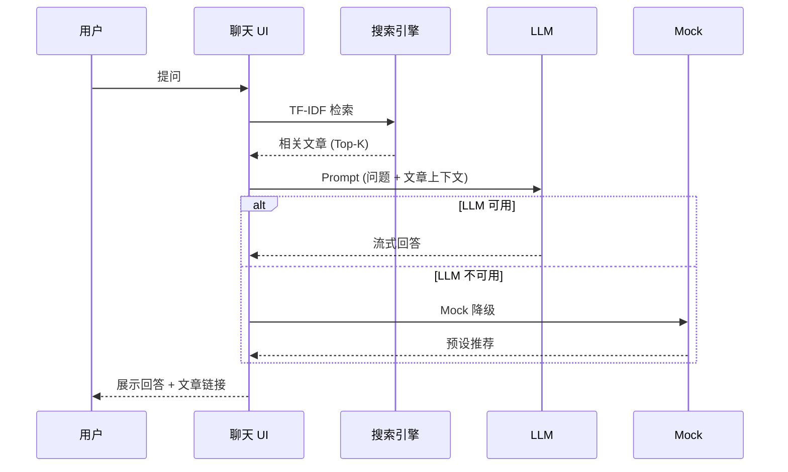

astro-minimax 不只是又一个博客主题。它是对「如何构建一个现代技术博客」的系统性回答。本文记录每个关键决策背后的思考。

## 为什么做这个项目

### 问题

2024-2025 年的博客生态面临几个核心矛盾：

1. **简单 vs 功能丰富** — 极简主题缺功能，功能丰富的主题又太臃肿
2. **开箱即用 vs 可定制** — 模板容易上手但难以持续维护，NPM 包灵活但配置门槛高
3. **内容创作 vs 技术维护** — 博主希望专注写作，却要花大量时间在工程化上
4. **AI 集成碎片化** — 想给博客加 AI 功能，需要自己拼接多个服务

### 目标

一个**极简为底座、无限可扩展**的博客系统：

- 内容创作者：3 分钟启动，专注写作
- 开发者：模块化架构，精确控制每个功能
- 两者都不需要在简单和强大之间做选择

## 架构决策

### 为什么选 Astro

在 2026 年的 SSG 框架中，Astro 有几个独特优势：

| 对比维度 | Astro v6 | Next.js | Hugo | Hexo |
|----------|----------|---------|------|------|
| **JS 输出** | 零 JS（除交互组件） | 完整 React 运行时 | 零 JS | 最小 JS |
| **构建速度** | 快（Vite） | 中等 | 极快（Go） | 中等 |
| **TypeScript** | 原生支持 | 原生支持 | 不支持 | 插件 |
| **组件模型** | 多框架岛屿 | React only | Go 模板 | EJS/Pug |
| **内容层** | Content Layer API | MDX 需手工 | 内置 | 内置 |
| **Edge Runtime** | Cloudflare Workers | Vercel Edge | 纯静态 | 纯静态 |

关键选择因素：
- **岛屿架构**：默认零 JS，只在需要交互的组件（如 AI 聊天）加载脚本。博客大部分页面是纯静态内容，不需要 JavaScript
- **Content Layer API**：Astro 6 的内容层允许从文件系统加载内容并验证 frontmatter 类型，无需额外工具
- **Edge Runtime 支持**：AI 聊天的后端 API 直接运行在 Cloudflare Workers，无需独立的服务器

### 为什么 Monorepo + 5 个包

传统博客主题是单一仓库：

```
typical-theme/
└── src/          # 所有代码混在一起
    ├── layouts/
    ├── components/
    ├── ai/       # AI 代码和主题代码耦合
    └── styles/
```

astro-minimax 拆分为 5 个独立包：

```
astro-minimax/
├── packages/core/    # 必需：布局、组件、路由
├── packages/viz/     # 可选：Mermaid、Markmap
├── packages/ai/      # 可选：AI 聊天、RAG
├── packages/notify/  # 可选：通知系统
└── packages/cli/     # 推荐：命令行工具
```

**为什么这样拆**：

1. **按需安装** — 不需要 AI 功能的博客不需要安装 `ai` 和 `workers-ai-provider` 等 20+ 依赖
2. **独立更新** — 修复 AI 包的 bug 不影响核心主题的稳定性
3. **依赖隔离** — `@astro-minimax/viz` 依赖 Mermaid（800KB+），不安装它的博客完全不受影响
4. **可替换性** — 用户可以用自己的 AI 实现替换 `@astro-minimax/ai`

**数据**：完整安装所有包约 1000+ 依赖，只安装 core 约 300 依赖。

### 为什么用虚拟模块

astro-minimax 的 core 包使用 Astro Integration + Vite Virtual Modules：

```typescript
// 用户的 config.ts
export const SITE = { ... };

// core 的 integration.ts
resolveId(id) {
  if (id === "virtual:astro-minimax/config") return "\0" + id;
},
load(id) {
  if (id === "\0virtual:astro-minimax/config") {
    return `export const SITE = ${JSON.stringify(userConfig.site)};`;
  }
}
```

**为什么不直接导入**：
- 虚拟模块让核心包的组件和页面可以通过 `import { SITE } from "virtual:astro-minimax/config"` 获取用户配置，而不需要知道用户项目的文件路径
- 这是实现「用户配置 → 核心主题」解耦的关键技术

### 为什么三种集成方式

1. **CLI 创建** — `npx @astro-minimax/cli init my-blog`
   - 目标用户：想快速启动的人
   - 特点：30 秒获得完整博客
   
2. **GitHub Template** — Fork 整个 monorepo
   - 目标用户：想深度定制的开发者
   - 特点：完全控制所有代码

3. **NPM 包** — `pnpm add @astro-minimax/core`
   - 目标用户：已有 Astro 项目，想引入部分功能
   - 特点：按需引入

## AI 决策

### 为什么内置 AI 聊天

2025-2026 年 AI 已不再是新鲜事物。对技术博客而言，AI 聊天解决了一个真实问题：

**读者的真实需求**：
- 「这个博客有关于 Docker 部署的文章吗？」
- 「这篇文章的核心观点是什么？」
- 「有推荐的入门教程吗？」

传统搜索只能匹配关键词，AI 聊天可以理解意图并推荐相关内容。

### 为什么选 RAG 而非纯 LLM

纯 LLM 调用的问题：
- AI 不知道你的博客有什么内容
- 容易产生幻觉（编造不存在的文章链接）
- 无法推荐你的具体文章

astro-minimax 的 RAG 方案：



1. **构建时**：CLI 工具生成文章摘要、关键要点（`astro-minimax ai process`）
2. **运行时**：用户提问 → TF-IDF 搜索相关文章 → 拼接为 Prompt 上下文 → LLM 生成回答
3. **结果**：AI 的回答总是基于你博客的真实内容，并附上文章链接

### 为什么 TF-IDF 而非 Embedding

| 对比 | TF-IDF | Embedding (OpenAI) |
|------|--------|-------------------|
| **成本** | 零（纯计算） | 按 Token 计费 |
| **延迟** | <10ms | 100-500ms |
| **依赖** | 无 | 需要 API Key |
| **效果** | 关键词匹配，足够博客场景 | 语义理解，更精准 |

对于博客规模的内容（10-1000 篇文章），TF-IDF 的效果完全够用。省下的延迟和成本可以投入到更重要的地方。

### 为什么需要来源分层协议

即使用了 RAG，AI 仍可能：
- 混淆不同来源的信息优先级
- 将写作风格描述当作事实依据
- 在没有证据时编造答案

来源分层协议（L1-L5）明确规定了信息优先级：

```
L1 博客原始内容 > L2 作者简介 > L3 统计数据 > L5 语言风格
```

这让 AI 在回答时自动遵循：「如果博客文章说了 A，不要引用其他来源说 B」。

### 为什么需要 Mock 降级

现实中的问题：
- 新用户还没配置 API Key
- API 服务偶尔不可用
- 免费额度用完了

如果这些情况下 AI 聊天直接报错或不显示，用户体验很差。Mock 模式保证：
- 永远有回应
- 返回基于关键词匹配的预设文章推荐
- 比空白页面好得多

## 搜索决策

### Pagefind vs DocSearch

astro-minimax 支持两种搜索方案：

| 对比 | Pagefind | Algolia DocSearch |
|------|----------|-------------------|
| **成本** | 免费 | 免费（开源项目） |
| **部署** | 零配置（构建时索引） | 需要申请或自建 |
| **隐私** | 100% 本地 | 数据在 Algolia 服务器 |
| **速度** | 快（静态文件） | 更快（CDN + 缓存） |
| **功能** | 基础全文搜索 | 搜索建议、自动补全 |

默认 Pagefind 的理由：零配置、零成本、完全静态。DocSearch 作为高级选项提供给需要更好搜索体验的用户。

## 通知系统决策

### 为什么独立成包

通知功能看似简单，但独立成包有几个原因：

1. **不强制依赖** — 不需要通知的博客不安装
2. **多事件类型** — 评论通知和 AI 对话通知的模板不同
3. **可复用** — 其他项目也可以直接使用 `@astro-minimax/notify`

### 为什么支持三个渠道

- **Telegram**：实时性最好，适合移动端
- **Email**：最通用，适合备份和存档
- **Webhook**：最灵活，可以对接任何系统（Slack、Discord、飞书等）

## CLI 工具决策

### 为什么需要 CLI

没有 CLI 时，用户需要：
1. 手动创建 Markdown 文件
2. 手动编写 frontmatter
3. 手动运行 AI 处理脚本
4. 手动检查数据文件状态

有 CLI 后：
```bash
astro-minimax post new "文章标题"  # 一键创建
astro-minimax ai process            # 一键处理
astro-minimax data status            # 一键检查
astro-minimax ai eval                # 一键评估
```

### 为什么不用 Astro CLI 插件

Astro 的 CLI 扩展点有限，不支持自定义子命令。独立 CLI 可以提供更丰富的功能，且不依赖 Astro 运行时。

## 竞争力分析

### 与同类项目对比

| 特性 | astro-minimax | AstroPaper | Starlight | Nextra |
|------|---------------|------------|-----------|--------|
| **框架** | Astro 6 | Astro 4 | Astro | Next.js |
| **AI 聊天** | 内置（RAG + 多 Provider） | 无 | 无 | 无 |
| **搜索** | Pagefind + DocSearch | Pagefind | Pagefind | Algolia |
| **可视化** | Mermaid + Markmap + Rough.js + Excalidraw | 无 | Mermaid | 无 |
| **通知** | Telegram + Email + Webhook | 无 | 无 | 无 |
| **CLI 工具** | 完整（创建+处理+评估） | 无 | 有 | 无 |
| **模块化** | 5 个独立包 | 单体 | 单包 | 单包 |
| **i18n** | 中英双语 | 无 | 多语言 | 多语言 |
| **评论** | Waline | 无 | 无 | 无 |

### 核心竞争力

1. **AI 原生** — 不是事后加的插件，而是从架构层面集成
2. **模块化极致** — 5 包分离，按需组合，互不影响
3. **开发者友好** — CLI 工具链、TypeScript 严格模式、完整文档
4. **中文生态** — 专为中文用户优化（中文分词、Waline、WeChat Pay）

## 技术数据

### 性能指标（基于示例博客）

- Lighthouse Performance: 95+
- First Contentful Paint: <1.5s
- Total Blocking Time: <50ms
- Cumulative Layout Shift: <0.01
- 首页 JS 大小: 0KB（纯静态）
- 文章页 JS 大小: ~2KB（仅 View Transitions）

### 包大小

| 包 | 安装大小 | 依赖数 |
|----|----------|--------|
| `@astro-minimax/core` | ~50KB（源码） | 0（peer deps） |
| `@astro-minimax/viz` | ~30KB + Mermaid | 4 |
| `@astro-minimax/ai` | ~80KB + AI SDK | 4 |
| `@astro-minimax/notify` | ~20KB + grammy | 1 |
| `@astro-minimax/cli` | ~100KB + tsx | 2 |

## 未来方向

### 短期（v0.8-v1.0）

- Turnstile 人机验证
- 对话记忆（跨会话）
- Astro 6 增量构建优化

### 中期（v1.x）

- 语义搜索（Embeddings）
- 多模态支持（图片理解）
- AI 写作辅助
- PWA 离线阅读

### 长期

- 可视化编辑器
- 博客生态市场（主题/插件）

---

这篇文章是 astro-minimax 设计思路的完整记录。如果你对某个决策有疑问或建议，欢迎在 [GitHub Issues](https://github.com/souloss/astro-minimax/issues) 中讨论。
