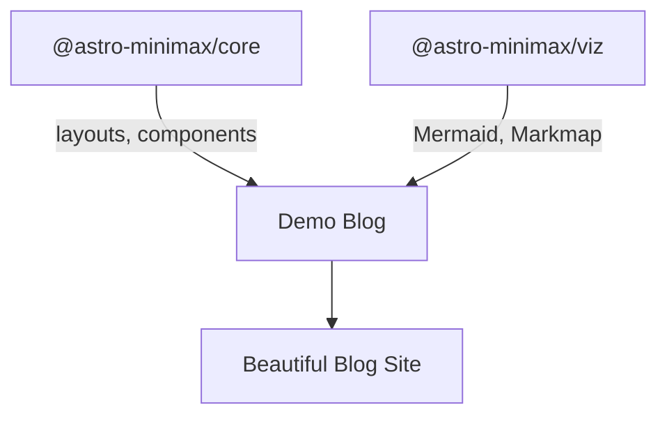

## Visualization Test

This page tests the visualization components from **@astro-minimax/viz**.

## Mermaid Diagram



## Markmap Mind Map

```markmap
# astro-minimax

## @astro-minimax/core
- Layouts
  - Layout.astro
  - PostDetails.astro
- Components
  - nav/
  - ui/
  - blog/
- Utils & Plugins

## @astro-minimax/viz
- Mermaid Diagrams
- Markmap Mind Maps
- VizContainer
- RoughDrawing
- Excalidraw

## Demo Blog
- Uses both packages
- Modular & customizable
- NPM-publishable
```

## Package Usage

Both packages are installed from the monorepo workspace:

```json
{
  "dependencies": {
    "@astro-minimax/core": "workspace:*",
    "@astro-minimax/viz": "workspace:*"
  }
}
```

When published to npm, users would use:

```json
{
  "dependencies": {
    "@astro-minimax/core": "^1.0.0",
    "@astro-minimax/viz": "^1.0.0"
  }
}
```
