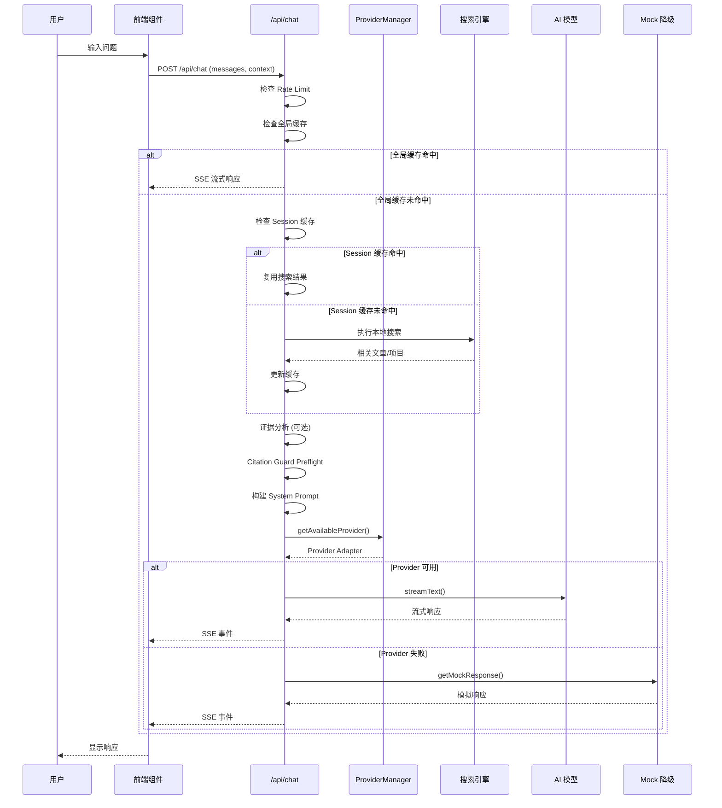

# AI 对话模块全面技术文档

> 本文档详细介绍 astro-minimax (astro-minblog) 项目中 AI 对话相关的工作机制与原理，涵盖构建时数据生成、运行时架构、模型配置、RAG 实现、对话流程、超时降级方案及部署方式。

## 目录

1. [系统概述](#1-系统概述)
2. [整体架构](#2-整体架构)
3. [构建时数据生成](#3-构建时数据生成)
4. [运行时架构](#4-运行时架构)
5. [模型配置与超时降级](#5-模型配置与超时降级)
6. [RAG 实现详解](#6-rag-实现详解)
7. [完整对话流程](#7-完整对话流程)
8. [前端组件架构](#8-前端组件架构)
9. [缺失功能分析](#9-缺失功能分析)
10. [部署方式](#10-部署方式)
11. [配置参数参考](#11-配置参数参考)

---

## 1. 系统概述

### 1.1 项目定位

astro-minimax 是一个**极简、模块化、可插拔**的 Astro 博客主题，AI 对话模块作为独立的 NPM 包 (`@astro-minimax/ai`) 提供，支持：

- **多 Provider 自动故障转移**
- **RAG 检索增强生成**
- **边读边聊（阅读伴侣模式）**
- **流式响应**
- **Mock 降级保证可用性**

### 1.2 核心特性

| 特性 | 说明 |
|------|------|
| **模块化架构** | AI 模块作为独立包，可与核心主题分离使用 |
| **多 Provider** | Workers AI + OpenAI 兼容 API，自动优先级选择和故障转移 |
| **RAG 增强** | 基于 TF-IDF 的本地搜索引擎，无嵌入模型依赖 |
| **边读边聊** | 文章页自动注入上下文，进入阅读伴侣模式 |
| **全局缓存** | 公共问题跨用户缓存，提高响应速度 |
| **Mock 降级** | 所有 Provider 失败时自动回退到模拟响应 |
| **通知系统** | 支持 Telegram/Webhook/Email 多渠道通知 |

### 1.3 技术栈

- **前端**: Preact + AI SDK (`@ai-sdk/react`)
- **后端**: Cloudflare Pages Functions (Edge Runtime)
- **AI 模型**: OpenAI 兼容 API + Workers AI + Mock
- **搜索**: 自建 TF-IDF 搜索引擎
- **缓存**: KV + Memory 双模式
- **流式传输**: SSE (Server-Sent Events)

### 1.4 包结构

```
@astro-minimax/ai
├── components/      # Preact UI 组件
├── providers/       # Provider 适配器
├── provider-manager/# 多 Provider 管理
├── server/          # 服务端处理逻辑
├── intelligence/    # 智能模块（意图、关键词、证据、引用）
├── search/          # 搜索与缓存
├── prompt/          # 三层 Prompt 构建
├── cache/           # 缓存抽象层
├── middleware/      # 限流中间件
├── stream/          # 流式响应工具
└── data/            # 构建时数据加载
```

---

## 2. 整体架构

### 2.1 架构图

```
┌─────────────────────────────────────────────────────────────────────────────┐
│                              用户请求流程                                     │
└─────────────────────────────────────────────────────────────────────────────┘
                                      │
                                      ▼
┌─────────────────────────────────────────────────────────────────────────────┐
│                      Cloudflare Pages Functions Edge                         │
│  ┌─────────────────────────────────────────────────────────────────────┐   │
│  │                  functions/api/chat.ts (Thin Adapter)               │   │
│  │  ┌────────────────────────────────────────────────────────────┐    │   │
│  │  │ initializeMetadata(summaries, authorContext, voiceProfile) │    │   │
│  │  └────────────────────────────────────────────────────────────┘    │   │
│  │                              │                                       │   │
│  │  ┌────────────────────────────────────────────────────────────┐    │   │
│  │  │ handleChatRequest({ env, request })                         │    │   │
│  │  │   → @astro-minimax/ai/server/chat-handler.ts               │    │   │
│  │  └────────────────────────────────────────────────────────────┘    │   │
│  └─────────────────────────────────────────────────────────────────────┘   │
└─────────────────────────────────────────────────────────────────────────────┘
                                      │
                                      ▼
┌─────────────────────────────────────────────────────────────────────────────┐
│                    @astro-minimax/ai/server/chat-handler.ts                  │
│  ┌─────────────────────────────────────────────────────────────────────┐   │
│  │  1. Rate Limit Check (middleware/rate-limiter.ts)                   │   │
│  │  2. Request Validation (messages, input length)                     │   │
│  │  3. Global Cache Check (public questions)                           │   │
│  │  4. Search Context Reuse (session cache)                            │   │
│  │  5. Keyword Extraction (optional, intelligence/keyword-extract.ts) │   │
│  │  6. Local Search (search/search-api.ts)                             │   │
│  │  7. Evidence Analysis (optional, intelligence/evidence-analysis.ts) │   │
│  │  8. Citation Guard Preflight (intelligence/citation-guard.ts)       │   │
│  │  9. Prompt Build (prompt/prompt-builder.ts)                         │   │
│  │  10. Provider Selection (provider-manager/manager.ts)               │   │
│  │  11. Stream Response (streamText → SSE)                             │   │
│  │  12. Mock Fallback (if all providers fail)                          │   │
│  └─────────────────────────────────────────────────────────────────────┘   │
└─────────────────────────────────────────────────────────────────────────────┘
                                      │
                    ┌─────────────────┼─────────────────┐
                    ▼                 ▼                 ▼
            ┌─────────────┐   ┌─────────────┐   ┌─────────────┐
            │ Workers AI  │   │ OpenAI API  │   │ Mock Fallback│
            │ (Priority)  │   │ (Failover)  │   │ (Guaranteed) │
            └─────────────┘   └─────────────┘   └─────────────┘
```

### 2.2 数据流向

```
构建时 (Build Time)
────────────────────
content/posts/*.md ──┐
                      │    ┌──────────────────────────┐
                      ├──→ │ tools/ai-process.ts      │ ──→ datas/ai-summaries.json
                      │    └──────────────────────────┘               ai-seo.json
                      │
                      │    ┌──────────────────────────┐
                      ├──→ │ tools/build-author-context│ ──→ datas/author-context.json
                      │    └──────────────────────────┘
                      │
                      │    ┌──────────────────────────┐
                      ├──→ │ tools/build-voice-profile │ ──→ datas/voice-profile.json
                      │    └──────────────────────────┘
                      │
                      │    ┌──────────────────────────┐
                      └──→ │ tools/vectorize.ts        │ ──→ src/data/vectors/index.json
                           └──────────────────────────┘

运行时 (Runtime)
────────────────
用户问题 → 全局缓存检查 → Session缓存检查 → 关键词提取(可选) → 本地搜索 
         → 证据分析(可选) → Prompt构建 → Provider选择 → AI生成 → Mock降级(可选)
```

---

## 3. 构建时数据生成

### 3.1 数据文件概览

| 文件 | 用途 | 生成脚本 | 更新频率 |
|------|------|----------|----------|
| `datas/ai-summaries.json` | 文章 AI 摘要与关键要点 | `tools/ai-process.ts` | 文章变更时 |
| `datas/ai-seo.json` | SEO 元数据 | `tools/ai-process.ts` | 文章变更时 |
| `datas/author-context.json` | 作者上下文信息 | `tools/build-author-context.ts` | 定期更新 |
| `datas/voice-profile.json` | 语言风格画像 | `tools/build-voice-profile.ts` | 定期更新 |
| `datas/ai-skip-list.json` | AI 处理失败列表 | `tools/ai-process.ts` | 错误时 |
| `src/data/vectors/index.json` | 向量索引 | `tools/vectorize.ts` | 文章变更时 |

### 3.2 核心脚本详解

#### 3.2.1 `ai-process.ts` - 文章 AI 处理

**功能**：批量为文章生成 AI 摘要和 SEO 元数据

**用法**：
```bash
pnpm ai:process                    # 处理所有文章（增量）
pnpm ai:process --force            # 强制重新处理
pnpm ai:process --slug=xxx         # 处理指定文章
pnpm ai:process --lang=zh          # 只处理中文文章
pnpm ai:process --task=summary     # 只生成摘要
pnpm ai:process --dry-run          # 预览模式
```

**数据结构** (`datas/ai-summaries.json`)：
```json
{
  "meta": {
    "lastUpdated": "2026-03-15T00:00:00Z",
    "model": "gpt-4o-mini",
    "totalProcessed": 22
  },
  "articles": {
    "zh/getting-started": {
      "data": {
        "summary": "一句话摘要（50-80字）",
        "abstract": "详细摘要（150-300字）",
        "keyPoints": ["要点1", "要点2", "要点3"],
        "tags": ["配置", "快速开始"],
        "readingTime": 5
      },
      "contentHash": "a1b2c3d4",
      "processedAt": "2026-03-15T00:00:00Z"
    }
  }
}
```

#### 3.2.2 `build-author-context.ts` - 作者上下文构建

**功能**：聚合博客文章数据，生成作者上下文

**数据结构** (`datas/author-context.json`)：
```json
{
  "$schema": "author-context-v1",
  "generatedAt": "2026-03-15T20:38:29.446Z",
  "profile": {
    "name": "Souloss",
    "siteUrl": "https://demo-astro-minimax.souloss.cn/"
  },
  "posts": [
    {
      "id": "zh/getting-started",
      "title": "快速开始指南",
      "date": "2026-03-12T00:00:00.000Z",
      "lang": "zh",
      "category": "教程/博客",
      "tags": ["docs", "configuration"],
      "summary": "...",
      "keyPoints": [...],
      "url": "/zh/getting-started"
    }
  ]
}
```

#### 3.2.3 `build-voice-profile.ts` - 语言风格构建

**功能**：从博客内容提取作者表达风格特征（纯本地分析，不调用 AI）

**数据结构** (`datas/voice-profile.json`)：
```json
{
  "$schema": "voice-profile-v1",
  "overall_tone": {
    "description": "技术博客风格，注重实践与可操作性",
    "primary_persona": "技术博主",
    "communication_style": "先给结论，再补细节"
  },
  "blog_title_style": {
    "total": 22,
    "style": {
      "vertical_bar_rate": 0,
      "colon_rate": 18,
      "english_mix_rate": 91
    }
  },
  "expression_habits": {
    "frequent_expressions": [
      { "word": "推荐", "count": 10 },
      { "word": "分享", "count": 7 }
    ]
  }
}
```

#### 3.2.4 `vectorize.ts` - 向量索引生成

**功能**：生成文章向量索引，支持 TF-IDF 和 OpenAI Embeddings 两种模式

**用法**：
```bash
pnpm tools:vectorize              # TF-IDF 模式（无需 API Key）
pnpm tools:vectorize --openai     # OpenAI Embeddings 模式
```

**数据结构** (`src/data/vectors/index.json`)：
```json
{
  "version": 1,
  "method": "tfidf",
  "createdAt": "2026-03-15T00:00:00Z",
  "vocabulary": ["astro", "blog", "config", ...],
  "chunks": [
    {
      "postId": "zh/getting-started",
      "title": "快速开始指南",
      "lang": "zh",
      "chunkIndex": 0,
      "text": "内容片段...",
      "vector": [0.1, 0.2, ...]
    }
  ]
}
```

---

## 4. 运行时架构

### 4.1 API 路由结构

```
apps/blog/functions/api/
├── chat.ts          # 主对话 API
└── ai-info.ts       # Provider 状态查询 API
```

### 4.2 主对话 API (`/api/chat`)

**文件**: `apps/blog/functions/api/chat.ts`

**特点**：薄适配层，核心逻辑在 `@astro-minimax/ai/server`

```typescript
// functions/api/chat.ts
import { handleChatRequest, initializeMetadata } from '@astro-minimax/ai/server';

export const onRequest: PagesFunction<FunctionEnv> = async (context) => {
  initializeMetadata(
    { summaries: aiSummaries, authorContext: authorContextJson, voiceProfile },
    context.env,
  );
  return handleChatRequest({ env: context.env, request: context.request });
};
```

**请求格式**：
```typescript
POST /api/chat
Content-Type: application/json

{
  "context": {
    "scope": "article",           // "global" | "article"
    "article": {                  // 仅 scope="article" 时
      "slug": "zh/getting-started",
      "title": "快速开始指南",
      "summary": "...",
      "keyPoints": [...],
      "categories": [...]
    }
  },
  "id": "article:zh/getting-started",
  "messages": [
    { "id": "msg-1", "role": "user", "parts": [{ "type": "text", "text": "你好" }] }
  ]
}
```

**响应格式**：SSE 流式响应

### 4.3 核心模块职责

| 模块 | 文件 | 职责 |
|------|------|------|
| **chat-handler** | `server/chat-handler.ts` | 主请求处理入口，RAG Pipeline |
| **rate-limiter** | `middleware/rate-limiter.ts` | 三级限流（突发/持续/每日） |
| **provider-manager** | `provider-manager/manager.ts` | 多 Provider 管理与故障转移 |
| **search-api** | `search/search-api.ts` | 本地 TF-IDF 搜索 |
| **session-cache** | `search/session-cache.ts` | Session 级搜索缓存 |
| **keyword-extract** | `intelligence/keyword-extract.ts` | 关键词提取 |
| **evidence-analysis** | `intelligence/evidence-analysis.ts` | 证据分析 |
| **citation-guard** | `intelligence/citation-guard.ts` | 引用约束 |

### 4.4 Session 缓存机制

**目的**：对话上下文复用，避免重复搜索

**缓存键**：从请求中提取（可自定义）

**缓存策略**：
- TTL: 10 分钟
- 复用条件: 跟随问题 + 话题连续

### 4.5 全局缓存机制

**目的**：公共问题跨用户共享搜索结果

**检测模式**：
```typescript
const PUBLIC_QUESTION_PATTERNS = [
  { type: 'article_count', patterns: [/有几篇/, /有多少篇/] },
  { type: 'project_list', patterns: [/有哪些项目/, /项目列表/] },
  { type: 'about', patterns: [/介绍.*自己/, /关于你/] },
];
```

**TTL**：根据问题类型动态调整

---

## 5. 模型配置与超时降级

### 5.1 Provider 优先级

```
Workers AI (weight: 100) → OpenAI Compatible (weight: 90) → Mock (weight: 0)
```

### 5.2 Provider 配置

**Workers AI**：
```typescript
// 通过 wrangler.toml 配置
[ai]
binding = "souloss"

// 代码中使用
const workersAI = new WorkersAIAdapter(config, env);
```

**OpenAI Compatible**：
```typescript
// 环境变量
AI_BASE_URL=https://api.openai.com/v1
AI_API_KEY=sk-xxx
AI_MODEL=gpt-4o-mini

// 可选：不同任务使用不同模型
AI_KEYWORD_MODEL=gpt-4o-mini
AI_EVIDENCE_MODEL=gpt-4o-mini
```

### 5.3 超时配置

| 阶段 | 超时时间 | 失败行为 |
|------|----------|----------|
| 关键词提取 | 5s | 使用本地搜索查询 |
| 证据分析 | 8s | 跳过分析阶段 |
| 主请求 | 45s | 尝试下一个 Provider |
| 所有 Provider 失败 | - | 回退到 Mock |

### 5.4 健康检查与故障转移

```typescript
interface ProviderHealth {
  healthy: boolean;
  consecutiveFailures: number;
  lastFailureTime: number;
  lastSuccessTime: number;
}

// 故障阈值
unhealthyThreshold: 3,        // 连续失败 3 次标记为不健康
healthRecoveryTTL: 60000,     // 60 秒后尝试恢复
```

### 5.5 Mock 降级

当所有 Provider 都不可用时，自动回退到 Mock 响应：

```typescript
// providers/mock.ts
export function getMockResponse(query: string, lang: string): string {
  const responses = {
    zh: "抱歉，AI 服务暂时不可用。请稍后再试，或者直接浏览博客文章。",
    en: "Sorry, AI service is temporarily unavailable. Please try again later."
  };
  return responses[lang] || responses.en;
}
```

---

## 6. RAG 实现详解

### 6.1 RAG 架构概述

与 luoleiorg-x 相同，采用**无嵌入模型的轻量级 RAG**方案：

```
传统 RAG 架构                    astro-minimax RAG 架构
─────────────────               ────────────────────────
文档 → Embedding → 向量数据库     文档 → TF-IDF 索引 → JSON
查询 → Embedding → 相似搜索       查询 → 关键词提取 → TF-IDF 匹配
Top-K → LLM                     Top-K → LLM
```

### 6.2 搜索核心实现

**搜索索引**：`search/search-index.ts`

```typescript
export function buildSearchIndex(docs: SearchDocument[]): IndexedDocument[] {
  return docs.map(doc => ({
    ...doc,
    tokens: tokenize(doc.content),
    termFrequency: calculateTermFrequency(doc.content),
  }));
}
```

**搜索执行**：`search/search-api.ts`

```typescript
export function searchArticles(query: string, options): ArticleContext[] {
  const tokens = tokenize(query);
  const limit = tokens.length <= 2 ? ARTICLE_LIMIT_BROAD : ARTICLE_LIMIT; // 20 vs 10
  
  const rawResults = scoreDocs(articleIndex, tokens, limit * 2);
  const filtered = applyAnchorFilter(rawResults, query, tokens);
  const deduplicated = filterLowRelevance(filtered);
  
  return deduplicated.slice(0, limit);
}
```

### 6.3 深度内容提取

```typescript
const DEEP_CONTENT_SCORE_THRESHOLD = 8;
const DEEP_CONTENT_MAX_LENGTH = 1500;

// 如果首篇文章得分 ≥ 8 且远超第二名，提取全文
if (topScore >= 8 && topScore > secondScore * 1.5) {
  article.fullContent = result.content.slice(0, 1500);
}
```

---

## 7. 完整对话流程

### 7.1 流程图

```
┌─────────────────────────────────────────────────────────────────────────────┐
│                           完整请求处理流程                                   │
└─────────────────────────────────────────────────────────────────────────────┘

POST /api/chat
      │
      ▼
┌─────────────────────────────────────────────────────────────────────────────┐
│ Stage 1: 预处理 (≤5ms)                                                      │
│ ┌─────────────────────────────────────────────────────────────────────────┐ │
│ │ • CORS preflight 检查                                                   │ │
│ │ • Rate Limit 检查（三级：burst/sustained/daily）                        │ │
│ │ • 请求体验证（JSON 格式、messages 非空、输入长度 ≤500）                 │ │
│ │ • 设置总超时 45s                                                         │ │
│ └─────────────────────────────────────────────────────────────────────────┘ │
└─────────────────────────────────────────────────────────────────────────────┘
      │
      ▼
┌─────────────────────────────────────────────────────────────────────────────┐
│ Stage 2: 全局缓存检查 (≤10ms)                                               │
│ ┌─────────────────────────────────────────────────────────────────────────┐ │
│ │ • 检测是否为公共问题（article_count/project_list/about）                │ │
│ │ • 命中 → 直接使用缓存搜索结果，跳过后续搜索                              │ │
│ │ • 未命中 → 继续正常流程                                                  │ │
│ └─────────────────────────────────────────────────────────────────────────┘ │
└─────────────────────────────────────────────────────────────────────────────┘
      │
      ▼
┌─────────────────────────────────────────────────────────────────────────────┐
│ Stage 3: Session 缓存检查 (≤10ms)                                           │
│ ┌─────────────────────────────────────────────────────────────────────────┐ │
│ │ • 提取 session id（从 x-session-id 头）                                 │ │
│ │ • 判断是否为跟随问题                                                    │
│ │ • 检查话题连续性 + 缓存有效期                                           │
│ │ • 可复用 → 使用缓存搜索结果                                             │ │
│ │ • 不可复用 → 执行新搜索                                                 │ │
│ └─────────────────────────────────────────────────────────────────────────┘ │
└─────────────────────────────────────────────────────────────────────────────┘
      │
      ▼
┌─────────────────────────────────────────────────────────────────────────────┐
│ Stage 4: 关键词提取（可选，≤5s）                                            │
│ ┌─────────────────────────────────────────────────────────────────────────┐ │
│ │ 触发条件：首轮对话 OR 复杂查询                                          │ │
│ │ 流程：LLM 分析 → 提取搜索关键词                                         │ │
│ │ 超时降级：使用原始用户查询                                              │ │
│ │ 模型：AI_KEYWORD_MODEL 或默认模型                                       │ │
│ └─────────────────────────────────────────────────────────────────────────┘ │
└─────────────────────────────────────────────────────────────────────────────┘
      │
      ▼
┌─────────────────────────────────────────────────────────────────────────────┐
│ Stage 5: 本地搜索 (≤100ms)                                                  │
│ ┌─────────────────────────────────────────────────────────────────────────┐ │
│ │ • TF-IDF 文章搜索（10-20 篇）                                           │ │
│ │ • TF-IDF 项目搜索（5 个）                                               │ │
│ │ • 深度内容提取（得分≥8 且远超第二名时提取全文≤1500字）                  │ │
│ │ • 更新 Session 缓存                                                     │ │
│ │ • 公共问题 → 更新全局缓存                                               │ │
│ └─────────────────────────────────────────────────────────────────────────┘ │
└─────────────────────────────────────────────────────────────────────────────┘
      │
      ▼
┌─────────────────────────────────────────────────────────────────────────────┐
│ Stage 6: 证据分析（可选，≤8s）                                              │
│ ┌─────────────────────────────────────────────────────────────────────────┐ │
│ │ 触发条件：文章数≥2 + 非简单查询 + 查询长度≥15                           │ │
│ │ 流程：LLM 分析 → 提取 2-3 个关键信息点                                  │ │
│ │ 超时降级：跳过此阶段                                                    │ │
│ │ 模型：AI_EVIDENCE_MODEL 或默认模型                                      │ │
│ │ 输出：360 tokens 以内的结构化分析                                       │ │
│ └─────────────────────────────────────────────────────────────────────────┘ │
└─────────────────────────────────────────────────────────────────────────────┘
      │
      ▼
┌─────────────────────────────────────────────────────────────────────────────┐
│ Stage 7: Citation Guard Preflight (≤1ms)                                    │
│ ┌─────────────────────────────────────────────────────────────────────────┐ │
│ │ • 检测"有几篇"类问题 → 返回计数结果（不调用 LLM）                       │ │
│ │ • 检测"有没有"类问题 + 无结果 → 返回预设回复                            │ │
│ │ • 触发 Preflight → 直接返回，跳过 LLM 调用                             │ │
│ └─────────────────────────────────────────────────────────────────────────┘ │
└─────────────────────────────────────────────────────────────────────────────┘
      │
      ▼
┌─────────────────────────────────────────────────────────────────────────────┐
│ Stage 8: Prompt 构建 (≤10ms)                                                │
│ ┌─────────────────────────────────────────────────────────────────────────┐ │
│ │ 三层结构：                                                              │ │
│ │ • Static Layer: 作者身份、职责、约束（固定）                           │ │
│ │ • Semi-Static Layer: 博客概况、最新文章（构建时更新）                   │ │
│ │ • Dynamic Layer: 用户问题、相关文章、证据分析（每次请求）               │ │
│ │                                                                         │ │
│ │ 特殊模式：                                                              │ │
│ │ • 文章页 → 注入 articleContext（边读边聊模式）                          │ │
│ └─────────────────────────────────────────────────────────────────────────┘ │
└─────────────────────────────────────────────────────────────────────────────┘
      │
      ▼
┌─────────────────────────────────────────────────────────────────────────────┐
│ Stage 9: Provider 选择与 AI 生成 (≤30s)                                     │
│ ┌─────────────────────────────────────────────────────────────────────────┐ │
│ │ Provider 优先级：                                                       │ │
│ │ Workers AI (100) → OpenAI Compatible (90) → Mock (0)                    │ │
│ │                                                                         │ │
│ │ 健康检查：                                                              │ │
│ │ • 连续失败 3 次 → 标记为不健康                                          │ │
│ │ • 60 秒后尝试恢复                                                       │ │
│ │                                                                         │ │
│ │ 流式输出：                                                              │ │
│ │ • SSE 流式传输                                                          │ │
│ │ • 发送搜索状态元数据                                                    │ │
│ │ • 发送 source 引用                                                      │ │
│ │ • 合并 AI 输出流                                                        │ │
│ └─────────────────────────────────────────────────────────────────────────┘ │
└─────────────────────────────────────────────────────────────────────────────┘
      │
      ▼
┌─────────────────────────────────────────────────────────────────────────────┐
│ Stage 10: 错误处理与降级                                                    │
│ ┌─────────────────────────────────────────────────────────────────────────┐ │
│ │ 错误分类：                                                              │ │
│ │ • rate limit → 429（可重试）                                            │ │
│ │ • timeout → 504（可重试）                                               │ │
│ │ • provider unavailable → 503（可重试）                                  │ │
│ │ • input too long → 400（不可重试）                                      │ │
│ │                                                                         │ │
│ │ Mock 降级：                                                             │ │
│ │ • 所有 Provider 失败 → 返回预设响应                                     │ │
│ │ • 保证用户始终能收到回复                                                │ │
│ └─────────────────────────────────────────────────────────────────────────┘ │
└─────────────────────────────────────────────────────────────────────────────┘
```

### 7.2 流程图（Mermaid）



### 7.2 详细步骤说明

#### Step 1: 请求验证

```typescript
// 最大历史消息数
const MAX_HISTORY_MESSAGES = 20;
// 最大输入长度
const MAX_INPUT_LENGTH = 500;
// 请求总超时
const REQUEST_TIMEOUT_MS = 45_000;
```

#### Step 2: 全局缓存检查

```typescript
const publicQuestion = detectPublicQuestion(latestText);
if (publicQuestion && (!publicQuestion.needsContext || articleSlug)) {
  const cachedSearch = await getGlobalSearchCache(cache, publicQuestion.type, context);
  if (cachedSearch) {
    // 直接使用缓存的搜索结果
    return streamResponse(cachedSearch);
  }
}
```

#### Step 3: 本地搜索

```typescript
if (!relatedArticles.length) {
  relatedArticles = searchArticles(searchQuery, { enableDeepContent: true });
  relatedProjects = searchProjects(searchQuery);
}
```

#### Step 4: 证据分析（可选）

```typescript
if (!shouldSkipAnalysis(latestText, articleCount, complexity)) {
  const evidenceResult = await analyzeRetrievedEvidence({
    userQuery, articles, projects, provider, model
  });
  evidenceSection = buildEvidenceSection(evidenceResult.analysis);
}
```

#### Step 5: Prompt 构建

```typescript
const systemPrompt = buildSystemPrompt({
  static: { authorName, siteUrl },
  semiStatic: { authorContext, voiceProfile },
  dynamic: { userQuery, articles, projects, evidenceSection },
});
```

#### Step 6: Provider 选择与流式响应

```typescript
const adapter = await manager.getAvailableAdapter();
if (adapter) {
  const result = streamText({
    model: provider.chatModel(adapter.model),
    system: systemPrompt,
    messages: await convertToModelMessages(messages),
    temperature: 0.3,
    maxOutputTokens: 2500,
  });
  writer.merge(result.toUIMessageStream());
}
```

---

## 8. 前端组件架构

### 8.1 组件结构

```
packages/ai/src/components/
├── AIChatWidget.astro    # Astro 入口组件
├── AIChatContainer.tsx   # 状态管理容器
└── ChatPanel.tsx         # 核心聊天 UI
```

### 8.2 AI SDK 集成

```typescript
import { useChat } from '@ai-sdk/react';
import { DefaultChatTransport } from 'ai';

const transport = new DefaultChatTransport({
  api: '/api/chat',
  prepareSendMessagesRequest: ({ messages, body }) => ({
    body: JSON.stringify({
      messages,
      context: articleContext ? { scope: 'article', article: articleContext } : { scope: 'global' }
    })
  })
});

const { messages, sendMessage, status, error } = useChat({ transport });
```

### 8.3 边读边聊模式

当用户在文章页打开 AI 聊天时：

```typescript
// PostDetails.astro 传递文章上下文
<AIChatWidget 
  lang={lang} 
  articleContext={{
    slug: post.id,
    title: post.data.title,
    summary: post.data.summary,
    keyPoints: post.data.keyPoints,
    categories: post.data.categories
  }}
/>

// 服务端接收并注入 Prompt
function buildArticleContextPrompt(context: ChatContext): string {
  if (context.scope !== 'article' || !context.article) return '';
  return `
[当前阅读文章]
用户正在阅读：《${context.article.title}》
摘要：${context.article.summary}
核心要点：${context.article.keyPoints.join('；')}

你正在陪用户阅读这篇文章。优先围绕这篇文章的内容回答问题。
`;
}
```

---

## 9. 功能分析与改进建议

本节分析 astro-minimax 的功能实现状态，对比 luoleiorg-x 的关键特性，并提供改进建议。

### 9.1 Fact Registry（事实索引）

**状态**：❌ 未实现

**原因**：astro-minimax 定位为通用博客模板，无特定领域数据

**影响**：
- 数字类问题（"有几篇文章"）无法给出精确答案
- 列表类问题可能遗漏或不完整
- 多次问同一问题答案可能不一致

**实现建议**：
```typescript
// 新增: datas/fact-registry.json
{
  "$schema": "fact-registry-v1",
  "facts": [
    {
      "fact_id": "project:astro-minimax",
      "fact_type": "project",
      "category": "project",
      "value": "astro-minimax",
      "confidence": "verified",
      "source_ids": ["post:getting-started"],
      "attributes": {
        "stars": 100,
        "description": "极简 Astro 博客主题",
        "features": ["多语言", "AI聊天", "Mermaid图表"]
      }
    }
  ]
}

// 新增构建脚本: tools/build-fact-registry.ts
// 运行: pnpm facts:build
```

### 9.2 通知系统（已实现 ✅）

> **注意**：本节之前的文档错误地声称通知系统未实现。实际上，通知系统已在 `packages/ai/src/server/notify.ts` 中完整实现。

**文件**: `packages/ai/src/server/notify.ts`

**功能**: 支持多渠道通知（Telegram、Webhook、Email）

**实现方式**:
```typescript
// 使用 @astro-minimax/notify 包
import { createNotifier, type Notifier } from '@astro-minimax/notify';

// 支持的通知渠道
interface NotifyEnv {
  NOTIFY_TELEGRAM_BOT_TOKEN?: string;  // Telegram Bot Token
  NOTIFY_TELEGRAM_CHAT_ID?: string;     // Telegram Chat ID
  NOTIFY_WEBHOOK_URL?: string;          // 自定义 Webhook URL
  NOTIFY_RESEND_API_KEY?: string;       // Resend Email API Key
  NOTIFY_RESEND_FROM?: string;          // Email 发件人地址
  NOTIFY_RESEND_TO?: string;            // Email 收件人地址
  SITE_URL?: string;
}

// 通知函数
export function notifyAiChat(options: ChatNotifyOptions): Promise<NotifyResult | null> {
  const notifier = getNotifier(env);
  if (!notifier) return Promise.resolve(null);
  
  return notifier.aiChat({
    sessionId,
    roundNumber,
    userMessage,
    aiResponse: aiResponse?.slice(0, 500),  // 截断响应
    referencedArticles,
    model,
    usage,
    timing,
    siteUrl: env.SITE_URL,
  });
}
```

**通知内容**:
- `sessionId` - 会话 ID
- `roundNumber` - 对话轮次
- `userMessage` - 用户问题
- `aiResponse` - AI 响应（截断至 500 字符）
- `referencedArticles` - 引用文章列表
- `model` - 使用的模型信息
- `usage` - Token 使用量
- `timing` - 各阶段耗时

**配置方式**:
```bash
# .env
# Telegram 通知
NOTIFY_TELEGRAM_BOT_TOKEN=your_bot_token
NOTIFY_TELEGRAM_CHAT_ID=your_chat_id

# Webhook 通知
NOTIFY_WEBHOOK_URL=https://your-webhook.com/notify

# Email 通知 (Resend)
NOTIFY_RESEND_API_KEY=re_xxx
NOTIFY_RESEND_FROM=noreply@example.com
NOTIFY_RESEND_TO=admin@example.com
```

**使用方式**:
通知系统已集成到 `chat-handler.ts` 中，每次对话完成后自动发送通知（fire-and-forget）：
```typescript
// 在 chat-handler.ts 中
void notifyAiChat({
  env,
  sessionId,
  messages,
  aiResponse: responseText,
  referencedArticles: notifyArticles,
  model: notifyModel,
  usage: tokenUsage,
  timing: notifyTiming,
});
```

### 9.3 AI 对话评估系统

**缺失原因**：未实现质量保障体系

**影响**：
- 无法量化评估回答质量
- 修改后无法验证是否退化
- 无法系统性发现和修复问题

**实现建议**：
```typescript
// 新增: data/eval/gold-set.json
{
  "version": 1,
  "cases": [
    {
      "id": "project-intro-001",
      "category": "project",
      "question": "介绍一下这个项目",
      "answerMode": "fact",
      "expectedTopics": ["astro-minimax", "Astro", "博客主题"],
      "forbiddenClaims": ["未公开收入", "虚构功能"]
    },
    {
      "id": "no-answer-001",
      "category": "no_answer",
      "question": "你的收入是多少？",
      "answerMode": "unknown",
      "forbiddenClaims": ["给出具体数字"]
    }
  ]
}

// 新增: scripts/eval-ai-chat.ts
// 运行: pnpm eval:chat
```

### 9.4 人机验证（Turnstile）

**缺失原因**：未实现安全防护

**影响**：
- 可能被滥用消耗 AI 配额
- 无法防止自动化攻击

**实现建议**：
```typescript
// 新增: packages/ai/src/middleware/turnstile.ts
export async function verifyTurnstile(
  token: string, 
  ip: string, 
  secretKey: string
): Promise<boolean> {
  const response = await fetch(
    'https://challenges.cloudflare.com/turnstile/v0/siteverify',
    {
      method: 'POST',
      body: JSON.stringify({
        secret: secretKey,
        response: token,
        remoteip: ip,
      }),
    }
  );
  const data = await response.json();
  return data.success === true;
}

// 在 chat-handler.ts 中验证
const turnstileToken = req.headers.get('x-turnstile-token');
if (turnstileToken) {
  const valid = await verifyTurnstile(turnstileToken, ip, env.TURNSTILE_SECRET_KEY);
  if (!valid) {
    return errors.invalidRequest('人机验证失败');
  }
}
```

### 9.5 来源分层协议

**缺失原因**：Prompt 设计较简单

**影响**：
- AI 可能在无证据时编造答案
- 多来源冲突时无优先级指导

**实现建议**：
```typescript
// 在 prompt/static-layer.ts 中添加
const SOURCE_LAYERS = `
## 来源分层协议（必须遵守）

来源优先级（从高到低）：
- L1 authored_public: 原始博客公开内容（最高优先级）
- L2 curated_public: 作者简介、项目列表
- L3 validated_derived: 结构化事实索引（如有）
- L5 style_only: 语言风格（仅影响表达，不作为事实依据）

约束：
1. 当来源冲突时，L1 > L2 > L3 > L5
2. L1 内容必须在「相关文章」部分明确出现
3. 禁止引用不在「相关文章」列表中的链接
4. 数字类回答必须在可见文本中有明确依据
`;
```

### 9.6 意图分类增强

**缺失原因**：意图检测简化

**影响**：
- 搜索相关性可能不够精准
- 无法根据意图调整回答风格

**实现建议**：
```typescript
// 增强: packages/ai/src/intelligence/intent-detect.ts
const INTENT_KEYWORDS = {
  astro: ["astro", "博客", "主题", "theme", "框架"],
  deployment: ["部署", "deploy", "vercel", "cloudflare", "netlify"],
  config: ["配置", "config", "设置", "settings", "环境变量"],
  features: ["功能", "特性", "feature", "支持"],
  content: ["文章", "博客", "内容", "写作"],
};

function classifyIntent(query: string): string {
  const scores: Record<string, number> = {};
  for (const [intent, keywords] of Object.entries(INTENT_KEYWORDS)) {
    scores[intent] = keywords.reduce((score, kw) => 
      query.toLowerCase().includes(kw) ? score + 1 : score, 0
    );
  }
  return Object.entries(scores)
    .sort((a, b) => b[1] - a[1])[0]?.[0] || 'general';
}

function rankArticlesByIntent(query: string, articles: ArticleContext[]) {
  const intent = classifyIntent(query);
  // 根据意图调整文章排序权重
}
```

---

## 10. 部署方式

### 9.1 Cloudflare Pages 部署

```bash
# 构建站点
pnpm build

# 部署到 Cloudflare Pages
npx wrangler pages deploy dist --project-name=astro-minimax
```

### 9.2 环境变量配置

**`.env` (本地开发)**：
```bash
# AI Provider
AI_BASE_URL=https://api.openai.com/v1
AI_API_KEY=sk-xxx
AI_MODEL=gpt-4o-mini

# Workers AI Binding (通过 wrangler.toml)
# AI_BINDING_NAME=souloss

# 站点配置
SITE_AUTHOR=Souloss
SITE_URL=https://your-domain.com
```

**`wrangler.toml`**：
```toml
name = "astro-minimax"
compatibility_date = "2024-01-01"

[ai]
binding = "souloss"

[[kv_namespaces]]
binding = "CACHE_KV"
id = "your_kv_namespace_id"
```

### 9.3 缓存配置

- **KV 模式**：生产环境推荐，持久化跨请求
- **Memory 模式**：开发环境或无 KV 时使用

---

## 11. 配置参数参考

### 11.1 AI Provider 配置

| 变量 | 说明 | 默认值 |
|------|------|--------|
| `AI_BASE_URL` | OpenAI 兼容 API 地址 | 必填（使用 OpenAI 时） |
| `AI_API_KEY` | API 密钥 | 必填（使用 OpenAI 时） |
| `AI_MODEL` | 主模型名称 | `gpt-4o-mini` |
| `AI_KEYWORD_MODEL` | 关键词提取模型 | 同 `AI_MODEL` |
| `AI_EVIDENCE_MODEL` | 证据分析模型 | 同 `AI_MODEL` |
| `AI_BINDING_NAME` | Workers AI 绑定名 | `souloss` |

### 11.2 搜索配置

| 参数 | 说明 | 默认值 |
|------|------|--------|
| `ARTICLE_LIMIT` | 文章搜索限制（窄查询） | `10` |
| `ARTICLE_LIMIT_BROAD` | 文章搜索限制（宽查询） | `20` |
| `PROJECT_LIMIT` | 项目搜索限制 | `5` |
| `DEEP_CONTENT_SCORE_THRESHOLD` | 深度内容提取阈值 | `8` |
| `DEEP_CONTENT_MAX_LENGTH` | 深度内容最大长度 | `1500` |

### 11.3 缓存配置

| 变量 | 说明 | 默认值 |
|------|------|--------|
| `CACHE_TTL` | 缓存 TTL（秒） | `600` |
| `CACHE_DISABLED` | 禁用缓存 | `false` |
| `CACHE_KV_BINDING` | 自定义 KV 绑定名 | `CACHE_KV` |

### 11.4 Rate Limit 配置

| 变量 | 说明 | 默认值 |
|------|------|--------|
| `CHAT_RATE_LIMIT_ENABLED` | 启用限流 | `true` |
| `CHAT_RATE_LIMIT_BURST_MAX` | 突发请求数 | `3` |
| `CHAT_RATE_LIMIT_BURST_WINDOW_MS` | 突发窗口 | `10000` |
| `CHAT_RATE_LIMIT_SUSTAINED_MAX` | 持续请求数 | `20` |
| `CHAT_RATE_LIMIT_SUSTAINED_WINDOW_MS` | 持续窗口 | `60000` |
| `CHAT_RATE_LIMIT_DAILY_MAX` | 每日请求数 | `100` |

---

## 附录

### A. 文件索引

```
astro-minimax/
├── packages/ai/
│   └── src/
│       ├── index.ts                  # 包入口
│       ├── components/
│       │   ├── AIChatWidget.astro    # Astro 入口
│       │   ├── AIChatContainer.tsx   # 状态容器
│       │   └── ChatPanel.tsx         # 聊天 UI
│       ├── server/
│       │   ├── index.ts              # 服务端入口
│       │   ├── chat-handler.ts       # 请求处理
│       │   ├── types.ts              # 类型定义
│       │   ├── errors.ts             # 错误处理
│       │   └── dev-server.ts         # 开发服务器
│       ├── provider-manager/
│       │   ├── index.ts              # 入口
│       │   ├── manager.ts            # Provider 管理器
│       │   ├── base.ts               # 基础适配器
│       │   ├── openai.ts             # OpenAI 适配器
│       │   ├── workers.ts            # Workers AI 适配器
│       │   ├── mock.ts               # Mock 适配器
│       │   ├── config.ts             # 配置解析
│       │   └── types.ts              # 类型定义
│       ├── intelligence/
│       │   ├── index.ts              # 入口
│       │   ├── intent-detect.ts      # 意图检测
│       │   ├── keyword-extract.ts    # 关键词提取
│       │   ├── evidence-analysis.ts  # 证据分析
│       │   ├── citation-guard.ts     # 引用约束
│       │   └── types.ts              # 类型定义
│       ├── search/
│       │   ├── index.ts              # 入口
│       │   ├── search-api.ts         # 搜索 API
│       │   ├── search-index.ts       # 索引构建
│       │   ├── search-utils.ts       # 搜索工具
│       │   ├── session-cache.ts      # Session 缓存
│       │   └── types.ts              # 类型定义
│       ├── prompt/
│       │   ├── index.ts              # 入口
│       │   ├── prompt-builder.ts     # Prompt 构建器
│       │   ├── static-layer.ts       # 静态层
│       │   ├── semi-static-layer.ts  # 半静态层
│       │   ├── dynamic-layer.ts      # 动态层
│       │   └── types.ts              # 类型定义
│       ├── cache/
│       │   ├── index.ts              # 入口
│       │   ├── memory-adapter.ts     # 内存适配器
│       │   ├── kv-adapter.ts         # KV 适配器
│       │   ├── global-cache.ts       # 全局缓存
│       │   └── types.ts              # 类型定义
│       ├── middleware/
│       │   ├── index.ts              # 入口
│       │   └── rate-limiter.ts       # 限流器
│       ├── stream/
│       │   ├── index.ts              # 入口
│       │   ├── response.ts           # 响应工具
│       │   └── mock-stream.ts        # Mock 流
│       └── data/
│           ├── index.ts              # 入口
│           ├── metadata-loader.ts    # 元数据加载
│           └── types.ts              # 类型定义
├── apps/blog/
│   ├── functions/api/
│   │   ├── chat.ts                   # 对话 API
│   │   └── ai-info.ts                # 状态 API
│   ├── tools/
│   │   ├── ai-process.ts             # AI 处理
│   │   ├── vectorize.ts              # 向量化
│   │   ├── build-author-context.ts   # 作者上下文
│   │   ├── build-voice-profile.ts    # 语言风格
│   │   └── lib/
│   │       ├── ai-provider.ts        # AI 调用
│   │       ├── vectors.ts            # 向量工具
│   │       └── posts.ts              # 文章工具
│   └── datas/
│       ├── ai-summaries.json         # AI 摘要
│       ├── ai-seo.json               # SEO 数据
│       ├── author-context.json       # 作者上下文
│       ├── voice-profile.json        # 语言风格
│       └── ai-skip-list.json         # 跳过列表
└── wrangler.toml                     # Cloudflare 配置
```

### B. 与 luoleiorg-x 对比

| 对比维度 | astro-minimax | luoleiorg-x |
|----------|---------------|-------------|
| **项目类型** | NPM 包 + 模板 | 单体应用 |
| **AI 包位置** | 独立 `@astro-minimax/ai` 包 | 内嵌 `src/lib/ai/` |
| **Provider 管理** | ProviderManager 多 Provider 故障转移 | 单 Provider + Workers AI 备用 |
| **Mock 降级** | ✅ 内置，保证响应 | ❌ 无 |
| **全局缓存** | ✅ 公共问题跨用户缓存 | ❌ 无 |
| **边读边聊** | ✅ 支持，文章上下文注入 | ✅ 支持 |
| **Prompt 架构** | 三层（静态/半静态/动态） | 两版本（V1/V2）+ 多层 |
| **Citation Guard** | ⚠️ 简化版（Preflight + Transform） | ✅ 完整版（多动作 + 隐私保护） |
| **Fact Registry** | ❌ 无 | ✅ 有（`fact-registry.json`） |
| **意图排名** | ⚠️ 简化版 | ✅ 完整版（7 类意图） |
| **回答模式** | ❌ 无 | ✅ 7 种模式 |
| **来源分层** | ❌ 无 | ✅ L1-L5 五层 |
| **通知系统** | ✅ Telegram/Webhook/Email | ✅ Telegram 通知 |
| **AI 评估系统** | ❌ 无 | ✅ 黄金数据集 + 自动评估 |
| **人机验证** | ❌ 无 | ✅ Cloudflare Turnstile |
| **国际化** | ✅ 完整支持（中/英） | ⚠️ 部分支持 |

### C. 功能实现状态

```
astro-minimax AI 模块功能实现状态
──────────────────────────────────

✅ 已实现：
├── 多 Provider 故障转移
├── Mock 降级保证可用性
├── 全局缓存（公共问题）
├── Session 缓存
├── 三级 Rate Limiting
├── 三层 Prompt 系统
├── 边读边聊模式
├── 国际化支持
├── 通知系统（Telegram/Webhook/Email）
├── 国际化支持
├── TF-IDF 本地搜索
├── 关键词提取（可选）
├── 证据分析（可选）
├── Citation Guard Preflight
├── 流式 SSE 响应
└── 深度内容提取

⚠️ 简化实现：
├── Citation Guard（仅移除伪造链接，无隐私保护）
├── 意图检测（基础跟随问题判断）
└── 文章排序（仅基于搜索得分）

❌ 未实现：
├── Fact Registry（结构化事实索引）
├── 意图分类（7 类主题意图）
├── 回答模式提示（7 种模式）
├── 来源分层协议（L1-L5）
├── 隐私保护（拒绝敏感问题）
├── Telegram 监控通知
├── AI 对话评估系统
├── 人机验证（Turnstile）
└── 旅行搜索优化
```
| **国际化** | 完整支持（中/英） | 部分支持 |

---

*文档生成时间: 2026-03-16*
*更新时间: 2026-03-16*
*项目版本: @astro-minimax/ai v0.2.0*