This article demonstrates how to create various Mermaid diagrams using ` ```mermaid ` code blocks.

---

## 1. Flowchart

### 1.1 Basic Flowchart

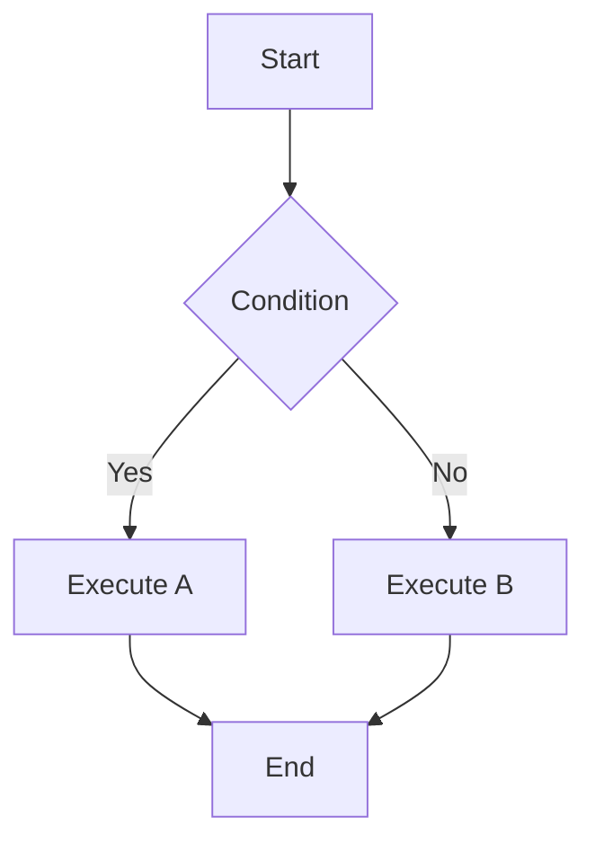

### 1.2 Horizontal Flowchart

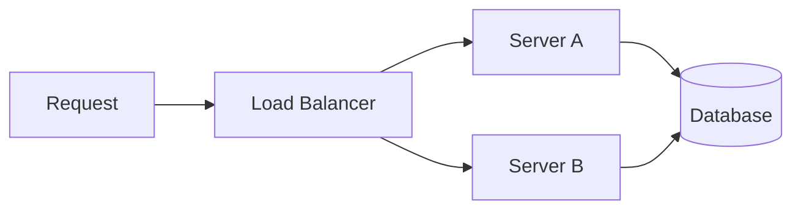

---

## 2. Sequence Diagram

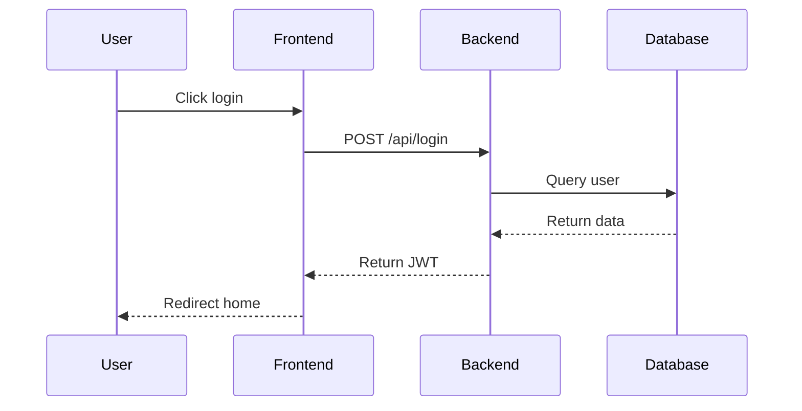

---

## 3. Class Diagram

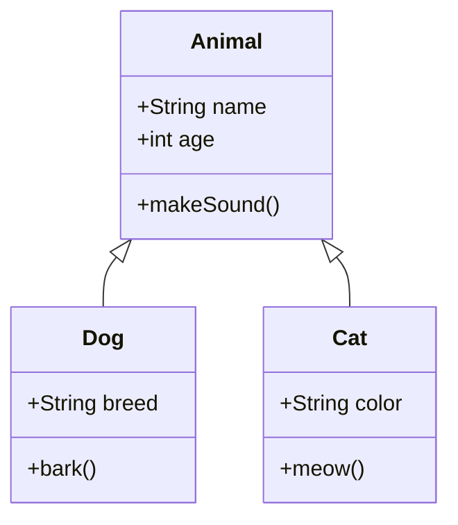

---

## 4. State Diagram

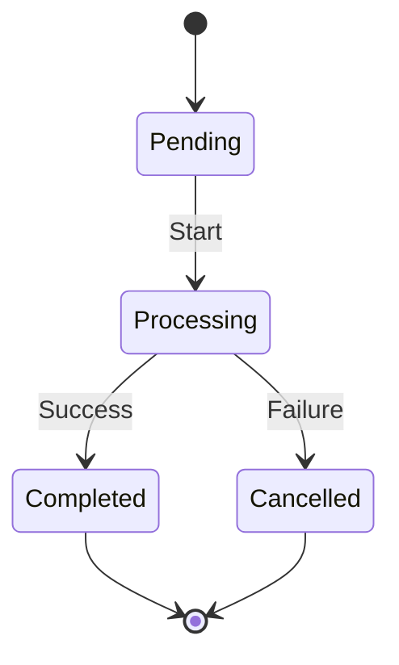

---

## 5. ER Diagram

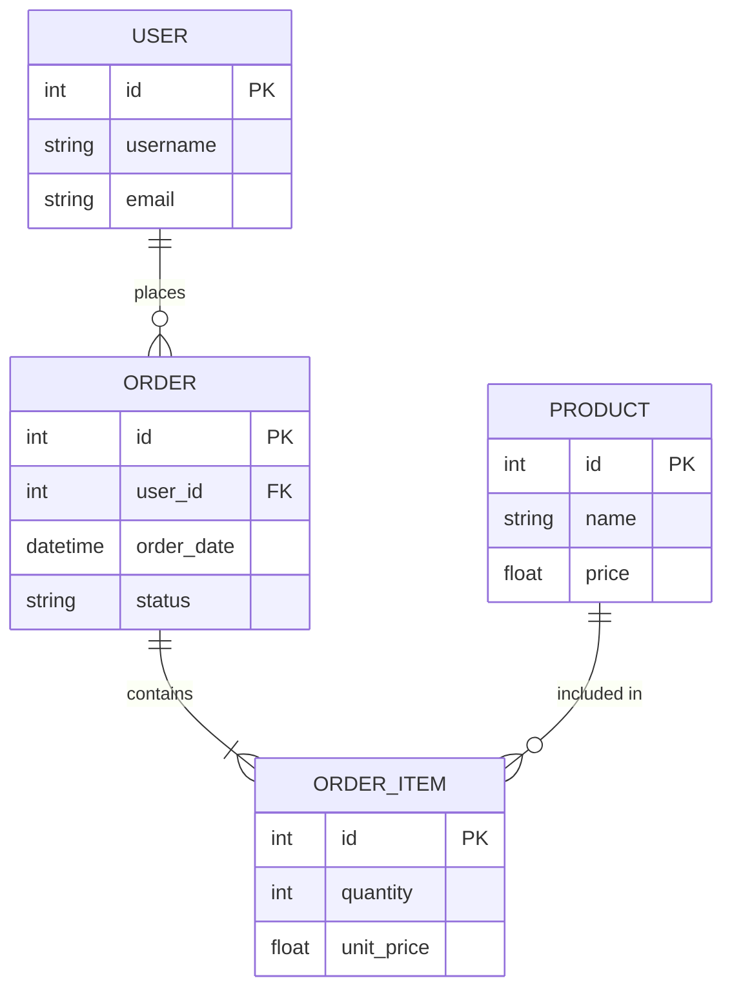

---

## 6. Gantt Chart

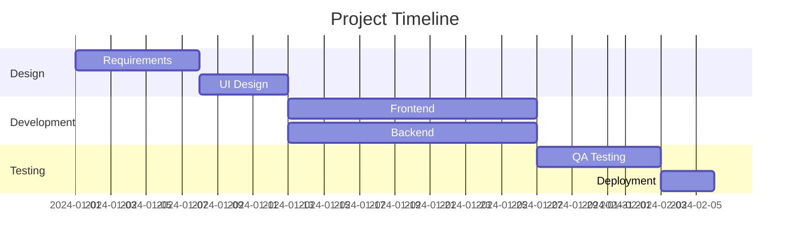

---

## 7. Pie Chart

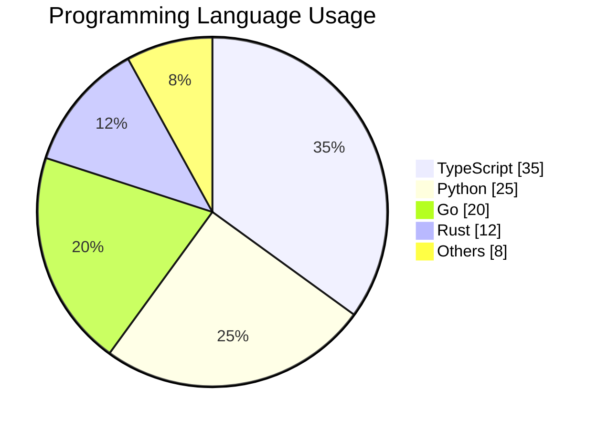

---

## 8. Git Graph

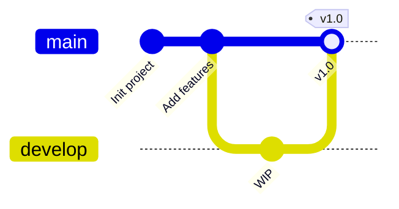

---

## 9. User Journey

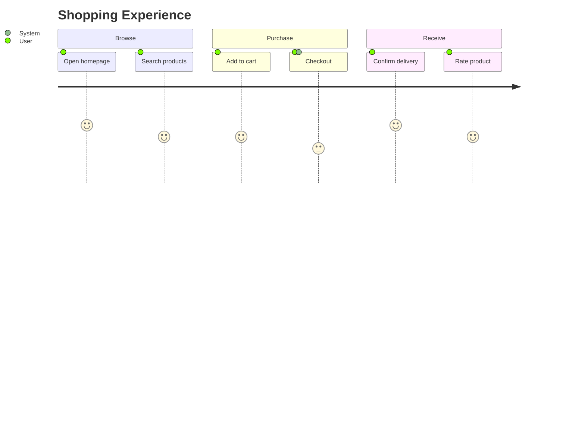

---

## 10. Mindmap

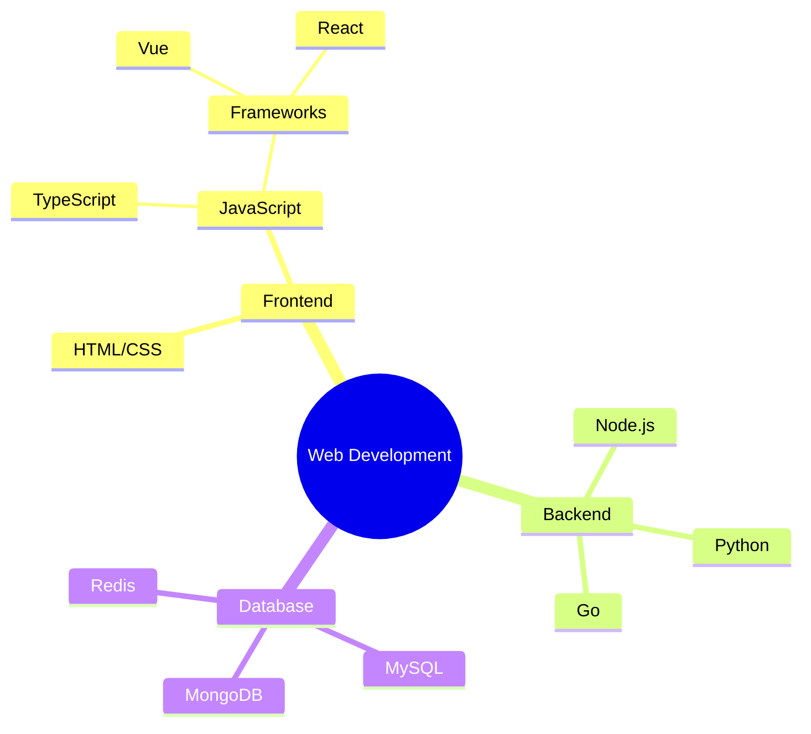

---

## 11. Custom Styling

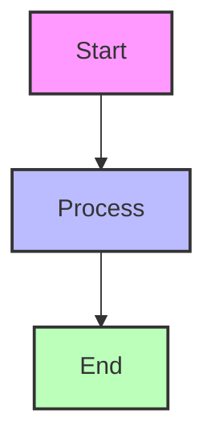

---

## References

- [Mermaid Documentation](https://mermaid.js.org/)
- [Mermaid Live Editor](https://mermaid.live/)