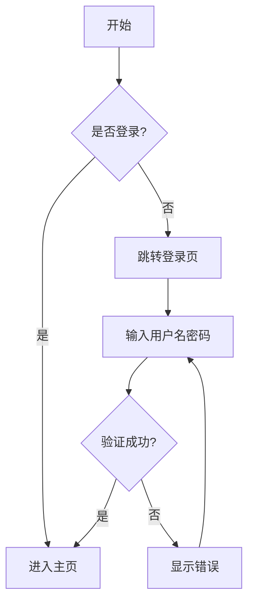
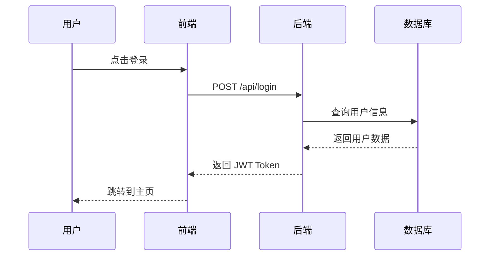
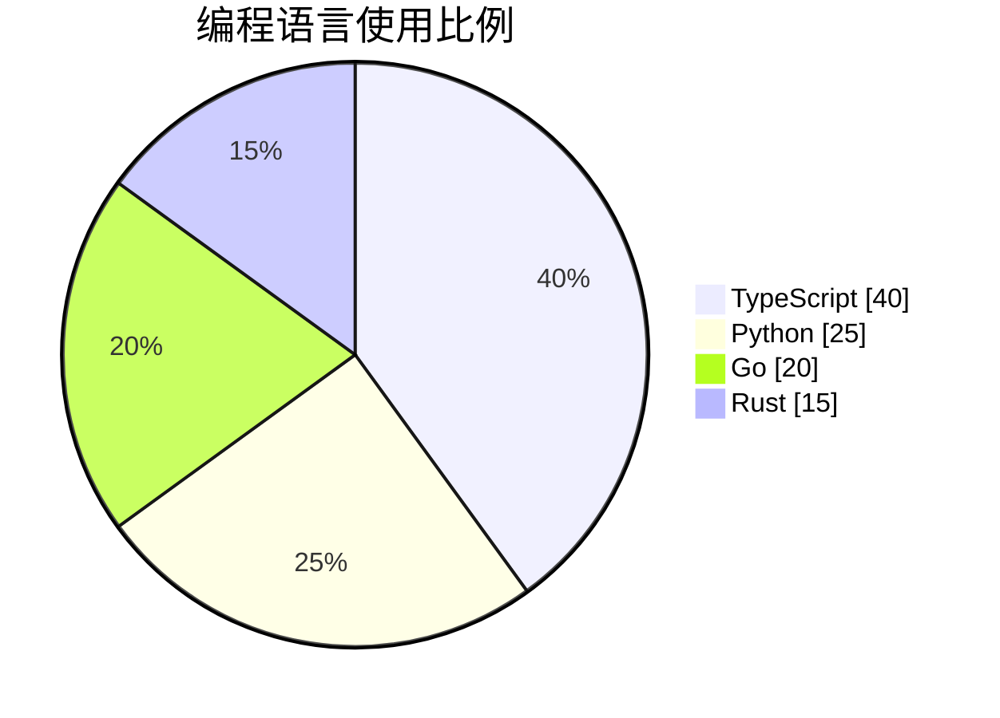
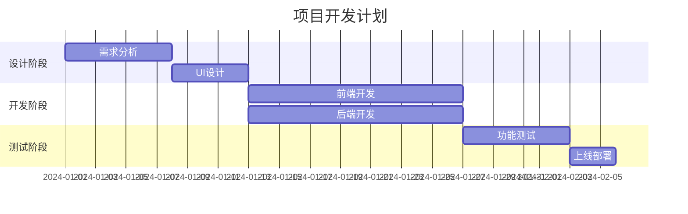
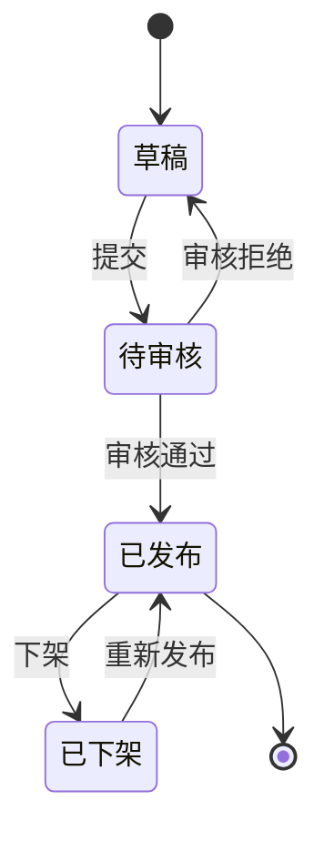

## 流程图

```mermaid
graph TD
    A[开始] --> B{是否登录?}
    B -->|是| C[进入主页]
    B -->|否| D[跳转登录页]
    D --> E[输入用户名密码]
    E --> F{验证成功?}
    F -->|是| C
    F -->|否| G[显示错误]
    G --> E
```

## 时序图

```mermaid
sequenceDiagram
    participant 用户
    participant 前端
    participant 后端
    participant 数据库
    
    用户->>前端: 点击登录
    前端->>后端: POST /api/login
    后端->>数据库: 查询用户信息
    数据库-->>后端: 返回用户数据
    后端-->>前端: 返回 JWT Token
    前端-->>用户: 跳转到主页
```

## 饼图

```mermaid
pie showData
    title 编程语言使用比例
    "TypeScript" : 40
    "Python" : 25
    "Go" : 20
    "Rust" : 15
```

## 甘特图

```mermaid
gantt
    title 项目开发计划
    dateFormat YYYY-MM-DD
    section 设计阶段
    需求分析 :a1, 2024-01-01, 7d
    UI设计 :a2, after a1, 5d
    section 开发阶段
    前端开发 :b1, after a2, 14d
    后端开发 :b2, after a2, 14d
    section 测试阶段
    功能测试 :c1, after b1, 7d
    上线部署 :c2, after c1, 3d
```

## 状态图

```mermaid
stateDiagram-v2
    [*] --> 草稿
    草稿 --> 待审核: 提交
    待审核 --> 已发布: 审核通过
    待审核 --> 草稿: 审核拒绝
    已发布 --> 已下架: 下架
    已下架 --> 已发布: 重新发布
    已发布 --> [*]
```

更多 Mermaid 图表类型请参考 [Mermaid 官方文档](https://mermaid.js.org/)。