本文展示如何使用 ` ```mermaid ` 代码块语法创建各种 Mermaid 图表。

---

## 一、流程图 (Flowchart)

### 1.1 基本流程图

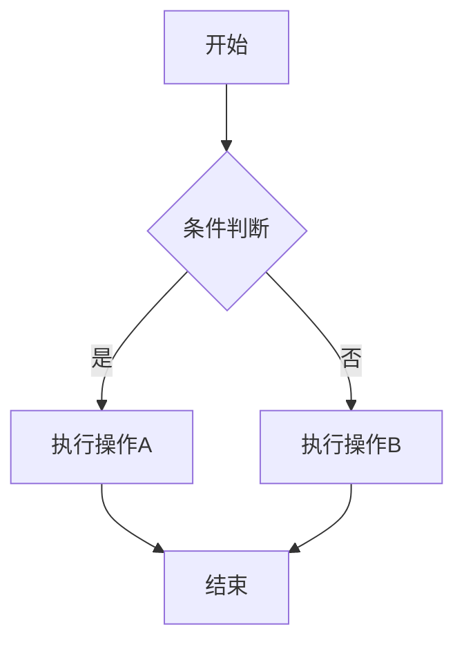

### 1.2 横向流程图

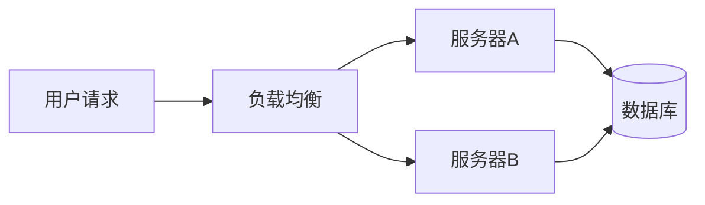

---

## 二、时序图 (Sequence Diagram)

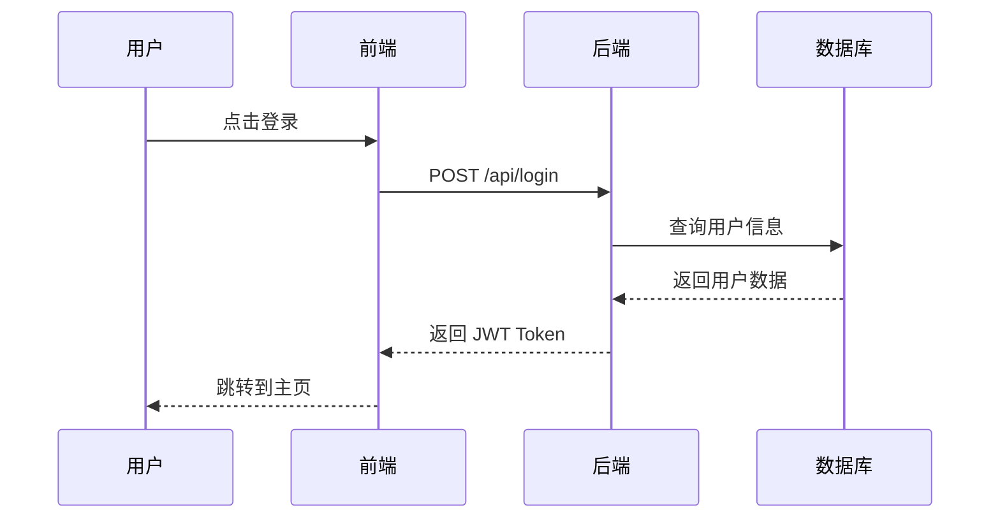

---

## 三、类图 (Class Diagram)

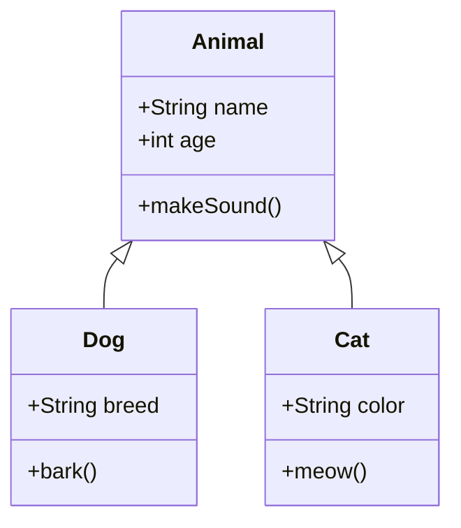

---

## 四、状态图 (State Diagram)

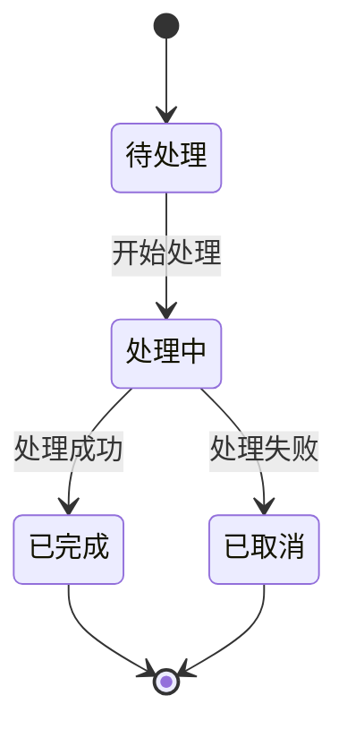

---

## 五、实体关系图 (ER Diagram)

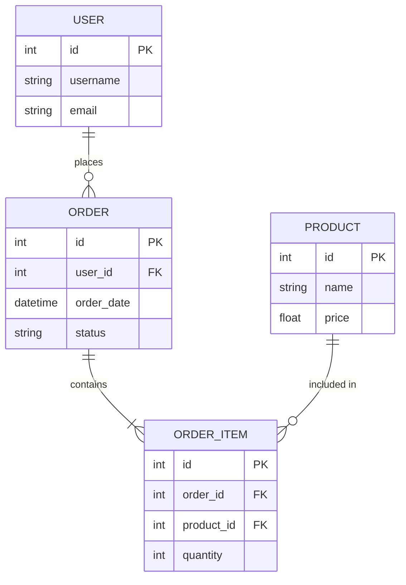

---

## 六、甘特图 (Gantt Chart)

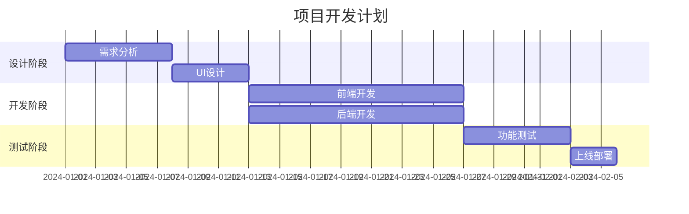

---

## 七、饼图 (Pie Chart)

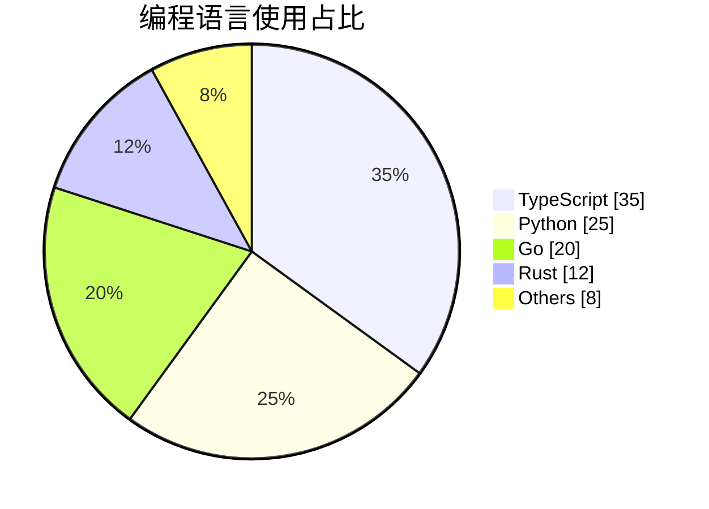

---

## 八、Git 图 (Git Graph)

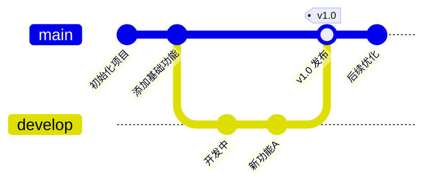

---

## 九、用户旅程图 (User Journey)

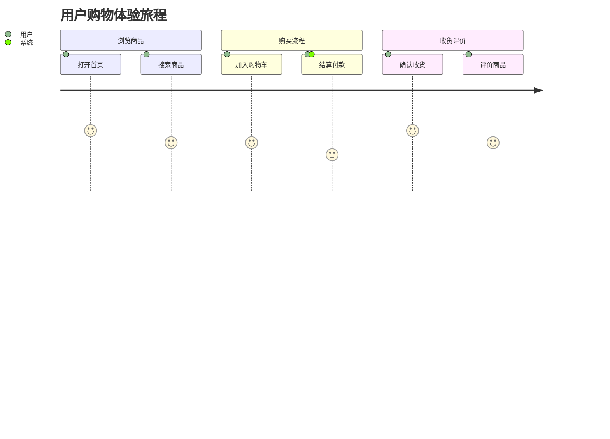

---

## 十、思维导图 (Mindmap)

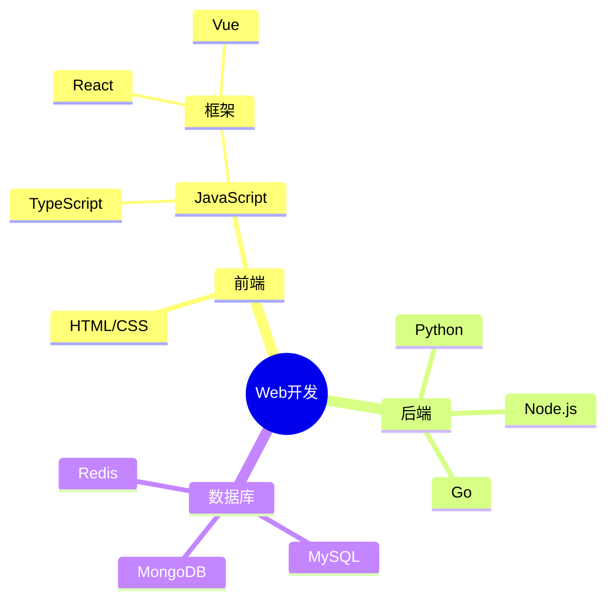

---

## 十一、样式定制

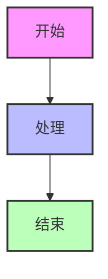

---

## 参考资料

- [Mermaid 官方文档](https://mermaid.js.org/)
- [Mermaid Live Editor](https://mermaid.live/)